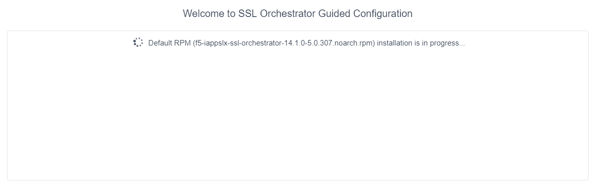

.. role:: red
.. role:: bred

Lab 1.3: Create the SSL Orchestrator deployment through Guided Configuration
----------------------------------------------------------------------------

The SSL Orchestrator Guided Configuration presents a completely new and
streamlined user experience. This workflow-based architecture provides
intuitive, re-entrant configuration steps tailored to the selected
topology.

The following steps will walk through the Guided Configuration (GC) to build a
simple transparent forward proxy. 

.. attention:: The following provides verbose details on each setting. For a
   more concise set of lab steps, without details, skip to
   `Appendix - Demo Scripts <../appendix/appendix4.html>`_

- **Initialization** - From the left-hand menu, navigate to
  :menuselection:`SSL Orchestrator --> Configuration`. If this is the first
  time accessing SSLO in a new BIG-IP build, upon first access Guided
  Configuration will automatically load and deploy the built-in SSLO package.

- **Configuration review and prerequisites** - take a moment to review the
  topology options and workflow configuration steps involved. Optionally
  satisfy any of the :red:`DNS, NTP and Route` prerequisites from this page.
  Keep in mind, however, that aside from NTP, the SSLO GC will provide an
  opportunity to define DNS and route settings later in the workflow. No other
  configurations are required on this page, click :guilabel:`Next`.

.. image:: ../images/image5.png
   :align: center
