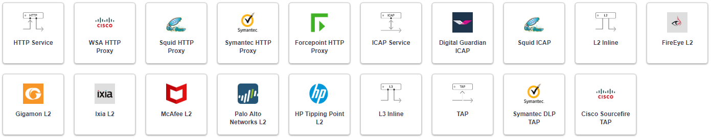
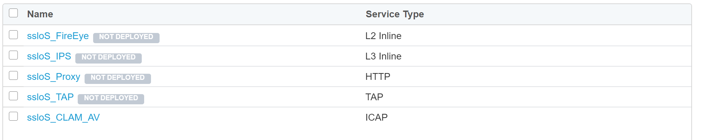

.. role:: red
.. role:: bred

Add the remaining services (optional - time permitting)
============================================================

This lab will create one of each remaining type of security service. 

- Return to SSL Orchestrator Guided Configuration.  

- Click on the :red:`sslo_demoL3` topology.

- In the configuration summary, find the row labeled :red:`Service` and click on the pencil at the far right.

- Click :red:`Add Service`, then either select a service from the catalog.

- click :red:`Add`, or simply double-click the service to go to its configuration page.

Inline layer 2 service
--------------------------

-  Select the :red:`FireEye NX Inline Layer 2` service from
   the catalog and click :red:`Add`, or simply double-click
   the FireEye NX Inline Layer 2 service (or any other
   Inline Layer 2 service in the catalog).

-  **Name** - provide a unique name to this service (example
   ":red:`FireEye`").

-  **Network Configuration** - paths define the network interfaces that take
   inspectable traffic to the inline service and receive traffic from the
   service. Click :red:`Add`.

   -  **Ratio** - inline security services are natively load balanced, so
      this setting defines a ratio, if any for the load balanced pool
      members. Enter :red:`1`.

   -  **From BIGIP VLAN** - this is the interface taking traffic to the inline
      service. Select the :red:`Create New` option, enter a unique name
      (ex. :red:`FireEye_in`), select the F5 interface connecting to the
      inbound side of the service, and add a VLAN tag value if required. For
      this lab, select interface :red:`1.4` without a VLAN tag.

   -  **To BIGIP VLAN** - this is the interface receiving traffic from the
      inline service. Select the :red:`Create New` option, enter a unique
      name (ex. :red:`FireEye_out`), select the F5 interface connecting to the
      outbound side of the service, and add a VLAN tag value if required. For
      this lab, select interface :red:`1.5` without a VLAN tag.

   - Click :red:`Done`.

-  **Device Monitor** - security service definitions can use
   specific custom monitors. For this lab, leave it set to the default
   :red:`/Common/gateway_icmp`.

-  **Service Action Down** - SSLO also natively monitors the load balanced
   pool of security devices, and if all pool members fail, can actively
   bypass this service (**Ignore**), or stop all traffic (**Reset**,
   **Drop**). For this lab, leave it set to :red:`Ignore`.

-  **Enable Port Remap** - this setting allows SSLO to remap the port of
   HTTPS traffic flowing across this service. This is advantageous when a
   security service defines port 443 traffic as encrypted HTTPS and natively
   ignores it. By remapping HTTPS traffic to a different port number, the security
   service will inspect the traffic. For this lab, :red:`enable (check)` this
   option and enter a Remap Port value of :red:`8080`.

-  **iRules** - SSLO allows for the insertion of additional iRule logic
   at different points. An iRule defined at the service only affects traffic
   flowing across this service. It is important to understand, however, that
   these iRules must not be used to control traffic flow (ex. pools, nodes,
   virtuals, etc.), but rather should be used to view/modify application
   layer protocol traffic. For example, an iRule assigned here could be used
   to view and modify HTTP traffic flowing to/from the service. Additional
   iRules are not required here so leave this :red:`empty`.

-  Click :red:`Save`.

Inline layer 3 service
-------------------------

-  Click on :red:`Add Service`.

-  Select the :red:`Generic Inline Layer 3`
   service from the catalog and click :red:`Add`, or simply double-click
   it.

-  **Name** - enter a unique name to this service (example ":red:`IPS`").

-  **IP Family** - this setting defines the IP family used with this layer 3
   service. Leave it set to :red:`IPv4`.

-  **Auto Manage Addresses** - when enabled the Auto Manage Addresses setting
   provides a set of unique, non-overlapping, non-routable IP addresses to be
   used by the security service. If disabled, the To and From IP addresses
   must be configured manually. It is recommended to leave this option
   :red:`enabled (checked)`.

   .. ATTENTION:: In environments where SSLO is introduced to existing security
      devices, it is a natural tendency to not want to have to move these
      devices. And while SSLO certainly allows it, by not moving the security
      devices into SSLO-protected enclaves, customers unintentionally run the
      risk of exposing sensitive decrypted traffic to other devices that may
      be connected to these existing networks. As a security best practice, it
      is *highly* recommended to remove SSLO-integrated security devices from
      existing networks and place them entirely within the isolated enclave
      that is created and maintained by SSLO.

-  **To Service Configuration** - the "To Service" defines the network
   connectivity from SSLO to the inline security device.

   -  **To Service** - with the Auto Manage Addresses option enabled, this IP
      address will be pre-defined, therefore the inbound side of the service
      must match this IP subnet. With the Auto Manage Addresses option
      disabled, the IP address must be defined manually. For this lab, leave
      the :red:`198.19.64.7/25` address intact.

   -  **VLAN** - select the :red:`Create New` option, provide a unique name
      (ex. :red:`IPS_in`), select the F5 interface connecting to the inbound
      side of the service, and add a VLAN tag value if required. For this lab,
      select interface :red:`1.3` and VLAN tag :red:`60`.

-  **Service Down Action** - SSLO also natively monitors the load balanced
   pool of security devices, and if all pool members fail, can actively
   bypass this service (**Ignore**), or stop all traffic (**Reset**,
   **Drop**). For this lab, leave it set to :red:`Ignore`.

-  **L3 Devices** - this defines the inbound-side IP address of the inline
   layer 3 service, used for routing traffic to this device. Multiple load
   balanced IP addresses can be defined here. Click :red:`Add`, enter
   :red:`198.19.64.30`, then click :red:`Done`.

-  **Device Monitor** - security service definitions can use
   specific custom monitors. For this lab, leave it set to the default
   :red:`/Common/gateway_icmp`.

-  **From Service Configuration** - the "From Service" defines the network
   connectivity from the inline security device to SSLO.

   -  **From Service** - with the Auto Manage Addresses option enabled, this
      IP address will be pre-defined, therefore the outbound side of the
      service must match this IP subnet. With the Auto Manage Addresses
      option disabled, the IP address must be defined manually. For this lab,
      leave the :red:`198.19.64.245/25` address intact.

   -  **VLAN** - select the :red:`Create New` option, provide a unique name
      (ex. :red:`IPS_out`), select the F5 interface connecting to the outbound
      side of the service, and add a VLAN tag value if required. For this lab,
      select interface :red:`1.3` and VLAN tag :red:`70`.

-  **Enable Port Remap** - this setting allows SSLO to remap the port of
   HTTPS traffic flowing across this service. This is advantageous when a
   security service defines port 443 traffic as encrypted HTTPS and natively
   ignores it. By remapping HTTPS traffic to a different port number, the security
   service will inspect the traffic. For this lab, :red:`enable (check)` this
   option and enter a Remap Port value of :red:`8181`.

-  **Manage SNAT Settings** - SSLO offers an option to enable SNAT
   (source NAT) across an inline layer 3/HTTP service. The primary use case
   for this is horizontal SSLO scaling, where independent SSLO devices are
   scaled behind a separate load balancer but share the same inline layer
   3/HTTP services. As these devices must route back to SSLO, there are now
   multiple SSLO devices to route back to. SNAT allows the layer 3/HTTP
   device to know which SSLO sent the packets for proper routing. SSLO
   scaling also requires that the Auto Manage option be disabled, to provide
   separate address spaces on each SSLO. For this lab, leave it set to
   :red:`None`.

-  **iRules** - SSLO allows for the insertion of additional iRule logic
   at different points. An iRule defined at the service only affects traffic
   flowing across this service. It is important to understand, however, that
   these iRules must not be used to control traffic flow (ex. pools, nodes,
   virtuals, etc.), but rather should be used to view/modify application
   layer protocol traffic. For example, an iRule assigned here could be used
   to view and modify HTTP traffic flowing to/from the service. Additional
   iRules are not required in this lab, so leave this :red:`empty`.

-  Click :red:`Save`.

Inline HTTP service
----------------------

An inline HTTP service is defined as an explicit or transparent proxy for HTTP (web) traffic.

-  Click on :red:`Add Service`.

-  Select the :red:`Cisco WSA HTTP Proxy` service from the catalog
   and click :red:`Add`, or simply double-click it.

   -  **Name** - provide a unique name to this service (example ":red:`Proxy`").

   -  **IP Family** - this setting defines the IP family used with this layer 3
      service. Leave it set to :red:`IPv4`.

-  **Auto Manage Addresses** - when enabled the Auto Manage Addresses setting
   provides a set of unique, non-overlapping, non-routable IP addresses to be
   used by the security service. If disabled, the To and From IP addresses
   must be configured manually. It is recommended to leave this option
   :red:`enabled (checked)`.

   .. ATTENTION:: In environments where SSLO is introduced to existing security
      devices, it is a natural tendency to not want to have to move these
      devices. And while SSLO certainly allows it, by not moving the security
      devices into SSLO-protected enclaves, customers unintentionally run the
      risk of exposing sensitive decrypted traffic to other devices that may
      be connected to these existing networks. As a security best practice, it
      is *highly* recommended to remove SSLO-integrated security devices from
      existing networks and place them entirely within the isolated enclave
      that is created and maintained by SSLO.

-  **Proxy Type** - this defines the proxy mode that the inline HTTP service
   is in. For this lab, set this option to :red:`Explicit`.

-  **To Service Configuration** - the "To Service" defines the network
   connectivity from SSLO to the inline security device.

   -  **To Service** - with the Auto Manage Addresses option enabled, this IP
      address will be pre-defined, therefore the inbound side of the service
      must match this IP subnet. With the Auto Manage Addresses option
      disabled, the IP address must be defined manually. For this lab, leave
      the :red:`198.19.96.7/25` address intact.

   -  **VLAN** - select the :red:`Create New` option, provide a unique name
      (ex. :red:`Proxy_in`), select the F5 interface connecting to the inbound
      side of the service, and add a VLAN tag value if required. For this lab,
      select interface :red:`1.3` and VLAN tag :red:`30`.

-  **Service Down Action** - SSLO also natively monitors the load balanced
   pool of security devices, and if all pool members fail, can actively
   bypass this service (**Ignore**), or stop all traffic (**Reset**,
   **Drop**). For this lab, leave it set to :red:`Ignore`.

-  **Security Devices - HTTP Proxy Devices** - this defines the
   inbound-side IP address of the
   inline HTTP service, used for passing traffic to this device. Multiple
   load balanced IP addresses can be defined here. For a transparent proxy
   HTTP service, only an IP address is required. For an explicit proxy HTTP
   service, the IP address and listening port is required. Click
   :red:`Add`, enter :red:`198.19.96.30` for the IP Address, and
   :red:`3128` for the Port, then click :red:`Done`.

-  **Device Monitor** - security service definitions can use
   specific custom monitors. For this lab, leave it set to the default
   :red:`/Common/gateway_icmp`.

-  **From Service Configuration** - the "From Service" defines the network
   connectivity from the inline security device to SSLO.

   -  **From Service** - with the Auto Manage Addresses option enabled, this
      IP address will be pre-defined, therefore the outbound side of the
      service must match this IP subnet. With the Auto Manage Addresses
      option disabled, the IP address must be defined manually. For this lab,
      leave the :red:`198.19.96.245/25` address intact.

   -  **VLAN** - select the :red:`Create New` option, provide a unique
      name (ex. :red:`Proxy_out`), select the F5 interface connecting to the
      outbound side of the service, and add a VLAN tag value if required. For
      this lab, select interface :red:`1.3` and VLAN tag :red:`40`.

-  **Manage SNAT Settings** - SSLO offers an option to enable SNAT
   (source NAT) across an inline layer 3/HTTP service. The primary use case
   for this is horizontal SSLO scaling, where independent SSLO devices are
   scaled behind a separate load balancer but share the same inline layer
   3/HTTP services. As these devices must route back to SSLO, there are now
   multiple SSLO devices to route back to. SNAT allows the layer 3/HTTP
   device to know which SSLO sent the packets for proper routing. SSLO
   scaling also requires that the Auto Manage option be disabled, to provide
   separate address spaces on each SSLO. For this lab, leave it set to
   :red:`None`.

-  **Authentication Offload** - when an Access authentication profile is
   attached to an explicit forward proxy topology, this option will present
   the authenticated username value to the service as an X-Authenticated-User
   HTTP header. For this lab, leave it :red:`disabled (unchecked)`.

-  **iRules** - SSLO allows for the insertion of additional iRule logic
   at different points. An iRule defined at the service only affects traffic
   flowing across this service. It is important to understand, however, that
   these iRules must not be used to control traffic flow (ex. pools, nodes,
   virtuals, etc.), but rather should be used to view/modify application
   layer protocol traffic. For example, an iRule assigned here could be used
   to view and modify HTTP traffic flowing to/from the service. Additional
   iRules are not required, however, so leave this :red:`empty`.

- Click :red:`Save`.

TAP service
---------------

A TAP service is a passive device that simply receives a copy of traffic.

-  Click on :red:`Add Service`.

-  Select the :red:`Cisco Firepower Threat Defense TAP`
   service from the catalog and click :red:`Add`, or simply double-click it.

-  **Name** - provide a unique name to this service (example ":red:`TAP`").

-  **Mac Address** - for a tap service that is not directly connected to the
   F5, enter the device's MAC address. For a tap service that is directly
   connected to the F5, the MAC address does not matter and can be
   arbitrarily defined. For this lab, enter :red:`12:12:12:12:12:12`.

-  **VLAN** - this defines the interface connecting the F5 to the TAP
   service. Click :red:`Create New` and provide a unique name (ex.
   :red:`TAP_in`).

-  **Interface** - select the :red:`1.6` interface without a tag.

-  **Enable Port Remap** - this setting allows SSLO to remap the port of
   HTTPS traffic flowing to this service. For this lab, leave the option
   :red:`disabled (unchecked)`.

- Click :red:`Save`.

The **Services** for this lab have now been configured.

- Click :red:`Save & Next` to continue to the next stage.

In the next section, you will associate these new services to service chains.

