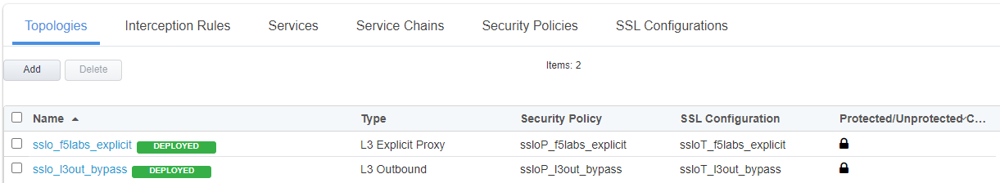
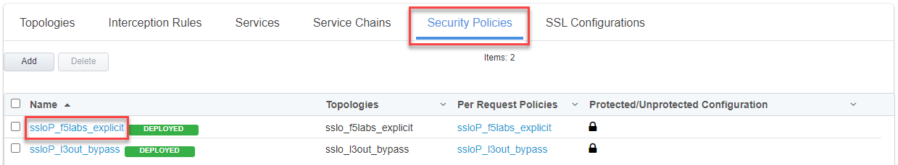
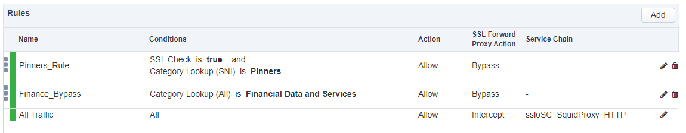
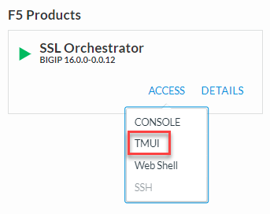

.. role:: red
.. role:: bred

Review the current SSL Orchestrator deployment
================================================================================

-  Start a TMUI session on **SSL Orchestrator** and log in as user **admin** (*Components > SSL Orchestrator > ACCESS > TMUI*)

   |credentials_link1|

   |

   |udf-sslo-tmui|

   |

-  Select **SSL Orchestrator** from the left-hand menu and then click on **Configuration**.

   |menu-sslo-config|

   |

-  When the SSL Orchestrator dashboard finishes loading, the following deployments should already be present.

   |config-topologies|

   |

-  Click on **Security Policies** from the horizontal menu. You should now be presented with following screen:

   |security-policy-overview|

   |

-  Click on **ssloP\_f5labs\_explicit** (in the **Name** column) and you will see the rules that are currently configured under this security policy.

   |initial-security-policy|

.. |menu-sslo-config| image:: ../images/menu-sslo-config.png
   :alt: SSL Orchestrator Configuration Menu

.. |credentials_link1| raw:: html

      <a href="../labinfo.html#credentials" target="_blank"> Link to user credentials (opens in new browser tab) </a>
