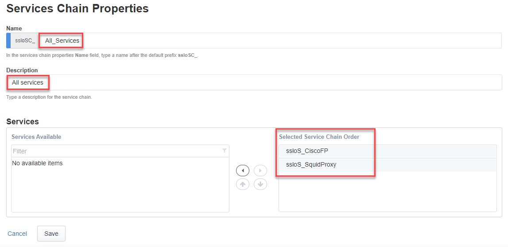

.. role:: red
.. role:: bred

Create a new "All Services" Service Chain
================================================================================

You now need to create a new Service Chain containing the Squid Proxy and the Cisco Firepower TAP services.

-  On the **Service Chain List** screen click the **Add** button to create a new Service Chain
   
-  On the **Service Chain Properties** screen enter the following values:

   -  **Name -** enter ``All_Services`` as the service chain name.

   -  **Description -** enter ``All services`` as the description.

   -  **Services -** select both services under **Services Available** and click on the right arrow to move them to the **Selected Service Chain Order** side.

|

-  Click the **Save** button
      
-  You will return to the **Service Chain List** where you will add one more Service Chain (see next page).
