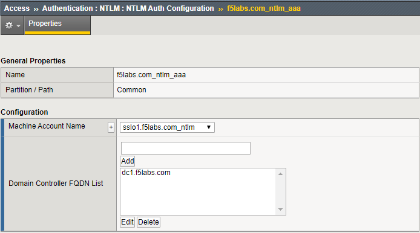
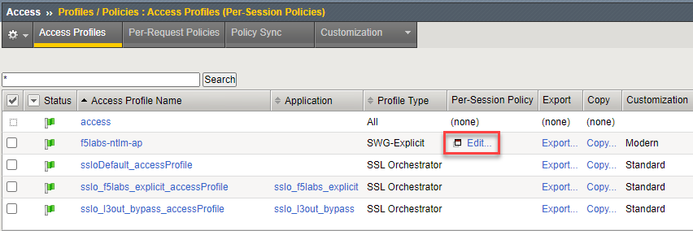
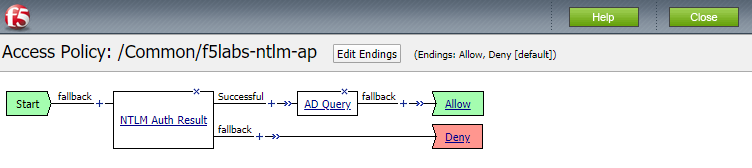

.. role:: red
.. role:: bred

Review the Access Policy and AAA configuration
================================================================================

-  From the Main menu on the left, select **Access > Authentication > NTLM > NTLM Auth Configuration**.

-  Select **f5labs.com_ntlm_aaa** from the NTLM Auth Configuration list. The following screen should appear:

   |f5labs.com_ntlm_aaa|

   **Machine Account Name** is the name of the security object that is added to the domain as a Computer Account. **Domain Controller FQDN List** contains a list of the Windows domain servers (there is only one in this lab environment).

-  From the main menu select **Access > Profiles / Policies > Access Profiles (Per-Session Policies)**. The following screen should appear:

   |access_profile_list|

-  Click on the **Edit** button next to the **f5labs-ntlm-ap** access profile. A new browser tab will appear showing the Access Policy in the Visual Policy Editor (VPE):

   |f5labs-ntlm-ap_vpe|

   The **NTLM Auth Result** agent check whether NTLM authentication was successful. If it was, the next action is an **AD Query** to gather more information about the user from Microsoft Active Directory.

-  Click on the **Close** button to exit the Visual Policy Editor.

