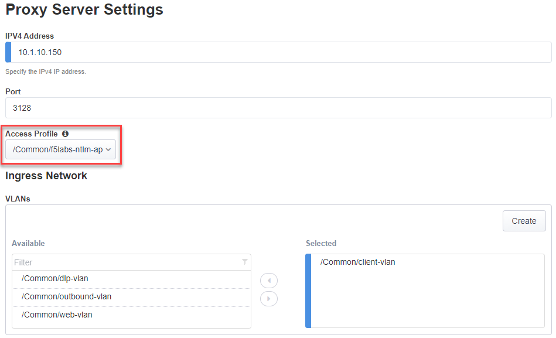
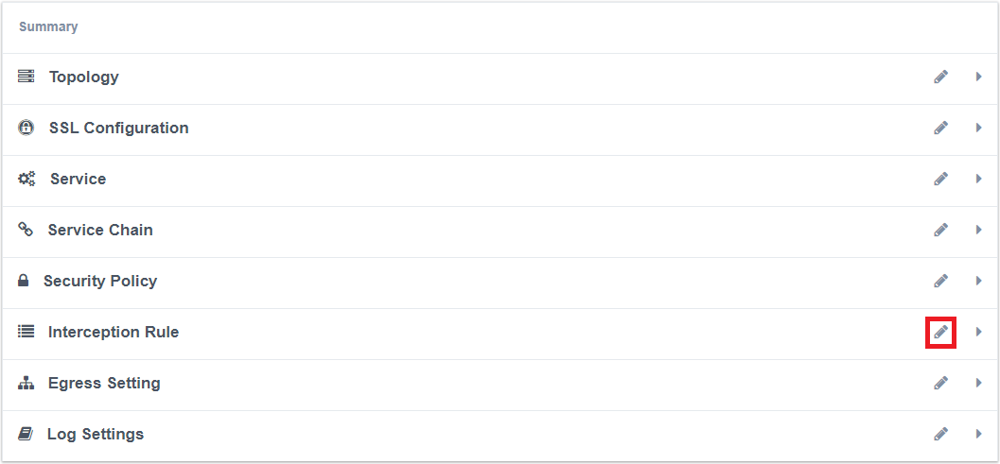
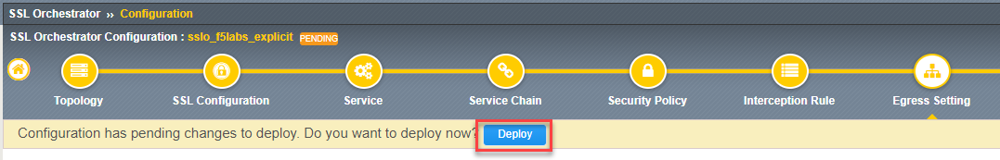

.. role:: red
.. role:: bred

Enable NTLM authentication on explicit proxy topology
================================================================================

The **f5labs_explicit** topology does not perform user authentication by default. You will now enable NTLM authentication for all users who connect to the explicit proxy.

-  From the Main menu on the left, select **SSL Orchestrator > Configuration**

-  In the Topology list click on **sslo_f5labs_explicit**. The topology summary screen will appear.

-  Click the edit icon (|pencil|) to the right of **Interception Rule**

   |topology-summary-IR-edit|

-  Select **/Common/f5labs-ntlm-ap** from the **Access Profile** drop down menu

-  Click **Save & Next** at the bottom of the screen

|

-  The **Egress Settings** screen will load. Wait a moment for the yellow "Deploy" ribbon to appear. When it does, click the **Deploy** button (see example below).

   |egress-settings-deploy-ribbon|

-  Click **OK** to acknowledge the successful deployment.

