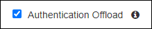
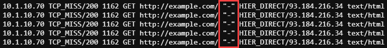
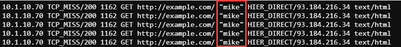

.. role:: red
.. role:: bred

Enable and test authentication offload
================================================================================

-  Start a Web Shell to **Ubuntu18.04 Services** (**Systems > Ubuntu18.04 Services > ACCESS > Web Shell**)

   .. image:: ../images/udf-ubuntu-services-webshell.png
      :alt: Unbuntu Services Web Shell Access

-  Enter the following commands in the Web Shell:

   .. code:: bash

      clear
      tail -f -n 0 /var/log/squid/access.log

-  Visit a few secure (HTTPS) websites (non-banking) using Chrome on the Windows Client and confirm that access is still being logged. You should see log entries of the sites and URLs visited but the username field (immediately after the URI) will be blank ("-"), similar to the example below:

   |proxy-access-log-nouser|

|

SSL Orchestrator does not pass authenticated usernames to a proxy service unless explicitly configured to do so. In the next step you will enable this feature.

-  On SSL Orchestrator select **SSL Orchestrator > Configuration** from the Main menu on the left

-  Click **Services** on the horizontal menu and then click on **ssloS_SquidProxy**. The Summary page will load for the Squid proxy service.

-  Click the edit icon (|pencil|) to the right of **Service**

-  Scroll down the Service Properties screen and select the **Authentication Offload** checkbox. Doing so will cause SSL Orchestrator to inject an "X-Authenticated-User" header into the HTTP payload of traffic it directs to the Squid proxy service.

-  Click the **Save & Next** button and confirm by clicking the **OK** button in the pop-up that appears.

-  The **Service Chain List** screen will load. Wait a moment for the yellow "Deploy" ribbon to appear. When it does, click the **Deploy** button.

-  Click **OK** to acknowledge the successful deployment.

-  Visit a few more secure (HTTPS) websites (non-banking) using Chrome on the Windows Client. You should now see your username logged along with the HTTP requests you sent, similar to the example below:

   |proxy-access-log-mike|

-  Press ``<CTRL+C>`` to stop the **tail** tool.

.. attention::
   This is the end of the lab module.

.. |pencil| image:: ../images/pencil.png
   :width: 20px
   :height: 20px
   :alt: Pencil Icon

