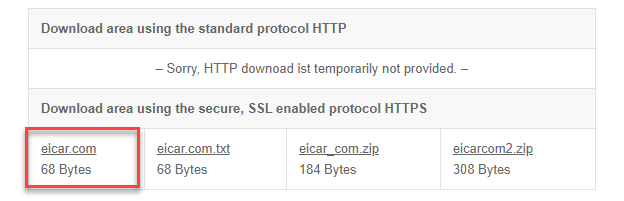
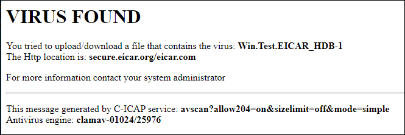
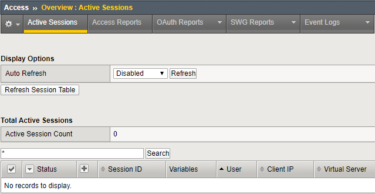
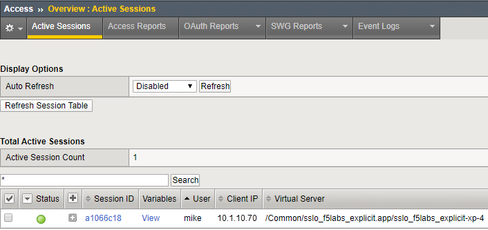

.. role:: red
.. role:: bred

Test Layered SSL Orchestrator Topology Deployment
================================================================================

Test Internet access from the two *client* machines to verify that the internal layered SSL Orchestrator deployment is working as intended.

Application Server Test
------------------------
Traffic from source addresses matching the **appserver_list** data group will be sent through the **appserver_explicit** topology.

-  RDP to the **Ubuntu18.04 Client** machine.

.. tip::

   If your previous RDP session timed out, refer to |credentials| for the **student** user password.

-  Launch the **Firefox** web browser. Recall that the browser was configured to use **10.1.10.150:3128** as its Internet proxy. Since the new **Topology Director virtual server** is now listening on that address and on the **client-vlan** VLAN, it will accept the explicit proxy connections from the web browser and steer the traffic according to the logic defined in the iRule.

-  Browse to a financial website (ex: Bank of America) and check the certificate that was received. The issuer should be **subrsa.f5labs.com** since the **appserver_explicit** topology does not bypass TLS decryption for financial websites.

.. note::
   You do not want this behavior for corporate user traffic since it may cause employee privacy concerns.

-  Browse to https://www.eicar.org/?page_id=3950 and attempt to download the **eicar.com** malware test file.

-  The request should be blocked by the antivirus service.

-  In the SSL Orchestrator TMUI, check **Access > Overview > Active Sessions**. Since user authentication is not enabled for the **appserver_explicit** topology, there should be no new sessions listed (except for possibly the user **mike** who logged in from the **Windows Client** machine earlier).

Corporate User Test
--------------------

All of the traffic that doesn't match the application server conditions (i.e., source address matching the **appserver_list** data group) will flow through the default **f5labs_explicit** topology.

-  If there is an active session for user **mike**, remove it:

   -  Click on the checkbox in the first column to select the session.

   -  Click on the **Kill Selected Sessions** button.

      .. image:: ../images/active-sessions-mike-remove-1.png
         :alt: Delete APM user session

   -  Click on the **Delete** button of the confirmation page. 

      .. image:: ../images/active-sessions-mike-remove-2.png
         :alt: Confirm delete

-  RDP to the **Windows Client** machine.

-  Launch the **Chrome** web browser. Recall that the browser was configured to use **10.1.10.150:3128** as its Internet proxy. Since the new **Topology Director virtual server** is now listening on that address and on the **client-vlan** VLAN, it will accept the explicit proxy connections from the web browser and steer the traffic according to the logic defined in the iRule.

-  Browse to a financial website (ex: Bank of America) and check the certificate that was received. The issuer should **NOT** be **subrsa.f5labs.com** since the **f5labs_explicit** topology bypasses TLS decryption for financial websites.

-  Browse to https://www.eicar.org/?page_id=3950 and attempt to download the **eicar.com** malware test file. The request should **NOT** be blocked by the ClamAV antivirus service since it is not in the service chain for the **f5labs_explicit** topology.

.. note::
   When the malware test file is downloaded to the **Windows Client** machine, the local antivirus software will block it. You will see a notification for that.

-  In the SSL Orchestrator TMUI, check **Access > Overview > Active Sessions**. There should be a user session listed for user **mike**.

|

.. attention::
   This is the end of the lab module.

.. |credentials| raw:: html

      <a href="../labinfo.html#credentials" target="_blank"> User Credentials </a>
