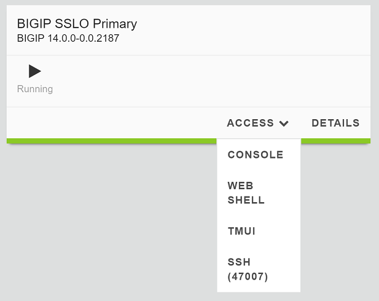
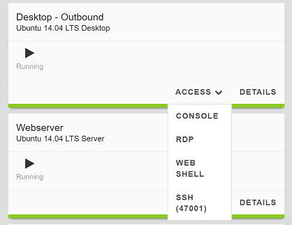

.. role:: red
.. role:: bred

Review the lab environment and map out the services and endpoints
=========================================================================

If needed review the previous section
`SSL Orchestrator Lab Environment <../labinfo.html>`_.

This lab will attach one of each type of security service (HTTP, ICAP, L2, L3,
TAP) to SSLO for an outbound forward proxy traffic flow. Afterwards, an
internal client will be able to access remote (Internet) resources
through SSLO, providing decrypted, inspectable traffic to the security
services.

-  Within the lab environment click on the **Access** drop down menu
   under the **BIGIP SSLO Primary** object which will open 
   **TMUI (HTTPS)** session.

-  Login as **admin** with password **admin**

-  Additionally, you will need to establish an **XRDP** session to the **Ubuntu14.04 Desktop Outbound** 
   client which is attached to a :red:`10.1.10.0/24` network
   and is assigned the IP :red:`10.1.10.50`. This network is attached to the
   BIG-IP :red:`1.1` interface.

   

-  The **L2 device** is consolidated onto the **Ubuntu14.04 Services** server configured to bridge its eth1
   and eth2 interfaces. Its inbound VLAN (traffic to it) is attached to the
   BIG-IP :red:`1.4` interface. Its outbound interface (traffic coming from it)
   is attached to the BIG-IP :red:`1.5` interface.

-  The **L3 device** is also the **Ubuntu14.04 Services** server configured to route between
   its eth1.10 and eth1.20 (tagged) interfaces. Its inbound VLAN (traffic to it)
   is attached to the BIG-IP :red:`1.6 (VLAN tag 10)` interface and has an IP of
   :red:`198.19.64.65/25`. Its outbound interface (traffic coming from it) is
   attached to the BIG-IP :red:`1.6 (VLAN tag 20)` interface and has an IP of
   :red:`198.19.64.130/25`. Its default gateway is :red:`198.19.64.245`, which
   will be a VLAN self-IP on the BIG-IP.

-  The **TAP** device is the **Ubuntu14.04 Services** server configured with a single
   eth1 interface. That interface is attached to the BIG-IP :red:`1.7`
   interface.

-  The **DLP/ICAP** device is also the **Ubuntu14.04 Services** server configured with a
   single eth1 interface. That interface is attached to the BIG-IP :red:`1.3`
   interface and has an IP of :red:`10.1.30.50 and listening on port 1344`. The
   box is running c-icap and Squid/Clamav.

-  The **Explicit Proxy device** is the **Ubuntu14.04 Services** server configured with
   Squid. Its interfaces are eth1.30 and eth1.40 (tagged). Its inbound VLAN
   (traffic to it) is attached to the BIG-IP :red:`1.6 (VLAN tag 30)` interface
   and has an IP of :red:`198.19.96.66/25`. Its outbound interface (traffic
   coming from it) is attached to the BIG-IP :red:`1.6 (VLAN tag 40)` interface
   and has an IP of :red:`198.19.96.131/25`. Its default gateway is
   :red:`198.19.96.245`, which will be a VLAN self-IP on the BIG-IP.

-  The outbound network is attached to the BIG-IP :red:`1.2` interface, in the
   :red:`10.1.20.0/24` subnet, and has a gateway of :red:`10.1.20.1`.

.. note:: In this lab, the client inbound, Internet outbound, and DLP VLANs and
   self-IPs are already created.
