.. role:: red
.. role:: bred

Create the SSL Orchestrator deployment through Guided Configuration
===========================================================================

The SSL Orchestrator Guided Configuration presents a completely new and
streamlined user experience. This workflow-based architecture provides
intuitive, re-entrant configuration steps tailored to the selected
topology.

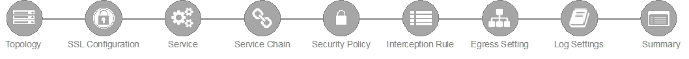

The following steps will walk through the **Guided Configuration (GC)** UI to build a
simple transparent forward proxy.

Initialization
------------------

From the left-hand menu, navigate to
:red:`SSL Orchestrator > Configuration`. If this is the first
time accessing SSLO in a new BIG-IP build, the Guided Configuration UI will
automatically load and deploy the built-in SSLO package.

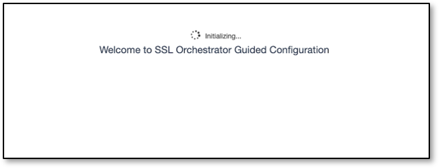

Configuration review and prerequisites
-------------------------------------------

Take a moment to review the topology options and workflow configuration steps
involved. Optionally satisfy any of the :red:`DNS, NTP and Route` prerequisites
from this page. Keep in mind, however, that aside from NTP, the SSLO GC will
provide an opportunity to define DNS and route settings later in the workflow.

.. NOTE::
   DNS and NTP settings have already been defined in this lab.

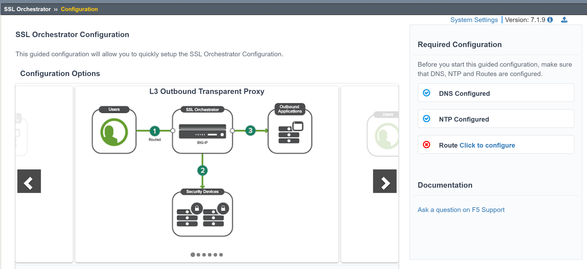

-  No other configurations are required on this page, click :red:`Next`.

Topology Properties
-----------------------

.. image:: ../images/gc-path-1.png
   :align: center

SSLO creates discrete configurations based
on the selected topology. For example, in previous versions of SSLO,
a transparent and explicit forward proxy might be defined together.
In SSLO 5.0 and above, these are configured separately. An explicit
forward proxy topology will ultimately create an explicit proxy
listener and its relying transparent proxy listener, but the
transparent listener will be bound only to the explicit proxy tunnel.
If a subsequent transparent forward proxy topology is configured, it
will not overlap the existing explicit proxy objects. The Topology
Properties page provides the following options:

The **Protocol** option presents four protocol types:

-  **TCP** - this option creates a single TCP wildcard interception
   rule for the L3 Inbound, L3 Outbound, and L3 Explicit Proxy
   topologies.

-  **UDP** - this option creates a single UDP wildcard interception
   rule for L3 Inbound and L3 Outbound topologies.

-  **Other** - this option creates a single any protocol wildcard
   interception rule for L3 Inbound and L3 Outbound topologies,
   typically used for non-TCP/UDP traffic flows.

-  **Any** - this option creates the TCP, UDP and non-TCP/UDP
   interception rules for outbound traffic flows.

The SSL Orchestrator **Topologies** option page presents six
topologies:

-  **L3 Explicit Proxy** - this is the traditional explicit forward
   proxy.

-  **L3 Outbound** - this is the traditional transparent forward
   proxy. An L3 outbound topology is effectively a "routed hop"
   configuration, where the SSLO topology listener becomes a routed
   path on the way to external (ie. Internet) resources.

-  **L3 Inbound** - this is a reverse proxy configuration. Like the
   L3 outbound, L3 inbound is typically a routed hop configuration
   for traffic directed inbound. It can also behave as a traditional
   load-balanced application.

-  **L2 Inbound** - the layer 2 topology options insert SSLO as a
   bump-in-the-wire in an existing routed path, where SSLO presents
   no IP addresses on its outer edges. The L2 Inbound topology
   provides a transparent path for inbound traffic flows.

-  **L2 Outbound** - the layer 2 topology options insert SSLO as a
   bump-in-the-wire in an existing routed path, where SSLO presents
   no IP addresses on its outer edges. The L2 Outbound topology
   provides a transparent path for outbound traffic flows.

   .. important:: It is important to distinguish SSLO's layer 2 topology from those
      of other traditional layer 2 SSL visibility vendors. Layer 2
      solutions such as the Blue Coat SSL visibility appliance (SSLVA)
      limit the types of devices that can be inserted into the
      inspection zone to layer 2 and below, and devices must be directly
      connected to the appliance. An SSLO layer 2 topology only exists at
      the outer edges. Inside the inspection zone, full-proxy routing is
      still happening, so layer 3 and HTTP services can still function
      normally.

-  **Existing Application** - this topology is designed to work with
   existing LTM applications. Whereas the L3 Inbound topology
   provides an inbound gateway function for SSLO, Existing
   Application works with LTM virtual servers that already perform
   their own SSL handling and client-server traffic management. The
   Existing Application workflow proceeds directly to service
   creation and security policy definition, then exits with an
   SSLO-type access policy and per-request policy that can easily be
   consumed by an LTM virtual server.

**For this lab:**

-  Click on the :red:`Next` button at the bottom of the page.

-  **Name**: Enter some name (ex. ":red:`demoL3`").

-  **Protocol**: Select :red:`Any` - this will create separate
   TCP, UDP and non-TCP/UDP interception rules.

-  **IP Family**: Select :red:`IPv4`

-  **Topology**: Select :red:`L3 Outbound`

   .. image:: ../images/module1-3.png
      :align: center

The **Topology** settings have been configured.

-  Click :red:`Save & Next` to continue to the next stage.

SSL Configurations
----------------------

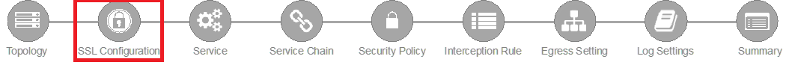

This page defines the specific SSL settings for the selected topology (in this
case a forward proxy) and controls both client-side and server-side SSL
options. If existing SSL settings are available (from a previous workflow), it
can be selected and re-used. Otherwise, the SSL Configurations page creates new
SSL settings for this workflow. The **[Advanced]** options below are
available when "Show Advanced Settings" is enabled (top right).

For this lab, :red:`Create a new SSL profile`.

Client-side SSL
~~~~~~~~~~~~~~~

-  **[Advanced] Processing Options** - SSLO 7.1 added TLS 1.3 support
   for outbound topologies, but does not enable it by default. In this lab,
   leave this setting as is.

-  **Cipher Type** - cipher type can be a Cipher Group or Cipher String.
   If the former, select a previously-defined cipher group (from Local
   Traffic - Ciphers - Groups). If the latter, enter a cipher string that
   appropriately represents the client-side TLS requirement. For this lab,
   leave the :red:`Cipher String` option selected. The default **Cipher**
   string of :red:`DEFAULT` is optimal for most environments.

-  **Certificate Key Chain** - the certificate key chain
   represents the certificate and private key used as the
   "template" for forged server certificates. While re-issuing
   server certificates on-the-fly is generally easy, private key
   creation tends to be a CPU-intensive operation. For that
   reason, the underlying SSL Forward Proxy engine forges server
   certificates from a single defined private key. This setting
   gives customers the opportunity to apply their own template
   private key, and optionally store that key in a FIPS-certified
   HSM for additional protection. The built-in "default"
   certificate and private key uses 2K RSA and is generated from
   scratch when the BIG-IP system is installed. The pre-defined
   :red:`default.crt` and :red:`default.key` can be left as is.

-  **CA Certificate Key Chain** - an SSL forward proxy must
   re-sign, or "forge" remote server certificate to local clients
   using a local certificate authority (CA) certificate, and local
   clients must trust this local CA. This setting defines the
   local CA certificate and private key used to perform the
   forging operation. Click the pencil icon to :red:`Edit`, then select
   :red:`subrsa.f5labs.com` for both Certificate and Key, and
   click :red:`Done`.

.. NOTE::
   SSL Settings minimally require RSA-based template and CA
   certificates but can also support Elliptic Curve (ECDSA)
   certificates. In this case, SSLO would forge an EC certificate
   to the client if the TLS handshake negotiated an ECDHE_ECDSA
   cipher. To enable EC forging support, add both an EC template
   certificate and key, and EC CA certificate and key.

-  **[Advanced] Bypass on Handshake Alert** - this setting allows
   the underlying SSL Forward Proxy process to bypass SSL
   decryption if an SSL handshake error is detected on the server
   side. It is recommended to leave this :red:`disabled`.

-  **[Advanced] Bypass on Client Certificate Failure** - this
   setting allows the underlying SSL Forward Proxy process to
   bypass SSL decryption if it detects a Certificate request
   message from the server, as in when a server requires mutual
   certificate authentication. It is recommended to leave this
   :red:`disabled`.

   .. NOTE::
      The above two Bypass options can create a security vulnerability. If
      a colluding client and server can force an SSL handshake error, or
      force client certificate authentication, they can effectively bypass
      SSL inspection. It is recommended that these settings be left
      disabled.

Server-side SSL
~~~~~~~~~~~~~~~

-  **[Advanced] Processing Options** - SSLO 7.1 added TLS 1.3 support
   for outbound topologies, but does not enable it by default. In this lab,
   leave this setting as is.

-  **Cipher Type** - cipher type can be a Cipher Group or Cipher
   String. If the former, select a previously-defined cipher group
   (from Local Traffic - Ciphers - Groups). If the latter, enter a
   cipher string that appropriately represents the server-side TLS
   requirement. For most environments, :red:`DEFAULT` is optimal.

-  **Trusted Certificate Authority** - browser vendors routinely
   update the CA certificate stores in their products to keep up with
   industry security trends, and to account for new and revoked CAs.
   In the SSL forward proxy use case, however, the SSL visibility
   product now performs all server-side certificate validation, in
   lieu of the client browser, and should therefore do its best to
   maintain the *same* industry security trends. BIG-IP ships with a CA
   certificate bundle that maintains a list of CA certificates common
   to the browser vendors. However, a more comprehensive bundle can
   be obtained from the F5 Downloads site. For this lab, select the
   built-in :red:`ca-bundle.crt`.

-  **[Advanced] Expire Certificate Response** - SSLO performs
   validation on remote server certificates and can control what
   happens if it receives an expired server certificate. The options
   are **drop**, which simply drops the traffic, and **ignore**,
   which mirrors an expired forged certificate to the client. The
   default and recommended behavior for forward proxy is to :red:`drop`
   traffic on an expired certificate.

-  **[Advanced] Untrusted Certificate Authority** - SSLO performs
   validation on remote server certificates and can control what
   happens if it receives an untrusted server certificate, based on
   the Trusted Certificate Authority bundle. The options are
   **drop**, which simply drops the traffic, and **ignore**, which
   allows the traffic and forges a good certificate to the client.
   The default and recommended behavior for forward proxy is to :red:`drop`
   traffic on an untrusted certificate.

-  **[Advanced] OCSP** - this setting selects an existing or can
   create a new OCSP profile for server-side Online Certificate
   Status Protocol (OCSP) and OCSP stapling. With this enabled, if a
   client issues a Status_Request message in its ClientHello message
   (an indication that it supports OCSP stapling), SSLO will issue a
   corresponding Status_Request message in its server-side TLS
   handshake. SSLO will then forge the returned OCSP stapling
   response back to the client. If the server does not respond with a
   staple but contains an Authority Info Access (AIA) field that
   points to an OCSP responder URL, SSLO will perform a separate OCSP
   request. The returned status is then mirrored in the stapled
   client-side TLS handshake.

-  **[Advanced] CRL** - this setting selects an existing or can
   create a new CRL profile for server-side Certificate Revocation
   List (CRL) validation. With this enabled, SSLO attempts to match
   server certificates to locally-cached CRLs.

The **SSL** settings have now been configured.

-  Click :red:`Save & Next` to continue to the next stage.

- **Authentication List** 
   SSL Orchestrator now supports an option to include Authentication services such as
   an **Online Certificate Status Protocol (OCSP)**.  Click Save/Next

Services List
-----------------

.. image:: ../images/gc-path-3.png
   :align: center

The Services List page is used to define security
services that attach to SSLO. The SSLO Guided Configuration now
includes a services catalog that contains common product
integrations. Beneath each of these catalog options is one of the
five basic service types. The service catalog also provides "generic"
security services. Depending on screen resolution, it may be
necessary to scroll down to see additional services.

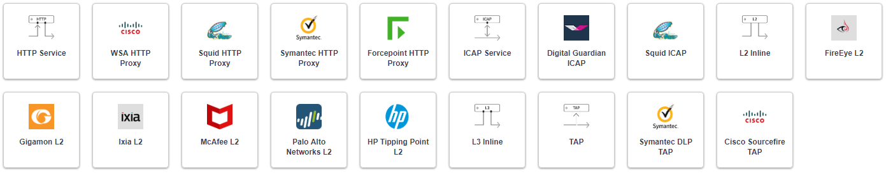

This lab will create one of each type of security service. Click :red:`Add
Service`, then either select a service from the catalog and
click :red:`Add`, or simply double-click the service to go
to its configuration page.

Inline layer 2 service
~~~~~~~~~~~~~~~~~~~~~~

-  Select the :red:`FireEye NX Inline Layer 2` service from
   the catalog and click :red:`Add`, or simply double-click
   the FireEye NX Inline Layer 2 service (or any other
   Inline Layer 2 service in the catalog).

-  **Name** - provide a unique name to this service (example
   ":red:`FireEye`").

-  **Network Configuration** - paths define the network interfaces that take
   inspectable traffic to the inline service and receive traffic from the
   service. Click :red:`Add`.

   -  **Ratio** - inline security services are natively load balanced, so
      this setting defines a ratio, if any for the load balanced pool
      members. Enter :red:`1`.

   -  **From BIGIP VLAN** - this is the interface taking traffic to the inline
      service. Select the :red:`Create New` option, enter a unique name
      (ex. :red:`FireEye_in`), select the F5 interface connecting to the
      inbound side of the service, and add a VLAN tag value if required. For
      this lab, select interface :red:`1.4` without a VLAN tag.

   -  **To BIGIP VLAN** - this is the interface receiving traffic from the
      inline service. Select the :red:`Create New` option, enter a unique
      name (ex. :red:`FireEye_out`), select the F5 interface connecting to the
      outbound side of the service, and add a VLAN tag value if required. For
      this lab, select interface :red:`1.5` without a VLAN tag.

   - Click :red:`Done`.

-  **Device Monitor** - security service definitions can use
   specific custom monitors. For this lab, leave it set to the default
   :red:`/Common/gateway_icmp`.

-  **Service Action Down** - SSLO also natively monitors the load balanced
   pool of security devices, and if all pool members fail, can actively
   bypass this service (**Ignore**), or stop all traffic (**Reset**,
   **Drop**). For this lab, leave it set to :red:`Ignore`.

-  **Enable Port Remap** - this setting allows SSLO to remap the port of
   HTTPS traffic flowing across this service. This is advantageous when a
   security service defines port 443 traffic as encrypted HTTPS and natively
   ignores it. By remapping HTTPS traffic to a different port number, the security
   service will inspect the traffic. For this lab, :red:`enable (check)` this
   option and enter a Remap Port value of :red:`8080`.

-  **iRules** - SSLO allows for the insertion of additional iRule logic
   at different points. An iRule defined at the service only affects traffic
   flowing across this service. It is important to understand, however, that
   these iRules must not be used to control traffic flow (ex. pools, nodes,
   virtuals, etc.), but rather should be used to view/modify application
   layer protocol traffic. For example, an iRule assigned here could be used
   to view and modify HTTP traffic flowing to/from the service. Additional
   iRules are not required here so leave this :red:`empty`.

-  Click :red:`Save`.

Inline layer 3 service
~~~~~~~~~~~~~~~~~~~~~~

-  Click on :red:`Add Service`.

-  Select the :red:`Generic Inline Layer 3`
   service from the catalog and click :red:`Add`, or simply double-click
   it.

-  **Name** - enter a unique name to this service (example ":red:`IPS`").

-  **IP Family** - this setting defines the IP family used with this layer 3
   service. Leave it set to :red:`IPv4`.

-  **Auto Manage Addresses** - when enabled the Auto Manage Addresses setting
   provides a set of unique, non-overlapping, non-routable IP addresses to be
   used by the security service. If disabled, the To and From IP addresses
   must be configured manually. It is recommended to leave this option
   :red:`enabled (checked)`.

   .. ATTENTION:: In environments where SSLO is introduced to existing security
      devices, it is a natural tendency to not want to have to move these
      devices. And while SSLO certainly allows it, by not moving the security
      devices into SSLO-protected enclaves, customers unintentionally run the
      risk of exposing sensitive decrypted traffic to other devices that may
      be connected to these existing networks. As a security best practice, it
      is *highly* recommended to remove SSLO-integrated security devices from
      existing networks and place them entirely within the isolated enclave
      that is created and maintained by SSLO.

-  **To Service Configuration** - the "To Service" defines the network
   connectivity from SSLO to the inline security device.

   -  **To Service** - with the Auto Manage Addresses option enabled, this IP
      address will be pre-defined, therefore the inbound side of the service
      must match this IP subnet. With the Auto Manage Addresses option
      disabled, the IP address must be defined manually. For this lab, leave
      the :red:`198.19.64.7/25` address intact.

   -  **VLAN** - select the :red:`Create New` option, provide a unique name
      (ex. :red:`IPS_in`), select the F5 interface connecting to the inbound
      side of the service, and add a VLAN tag value if required. For this lab,
      select interface :red:`1.6` and VLAN tag :red:`10`.

-  **Service Down Action** - SSLO also natively monitors the load balanced
   pool of security devices, and if all pool members fail, can actively
   bypass this service (**Ignore**), or stop all traffic (**Reset**,
   **Drop**). For this lab, leave it set to :red:`Ignore`.

-  **L3 Devices** - this defines the inbound-side IP address of the inline
   layer 3 service, used for routing traffic to this device. Multiple load
   balanced IP addresses can be defined here. Click :red:`Add`, enter
   :red:`198.19.64.65`, then click :red:`Done`.

-  **Device Monitor** - security service definitions can use
   specific custom monitors. For this lab, leave it set to the default
   :red:`/Common/gateway_icmp`.

-  **From Service Configuration** - the "From Service" defines the network
   connectivity from the inline security device to SSLO.

   -  **From Service** - with the Auto Manage Addresses option enabled, this
      IP address will be pre-defined, therefore the outbound side of the
      service must match this IP subnet. With the Auto Manage Addresses
      option disabled, the IP address must be defined manually. For this lab,
      leave the :red:`198.19.64.245/25` address intact.

   -  **VLAN** - select the :red:`Create New` option, provide a unique name
      (ex. :red:`IPS_out`), select the F5 interface connecting to the outbound
      side of the service, and add a VLAN tag value if required. For this lab,
      select interface :red:`1.6` and VLAN tag :red:`20`.

-  **Enable Port Remap** - this setting allows SSLO to remap the port of
   HTTPS traffic flowing across this service. This is advantageous when a
   security service defines port 443 traffic as encrypted HTTPS and natively
   ignores it. By remapping HTTPS traffic to a different port number, the security
   service will inspect the traffic. For this lab, :red:`enable (check)` this
   option and enter a Remap Port value of :red:`8181`.

-  **Manage SNAT Settings** - SSLO offers an option to enable SNAT
   (source NAT) across an inline layer 3/HTTP service. The primary use case
   for this is horizontal SSLO scaling, where independent SSLO devices are
   scaled behind a separate load balancer but share the same inline layer
   3/HTTP services. As these devices must route back to SSLO, there are now
   multiple SSLO devices to route back to. SNAT allows the layer 3/HTTP
   device to know which SSLO sent the packets for proper routing. SSLO
   scaling also requires that the Auto Manage option be disabled, to provide
   separate address spaces on each SSLO. For this lab, leave it set to
   :red:`None`.

-  **iRules** - SSLO allows for the insertion of additional iRule logic
   at different points. An iRule defined at the service only affects traffic
   flowing across this service. It is important to understand, however, that
   these iRules must not be used to control traffic flow (ex. pools, nodes,
   virtuals, etc.), but rather should be used to view/modify application
   layer protocol traffic. For example, an iRule assigned here could be used
   to view and modify HTTP traffic flowing to/from the service. Additional
   iRules are not required in this lab, so leave this :red:`empty`.

-  Click :red:`Save`.

Inline HTTP service
~~~~~~~~~~~~~~~~~~~

An inline HTTP service is defined as an explicit or transparent proxy for HTTP (web) traffic.

-  Click on :red:`Add Service`.

-  Select the :red:`Cisco WSA HTTP Proxy` service from the catalog
   and click :red:`Add`, or simply double-click it.

   -  **Name** - provide a unique name to this service (example ":red:`Proxy`").

   -  **IP Family** - this setting defines the IP family used with this layer 3
      service. Leave it set to :red:`IPv4`.

-  **Auto Manage Addresses** - when enabled the Auto Manage Addresses setting
   provides a set of unique, non-overlapping, non-routable IP addresses to be
   used by the security service. If disabled, the To and From IP addresses
   must be configured manually. It is recommended to leave this option
   :red:`enabled (checked)`.

   .. ATTENTION:: In environments where SSLO is introduced to existing security
      devices, it is a natural tendency to not want to have to move these
      devices. And while SSLO certainly allows it, by not moving the security
      devices into SSLO-protected enclaves, customers unintentionally run the
      risk of exposing sensitive decrypted traffic to other devices that may
      be connected to these existing networks. As a security best practice, it
      is *highly* recommended to remove SSLO-integrated security devices from
      existing networks and place them entirely within the isolated enclave
      that is created and maintained by SSLO.

-  **Proxy Type** - this defines the proxy mode that the inline HTTP service
   is in. For this lab, set this option to :red:`Explicit`.

-  **To Service Configuration** - the "To Service" defines the network
   connectivity from SSLO to the inline security device.

   -  **To Service** - with the Auto Manage Addresses option enabled, this IP
      address will be pre-defined, therefore the inbound side of the service
      must match this IP subnet. With the Auto Manage Addresses option
      disabled, the IP address must be defined manually. For this lab, leave
      the :red:`198.19.96.7/25` address intact.

   -  **VLAN** - select the :red:`Create New` option, provide a unique name
      (ex. :red:`Proxy_in`), select the F5 interface connecting to the inbound
      side of the service, and add a VLAN tag value if required. For this lab,
      select interface :red:`1.6` and VLAN tag :red:`30`.

-  **Service Down Action** - SSLO also natively monitors the load balanced
   pool of security devices, and if all pool members fail, can actively
   bypass this service (**Ignore**), or stop all traffic (**Reset**,
   **Drop**). For this lab, leave it set to :red:`Ignore`.

-  **Security Devices - HTTP Proxy Devices** - this defines the
   inbound-side IP address of the
   inline HTTP service, used for passing traffic to this device. Multiple
   load balanced IP addresses can be defined here. For a transparent proxy
   HTTP service, only an IP address is required. For an explicit proxy HTTP
   service, the IP address and listening port is required. Click
   :red:`Add`, enter :red:`198.19.96.66` for the IP Address, and
   :red:`3128` for the Port, then click :red:`Done`.

-  **Device Monitor** - security service definitions can use
   specific custom monitors. For this lab, leave it set to the default
   :red:`/Common/gateway_icmp`.

-  **From Service Configuration** - the "From Service" defines the network
   connectivity from the inline security device to SSLO.

   -  **From Service** - with the Auto Manage Addresses option enabled, this
      IP address will be pre-defined, therefore the outbound side of the
      service must match this IP subnet. With the Auto Manage Addresses
      option disabled, the IP address must be defined manually. For this lab,
      leave the :red:`198.19.96.245/25` address intact.

   -  **VLAN** - select the :red:`Create New` option, provide a unique
      name (ex. :red:`Proxy_out`), select the F5 interface connecting to the
      outbound side of the service, and add a VLAN tag value if required. For
      this lab, select interface :red:`1.6` and VLAN tag :red:`40`.

-  **Manage SNAT Settings** - SSLO offers an option to enable SNAT
   (source NAT) across an inline layer 3/HTTP service. The primary use case
   for this is horizontal SSLO scaling, where independent SSLO devices are
   scaled behind a separate load balancer but share the same inline layer
   3/HTTP services. As these devices must route back to SSLO, there are now
   multiple SSLO devices to route back to. SNAT allows the layer 3/HTTP
   device to know which SSLO sent the packets for proper routing. SSLO
   scaling also requires that the Auto Manage option be disabled, to provide
   separate address spaces on each SSLO. For this lab, leave it set to
   :red:`None`.

-  **Authentication Offload** - when an Access authentication profile is
   attached to an explicit forward proxy topology, this option will present
   the authenticated username value to the service as an X-Authenticated-User
   HTTP header. For this lab, leave it :red:`disabled (unchecked)`.

-  **iRules** - SSLO allows for the insertion of additional iRule logic
   at different points. An iRule defined at the service only affects traffic
   flowing across this service. It is important to understand, however, that
   these iRules must not be used to control traffic flow (ex. pools, nodes,
   virtuals, etc.), but rather should be used to view/modify application
   layer protocol traffic. For example, an iRule assigned here could be used
   to view and modify HTTP traffic flowing to/from the service. Additional
   iRules are not required, however, so leave this :red:`empty`.

- Click :red:`Save`.

ICAP service
~~~~~~~~~~~~

An ICAP service is an RFC 3507-defined service that
provides some set of services over the ICAP protocol.

-  Click on :red:`Add Service`.

-  Select the :red:`Digital Guardian ICAP` service from the
   catalog and click :red:`Add`, or simply double-click it.

-  **Name** - provide a unique name to this service (example ":red:`DLP`").

- **IP Family** - this setting defines the IP family used with this layer 3
   service. Leave it set to :red:`IPv4`.

-  **ICAP Devices** - this defines the IP address of the ICAP service, used
   for passing traffic to this device. Multiple load balanced IP addresses
   can be defined here. Click :red:`Add`, enter :red:`10.1.30.50` for the
   IP Address, and :red:`1344` for the Port, and then click :red:`Done`.

-  **Device Monitor** - security service definitions can use
   specific custom monitors. For this lab, leave it set to the default
   :red:`/Common/tcp`.

-  **ICAP Headers** - options are **Default** or **Custom**. Selecting
   **Custom** allows you to specify additional ICAP headers. For this lab,
   leave the setting at :red:`Default`.

-  **OneConnect** - the F5 OneConnect profile improves performance by reusing
   TCP connections to ICAP servers to process multiple transactions. If the
   ICAP servers do not support multiple ICAP transactions per TCP connection,
   do not enable this option. For this lab, leave the OneConnect setting
   :red:`enabled (checked)`.

-  **Request URI Path** - this is the RFC 3507-defined URI request path to
   the ICAP service. Each ICAP security vendor will differ with respect to
   request and response URIs, and preview length, so it is important to
   review the vendor's documentation. In this lab, enter :red:`/squidclamav`.

-  **Response URI Path** - this is the RFC 3507-defined URI response path to
   the ICAP service. Each ICAP security vendor will differ with respect to
   request and response URIs, and preview length, so it is important to
   review the vendor's documentation. In this lab, enter :red:`/squidclamav`.

-  **Preview Max Length(bytes)** - this defines the maximum length of the
   ICAP preview. Each ICAP security vendor will differ with respect to
   request and response URIs, and preview length, so it is important to
   review the vendor's documentation. A zero-length preview length implies
   that data will be streamed to the ICAP service, similar to an HTTP
   100/Expect process, while any positive integer preview length defines the
   amount of data (in bytes) that are transmitted first, before streaming the
   remaining content. The ICAP service in this lab environment does not
   support a complete stream, so requires a modest amount of initial preview.
   In this lab, enter :red:`524288`.

-  **Service Down Action** - SSLO also natively monitors the load balanced
   pool of security devices. If all pool members fail, SSLO can actively
   bypass this service (**Ignore**), or stop all traffic (**Reset**,
   **Drop**). For this lab, leave it set to :red:`Ignore`.

-  **HTTP Version** - this defines whether SSLO sends HTTP/1.1 or HTTP/1.0
   requests to the ICAP service. The lab's ICAP service supports both.

-  **ICAP Policy** - an ICAP policy is a pre-defined LTM CPM policy that can
   be configured to control access to the ICAP service based on attributes of
   the HTTP request or response. ICAP processing is enabled by default, so an
   ICAP CPM policy can be used to disable the request and/or response ADAPT
   profiles. Leave this :red:`blank (--Select--)`

-  Click :red:`Save`.

TAP service
~~~~~~~~~~~

A TAP service is a passive device that simply receives a copy of traffic.

-  Click on :red:`Add Service`.

-  Select the :red:`Cisco Firepower Thread Defense TAP`
   service from the catalog and click :red:`Add`, or simply double-click it.

-  **Name** - provide a unique name to this service (example ":red:`TAP`").

-  **Mac Address** - for a tap service that is not directly connected to the
   F5, enter the device's MAC address. For a tap service that is directly
   connected to the F5, the MAC address does not matter and can be
   arbitrarily defined. For this lab, enter :red:`12:12:12:12:12:12`.

-  **VLAN** - this defines the interface connecting the F5 to the TAP
   service. Click :red:`Create New` and provide a unique name (ex.
   :red:`TAP_in`).

-  **Interface** - select the :red:`1.7` interface without a tag.

-  **Enable Port Remap** - this setting allows SSLO to remap the port of
   HTTPS traffic flowing to this service. For this lab, leave the option
   :red:`disabled (unchecked)`.

- Click :red:`Save`.

The **Services** for this lab have now been configured.

- Click :red:`Save & Next` to continue to the next stage.

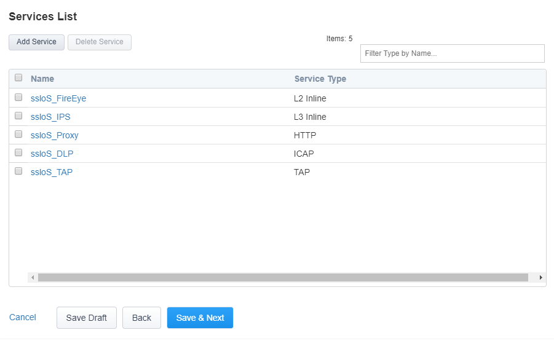

Service Chain List
----------------------

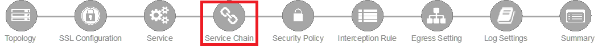

Service chains are arbitrarily-ordered lists of security devices. Based on
environmental requirements, different service chains may contain different
re-used sets of services, and different types of traffic can be assigned to
different service chains. For example, HTTP traffic may need to go through all
of the security services, while non-HTTP traffic goes through a subset, and
traffic destined to a financial service URL can bypass decryption and still
flow through a smaller set of security services.

|

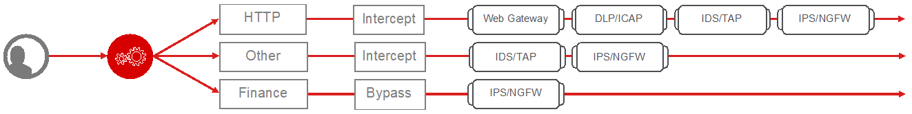

|

-  Click :red:`Add` to create a new service chain containing all of the
   security services.

   -  **Name** - provide a unique name to this service chain
      (ex.":red:`all_services`").

   -  **Services** - select any number of desired service and move them into the
      :red:`Selected Service Chain Order` column, optionally also ordering
      them as required. In this lab, select :red:`all of the services` and then
      click the :red:`rightward-pointing arrow` to move them to the
      :red:`Selected Service Chain Order` side.

   -  Click :red:`Save`.

-  Click :red:`Add` to create a new service chain for just the L2 (ex.
   FireEye) and TAP services.

   -  **Name** - provide a unique name to this service chain (ex.
      ":red:`L2_services`").

   -  **Services** - select and then move the :red:`FireEye` and :red:`TAP`
      services to the right-hand side.

   - Click :red:`Save`.

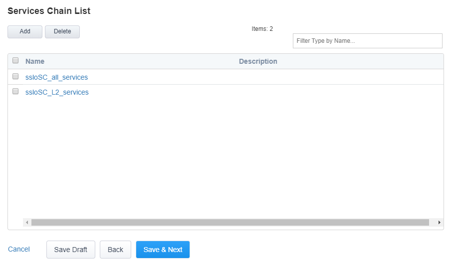

The **Service Chains** have now been configured.

- Click :red:`Save & Next` to continue to the next stage.

Security Policy
-------------------

.. image:: ../images/gc-path-5.png
   :align: center

Security policies are the set of rules that govern how traffic is processed in
SSLO. The "actions" a rule can take include:

- Whether or not to allow the traffic

- Whether or not to decrypt the traffic

- Which service chain (if any) to pass the traffic through

The SSLO Guided Configuration presents an intuitive rule-based, drag-and-drop
user interface for the definition of security policies.

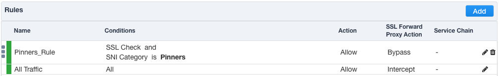

.. NOTE::
   In the background, SSLO maintains these security policies as visual
   per-request policies. If traffic processing is required that exceeds the
   capabilities of the rule-based user interface, the underlying per-request
   policy can be modified directly.

.. ATTENTION::
   If the per-request policy is modifed directly (outside of the
   SSLO Guide Configuration UI), the SSLO UI can no longer be used afterwards
   without losing your direct per-request policy modifications.

Add a New Rule
~~~~~~~~~~~~~~

In this lab, create an additional rule to bypass SSL for "Financial Data and
Services" and "Health and Medicine" URL categories.

-  Click :red:`Add` to create a new rule.

-  **Name** - provide a unique name for the rule (ex. ":red:`urlf_bypass`").

-  **Conditions** - Select **Category Lookup (All)** from the drop-down list
   and then add the :red:`Financial Data and Services` and :red:`Health and Medicine`
   URL categories. Start typing the category name to narrow the list.

   .. NOTE::
      The **Category Lookup (All)** condition provides categorization for
      TLS SNI, HTTP Connect and HTTP Host information.

-  **Action** - select :red:`Allow`.

-  **SSL Forward Proxy Action** - select :red:`Bypass`.

-  **Service Chain** - select the FireEye/TAP service chain
   :red:`L2_services`.

-  Click :red:`OK`.

   .. image:: ../images/module1-10.png

In the list of rules, notice that the **All Traffic** rule intercepts but
does *not* send traffic to any service chain. For the lab, edit this rule to
send all intercepted traffic to a service chain.

-  Click the pencil icon to :red:`edit` this rule.

-  **Service Chain** - select the service chain containing :red:`all` of the
   services.

-  Click :red:`OK`.

   .. image:: ../images/module1-11.png

-  **Server Certificate Status Check** - this option
   inserts additional security policy logic to validate the remote
   server certificate and return a blocking page to the user if the
   certificate is untrusted or expired. One or both of the Certificate
   Response options on the SSL Configuration page (Expire Certificate
   Response and Untrusted Certificate Response) must be set to 'ignore'.
   SSLO will "mask" the server certificate's attributes in order to
   present a blocking page with a valid forged certificate. For this lab,
   leave this option disabled.

-  Proxy Connect - this option allow you to add an upstream explicit proxy
   to your security rule chaining. You can add multiple proxy devices, or
   pool members, as necessary. For this lab, leave this option disabled.

The **Security Policy** has now been configured.

-  Click :red:`Save & Next` to continue to the next stage.

Interception Rule
---------------------

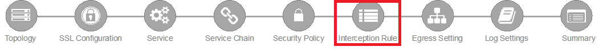

Interception rules are based on the selected topology and define the "listeners"
that accept and process different types of traffic (ex. TCP, UDP, other). The
resulting LTM virtual servers will bind the SSL settings, VLANs, IPs, and
security policies created in the topology workflow.

-  **Source Address** - the source address field provides a filter
   for incoming traffic based on source address and/or source subnet.
   It is usually appropriate to leave the default :red:`0.0.0.0%0/0`
   setting applied to allow traffic from all addresses to be processed.

-  **Destination Address/Mask** - the destination address/mask field
   provides a filter for incoming traffic based on destination
   address and/or destination subnet. As this is a transparent
   forward proxy configuration, it is appropriate to leave the
   default :red:`0.0.0.0%0/0` setting applied to allow all
   outbound traffic to be processed.

-  **Ingress Network - VLANs** - this defines the VLANs through which traffic
   will enter. For a transparent forward proxy topology, this would be a
   client-side VLAN. Select :red:`client-vlan` and move it to the right-hand
   side.

-  **Security Policy Settings - Access Profile** - the Access Profile
   selection is exposed for both explicit and transparent forward
   proxy topology deployments. In transparent forward proxy mode,
   this allows selection of an access policy to support captive
   portal authentication. For this lab,
   leave the default selection.

-  **L7 Interception Rules - Protocols** - FTP and email protocol traffic
   are all "server-speaks-first" protocols, and therefore SSLO must process
   these separately from typical client-speaks-first protocols like HTTP. This
   *optional* selection enables processing of each of these protocols, which create
   separate port-based listeners for each. In this lab, select :red:`FTP` and
   move it to the right-hand side.

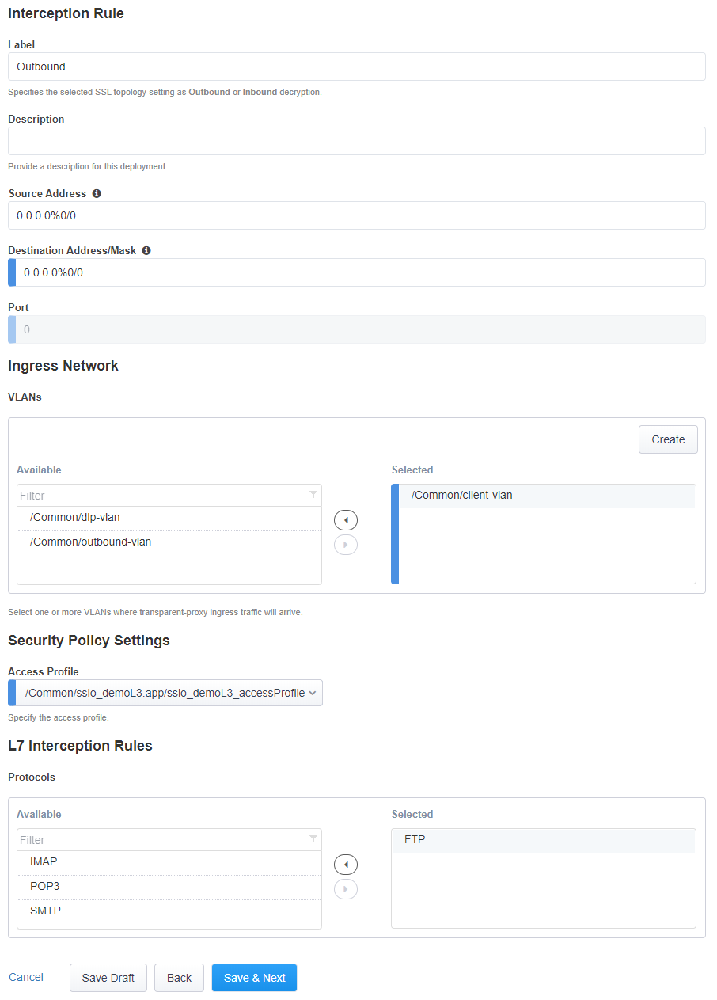

The **Interception Rules** have now been configured.

-  Click :red:`Save & Next` to continue to the next stage.

Egress Setting
------------------

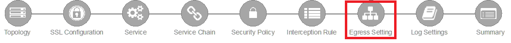

Traffic egress settings are now defined per-topology and manage both the
default gateway route and outbound SNAT settings.

-  **Manage SNAT Settings** - enables per-topology instance SNAT settings. For
   this lab, select :red:`Auto Map`.

-  **Gateways** - enables per-topology instance gateway routing. The options
   include: use the system Default Route, use an existing gateway pool, or
   create a new gateway. For this lab, select :red:`Create New`.

-  **IPv4 Outbound Gateways** - when creating a new gateway, this section
   provides the ratio and gateway address settings.

   -  **Ratio** - multiple gateway IP addresses are load balanced in an LTM pool,
      and the ratio setting allows SSLO to proportion traffic to the gateway
      members, as required. A ratio of 1 for all members evenly distributes the
      load across them. For this lab, select :red:`1`.

   -  **Address** - this is the next hop gateway IP address. For this lab, enter
      :red:`10.1.20.1`.

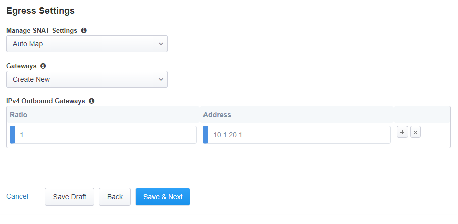

The **Egress Settings** have now been configured.

-  Click :red:`Save & Next` to continue to the next stage.

Log Settings
-----------------

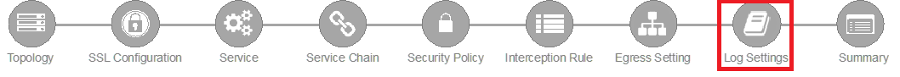

Log settings are defined per-topology. In
environments where multiple topologies are deployed, this can help to
streamline troubleshooting by reducing debug logging to the affected
topology.

Multiple discreet logging options are available:

-  **Per-Request Policy** - provides log settings for security policy
   processing. In Debug mode, this log facility produces an enormous
   amount of traffic, so it is recommended to only set Debug mode for
   troubleshooting. Otherwise the most appropriate setting is :red:`Error`
   to log only error conditions.

-  **FTP** - specifically logs error conditions for the built-in FTP
   listener when FTP is selected among the additional protocols in
   the Interception Rule configuration. The most appropriate setting
   is :red:`Error` to log only error conditions.

-  **IMAP** - specifically logs error conditions for the built-in
   IMAP listener when IMAP is selected among the additional protocols
   in the Interception Rule configuration. The most appropriate
   setting is :red:`Error` to log only error conditions.

-  **POP3** - specifically logs error conditions for the built-in
   POP3 listener when POP3 is selected among the additional protocols
   in the Interception Rule configuration. The most appropriate
   setting is :red:`Error` to log only error conditions.

-  **SMTP** - specifically logs error conditions for the built-in
   SMTP listener when SMTP is selected among the additional protocols
   in the Interception Rule configuration. The most appropriate
   setting is :red:`Error` to log only error conditions.

-  **SSL Orchestrator Generic** - provides log settings for generic
   SSLO processing. If Per-Request Policy logging is set to Error,
   and SSL Orchestrator Generic is set to Information, only the SSLO
   packet summary will be logged. Otherwise the most appropriate
   setting is :red:`Error` to log only error conditions.

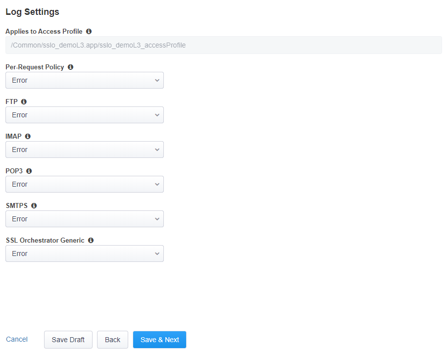

The **Log Settings** have now been configured.

-  Click :red:`Save & Next` to continue to the next stage.

Summary
------------

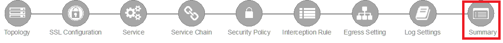

The summary page presents an expandable list of all of the workflow-configured
objects. To expand the details for any given setting, click the corresponding
arrow icon on the far right. To edit any given setting, click the corresponding
pencil icon. Clicking the pencil icon will send the workflow back to the
selected settings page.

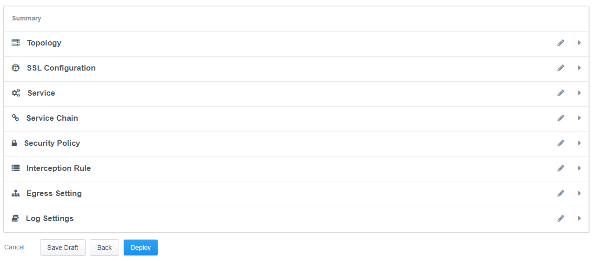

- When satisfied with the defined settings, click :red:`Deploy`.

Upon successfully deploying the configuration, SSL Orchestrator will now
display a **Configure** view:

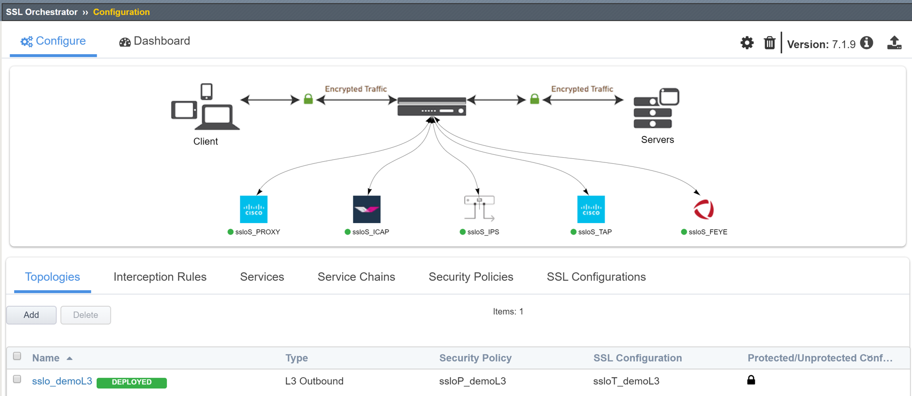

The **Interception Rules** tab shows the listeners that were created per the
selected topology.

.. image:: ../images/module1-17.png

In the above list:

- The **-in-t-4** listener defines normal TCP IPv4 traffic.

- The **-in-u-4** listener defines normal UDP IPv4 traffic.

- The **-ot-4** listener defines normal non-TCP/non-UDP IPv4 traffic.

- The **-ftp, -ftps** listeners create paths for each respective protocol.

This completes the configuration of SSL Orchestrator as a
transparent forward proxy.

In the next section, you will use an internal client
**(Desktop-Outbound)** to browse to external (Internet)
resources. Decrypted traffic will flow across the security services.
