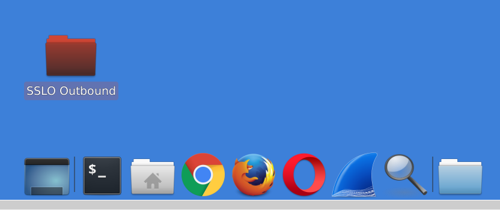
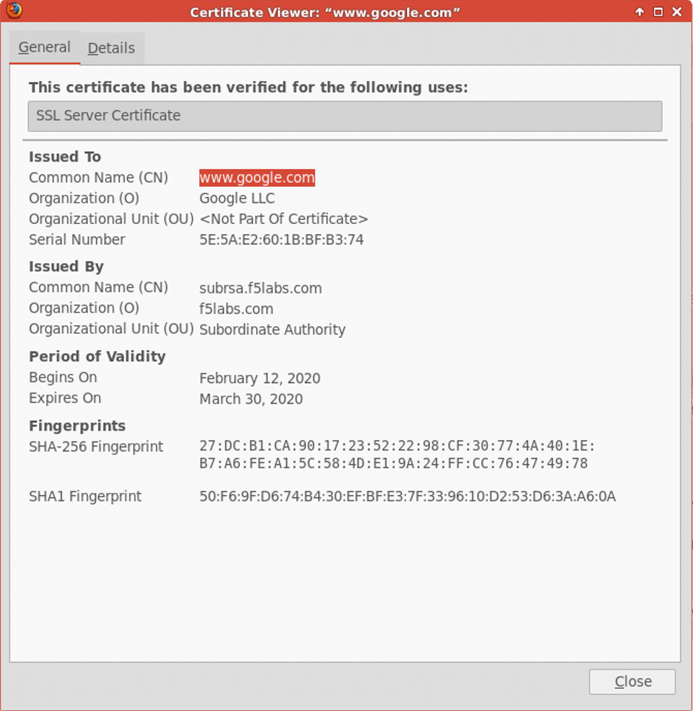

.. role:: red
.. role:: bred

Testing the deployment
==============================

To test the deployed solution, RDP to the :red:`Desktop-Outbound` client
machine.

- At the **Login to xrdp** window, click on the :red:`OK` button.

|

You will then see the Client desktop.

.. image:: ../images/module1-19-2.PNG
   :scale: 50 %
   :align: center

|

Server certificate test
-----------------------

Open a web browser (e.g., Firefox, Chrome) on the outbound client system and
navigate to any remote HTTPS site (e.g., https://www.google.com). Once the
site opens in the browser, check the server certificate of the site and verify
that it has been issued by the local CA configured in SSLO. This confirms that
the SSL forward proxy functionality enabled by SSL Orchestrator is working correctly.

|

Decrypted traffic analysis on the security services
---------------------------------------------------

Depending on the type of security service, it may be easier to log into the
console shell and run a similar tcpdump capture on the inbound or outbound
interface. A tcpdump capture usually requires *root* or *sudo* access.

Let's check if we see data on the TAP device.

-  In the UDF UI, select the :red:`Access` drop down selection on the :red:`Service - TAP` VM,
   then select :red:`WEB SHELL`.

-  In the web shell window, perform a packet capture using :red:`tcpdump`. The
   client machine's IP address is :red:`10.1.10.50`.

.. code-block:: bash

   sudo tcpdump -lnni eth1 -Xs0 host 10.1.10.50

-  Browse to an HTTPS web site (e.g., https://www.cnn.com) from the
   :red:`Desktop-Outbound` machine (RDP session)
   and notice that the TAP device is receiving traffic unencrypted.

-  Return to the web shell and press :red:`<CTRL-C>` to stop the tcpdump.

Let's check another security device. Perform a tcpdump on the IPS device to
observe the decrypted clear text traffic.

-  In the UDF UI, select the :red:`Access` drop down selection on the
   :red:`Service - Inline L3` VM, then select :red:`WEB SHELL`.

-  In the web shell window, perform a packet capture using :red:`tcpdump`. The
   client machine's IP address is :red:`10.1.10.50`. Recall that port remap was
   enabled so the unecrypted traffic will be seen on destination port 8181.

.. code-block:: bash

   sudo tcpdump -lnni eth1.10 -Xs0 host 10.1.10.50 and port 8181

-  Browse to an HTTPS web site (e.g., :red:`https://www.cnn.com`) from the
   :red:`Desktop-Outbound` machine (RDP session)
   and notice that the IPS device is receiving traffic unencrypted.

-  Return to the web shell and press :red:`<CTRL-C>` to stop the tcpdump.

-  Close out (exit) all Webshell windows.

.. ATTENTION::
   This is the end of the lab module.
