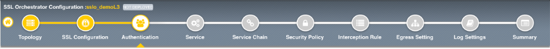
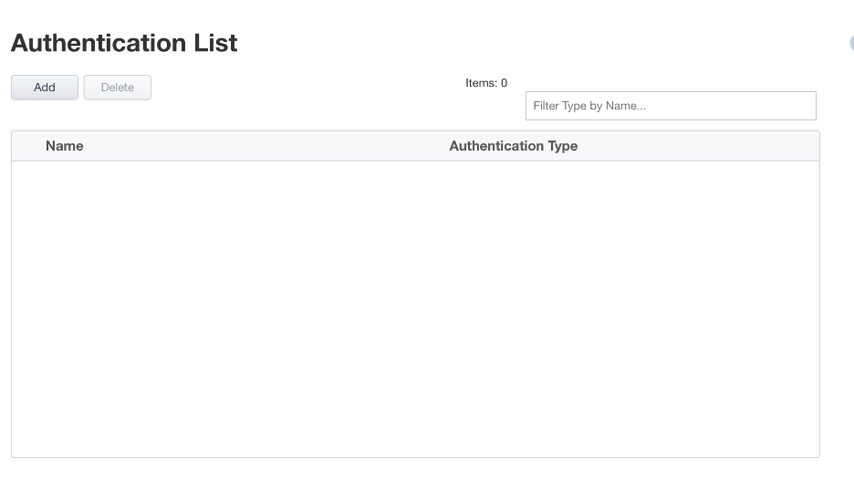

.. role:: red
.. role:: bred

Guided configuration SSL configurations
==========================================

In 9.0 and above，a new Authentication List workflow exists to create authentication mechanisms
for  a  topology.  In  this  initial  release,  the  Authentication  List  simply  contains  an  OCSP  Responder 
configuration. The list of authentication mechanisms will grow in subsequent versions.

Essentially, this OCSP Responder configuration creates an OCSP service on the client side. An iRule 
is then added to the interception rule VIP that inserts the FQDN into the forged server certificate 
that should resolve to the destination IP address defined in the setting, which is itself a separate 
virtual server with OCSP profile configuration.The applied SSL settings must also contain a valid 
server side OCSP configuration in order to report back actual revocation state to the OCSP profile.

**For this lab:**

.. note:: You can leave everything as default on this page.

-  Click :red:`Save & Next` to continue to the next stage.

|
.. note:: There are no additional hands-on steps that need to be taken before proceeding to the next section.  The information below is intended to provide additional context on the SSL Configurations.

**OCSP Responder**

You can configure a Local Online Certificate Status Protocol (OCSP) Responder and  associate  a  Local  OCSP  Responder  to  a  virtual  server.  OCSP  is  an  Internet  protocol  used  to obtain the revocation status of a digital certificate. When the validity of a certificate is requested, an OCSP request is sent to an OCSP Responder and checks the specific certificate with a trusted certificate  authority.  This  results  in  an  OCSP  response  being  sent  back  of  good,  revoked,  or unknown. To configure OCSP, you must select TCP or Any as your Protocol and either L2 Outbound, L3 Outbound, or L3 Explicit Proxy as your SSL Orchestrator topology from the Topology Properties screen. To create a new authentication, click Add. The Authentication Properties screen appears where you canselect OCSP Responder (for the Client). Click OCSP Responder and click Add. The Authentication Properties screen appears where you can configure a new OCSP Responder. Later when  configuring  the  Interception  Rule,  you  may  select  from  the  Authentication  section  OCSP Responder list to associate a Local OCSP Responder into the Interception Rule. This action adds a new iRule to the virtual server. In addition, you may configure authentication using the mini-flow Authentication tab without creating a topology and may utilize the existing iRule item-selector to select the OCSP iRule.

-  **FQDN** - Enter an FQDN that will be injected into the authorityInfoAccess (AIA) field of the forged server certificate. This should resolve to the virtual server address listed below.

-  **Source** - Enter a source address filter here, as required. Otherwise leave as 0.0.0.0%0/0 to allow access from any source.§Destination Address/Mask: Enter the destination address and mask here that will match the FQDN value in the forged AIA value.

-  **Port** - Enter  the  destination  port  here  for  the  OCSP  service.  This  will  almost  always  be unencrypted HTTP on port 80.

-  **VLANs** - Select the client facing VLAN.§SSL  Configuration: Select  the  SSL  configuration  previously  created  for  this  topology workflow.

-  **OCSP Profile** - Select Create Newor Use Existingas required.

-  **Max Age in Seconds** - Enter a value in seconds for max age of the OCSP response.§Nonce: Enable or disable OCSP response nonce, as required.

-  **[Advanced] Client TCP Profile** - Select an alternate client-side TCP profile, as required.§[Advanced] Server TCP Profile: Select an alternate server-side TCP profile, as required.

-  **[Advanced] HTTP Profile** - Select an alternate HTTP profile, as required.

