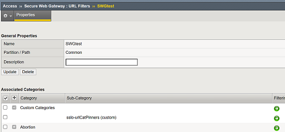
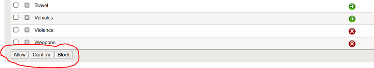

.. role:: red
.. role:: bred

Define custom SWG Per-Request Policies
===========================================================================

-  SWG must be licensed and provisioned
-  To get SWG reporting, URL Request logging must be configured
-  Per-Session Access Profiles with a simple **start - allow** are sufficient
   since the Per-Request policy handles the bulk of SWG processing
-  **Access Profile Scope** - For this lab we will simply be using **Named** scopes

-  The first task will be to create a custom URL category filter
-  Conversely, you can simply select one of the built-in URL category filters **allow-all, basic-security, block-all, default**

   
   
   
   

   
   

Creating an SWG per-request policy
===========================================================================

   From the left-hand menu, navigate to
   **Access, Profiles/Policies, Per-Request Policies**. Click
   the **Create** button.

-  **Name** enter a unique name
-  **Policy Type** select **All**
-  **Incomplete Action** select **All**
-  **Customization Type** select the appropriate language(s)

   Once complete, edit the new SWG per-request policy VPE.  You can begin
   adding functionality directly, or you can start with one of the pre-built macro templates.
   Click the **Add New Macro** button and select from one of the three templates and click
   **save**.  Now add that macro to the primary policy flow to enable it.  Make any additional
   modifications as requred.
   
  
 .. image:: ../images/per-request1.PNG
 
   
   
 .. image:: ../images/url-categories3.PNG
   
   
   

-  While most options are possible within the SWG per-request policy
   several are not appropriate for an inline SWG service including the list
   below.
   
-  Assignment
      **Pool Assignment**
-  General
      **IP Based SSL Bypass Set, Server Cert Response Control, Server Cert Status, SSL Check, SSL Intercept Set, SSL Configuration Select**
-  Traffic Management
      **Proxy Select, Service Connect, Session Check**
      

Applying the new Per-Request policy to SSL Orchestrator
===========================================================================

-  Once the new Per-Request policy has been configured it can then be applied
   to the SSL Orchestrator Topology.

      
      
      
      
      
      
   
   
   
   
   

