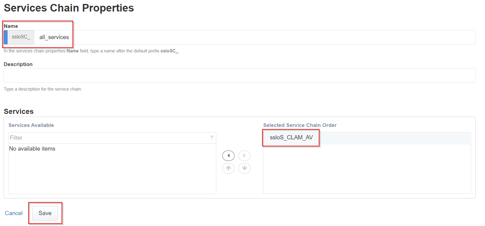

.. role:: red
.. role:: bred

Guided Configuration Service Chain List
=======================================

.. image:: ../images/gc-path-4.png
   :align: center

Service chains are arbitrarily-ordered lists of security devices. Based on
environmental requirements, different service chains may contain different
re-used sets of services, and different types of traffic can be assigned to
different service chains. For example, HTTP traffic may need to go through all
of the security services, while non-HTTP traffic goes through a subset, and
traffic destined to a financial service URL can bypass decryption and still
flow through a smaller set of security services.

.. warning:: The diagram below is designed to illustrate the power of SSL Orchestrator's dynamic service chains. Please note that it does not match this lab's specific configuration.

.. image:: ../images/module1-7.png

-  Click :red:`Add` to create a new service chain.

   -  **Name** - provide a unique name to this service chain
      (ex.":red:`all_services`").

   -  **Services** - select the :red:`CLAM_AV` ICAP service and click the 
   -  :red:`rightward-pointing arrow` to move it to the :red:`Selected Service Chain Order` side.

   -  Click :red:`Save`.

.. image:: ../images/chaincomplete.png

The preliminary :red:`Service Chain` has now been configured.

-  Click :red:`Save & Next` to continue to the next stage.

.. image:: ../images/module1-4.png