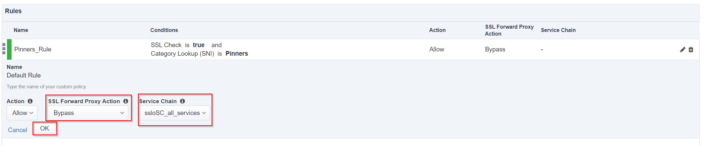

.. role:: red
.. role:: bred

Guided Configuration Security Policy
=====================================

.. image:: ../images/gc-path-5.png
   :align: center

Security policies are the set of rules that govern how traffic is processed in
SSLO. The "actions" a rule can take include:

- Whether or not to allow the traffic

- Whether or not to decrypt the traffic

- Which service chain (if any) to pass the traffic through

The SSLO Guided Configuration presents an intuitive rule-based, drag-and-drop
user interface for the definition of security policies.

.. image:: ../images/policy1.png
   :align: center

-  In the Security Policy, click the pencil at the far right of the :red:`All Traffic` rule.

- Select the :red:`SSL Forward Bypass Action` drop down menu and select :red:`Bypass`.

- Select the :red:`Service Chain` drop down menu and select :red:`ssloSC_all_services`.

-  Click :red:`OK`.

The preliminary :red:`Security Policy` has now been configured.

Click :red:`Save & Next` to continue to the next stage.

.. image:: ../images/module1-4.png

.. tip::
   In the background, SSLO maintains these security policies as visual
   per-request policies. If traffic processing is required that exceeds the
   capabilities of the rule-based user interface, the underlying per-request
   policy can be modified directly.

.. warning::
   If the per-request policy is modifed directly (outside of the
   SSLO Guide Configuration UI), the SSLO UI can no longer be used afterwards
   without losing your direct per-request policy modifications.

.. note:: There are no additional hands-on steps that need to be taken by the student before proceeding to the next section.  The information below is intended to provide additional context on the ICAP Service.

Add a New Rule
~~~~~~~~~~~~~~

In this lab, create an additional rule to bypass SSL for "Financial Data and
Services" and "Health and Medicine" URL categories.

-  Click :red:`Add` to create a new rule.

-  **Name** - provide a unique name for the rule (ex. ":red:`urlf_bypass`").

-  **Conditions** - Select **Category Lookup (All)** from the drop-down list
   and then add the :red:`Financial Data and Services` and :red:`Health and Medicine`
   URL categories. Start typing the category name to narrow the list.

   .. NOTE::
      The **Category Lookup (All)** condition provides categorization for
      TLS SNI, HTTP Connect and HTTP Host information.

-  **Action** - select :red:`Allow`.

-  **SSL Forward Proxy Action** - select :red:`Bypass`.

.. ATTENTION::
  Bypass will not decrypt.  We setting bypass temporarily so we can validate the original behavior, after which we will enable decryption.

-  **Service Chain** - select the FireEye/TAP service chain
   :red:`L2_services`.

-  Click :red:`OK`.

   .. image:: ../images/module1-10.png

In the list of rules, notice that the **All Traffic** rule intercepts but
does *not* send traffic to any service chain. For the lab, edit this rule to
send all intercepted traffic to a service chain.

-  Click the pencil icon to :red:`edit` this rule.

-  **Service Chain** - select the service chain containing :red:`all` of the
   services.

-  Click :red:`OK`.

   .. image:: ../images/module1-11.png

-  **Server Certificate Status Check** - this option
   inserts additional security policy logic to validate the remote
   server certificate and return a blocking page to the user if the
   certificate is untrusted or expired. One or both of the Certificate
   Response options on the SSL Configuration page (Expire Certificate
   Response and Untrusted Certificate Response) must be set to 'ignore'.
   SSLO will "mask" the server certificate's attributes in order to
   present a blocking page with a valid forged certificate. For this lab,
   leave this option disabled.

-  Proxy Connect - this option allow you to add an upstream explicit proxy
   to your security rule chaining. You can add multiple proxy devices, or
   pool members, as necessary. For this lab, leave this option disabled.

