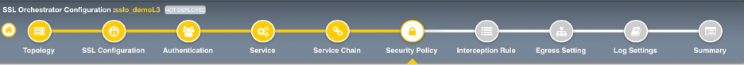
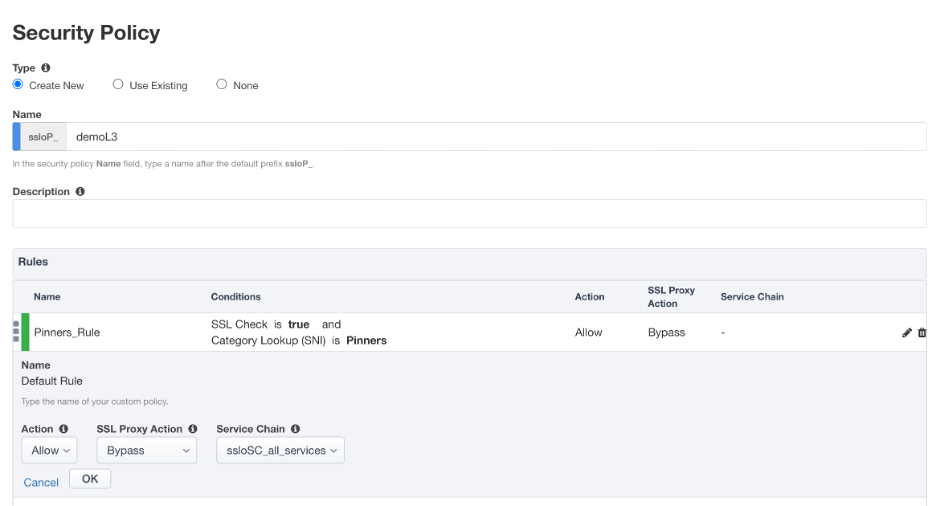

.. role:: red
.. role:: bred

Guided configuration Security Policy
=====================================

Security policies are the set of rules that govern how traffic is processed in
SSLO. The "actions" a rule can take include:

- Whether or not to allow the traffic

- Whether or not to decrypt the traffic

- Which service chain (if any) to pass the traffic through

The SSLO Guided Configuration presents an intuitive rule-based, drag-and-drop
user interface for the definition of security policies.

.. image:: ../images/module1-36.png
   :align: center
   :scale: 100

-  In the Security Policy, click the pencil at the far right of the :red:`All Traffic` rule.

- Click on the :red:`SSL Proxy Action` drop down menu and select :red:`Bypass`.

- Click on the :red:`Service Chain` drop down menu and select :red:`ssloSC_all_services`.

-  Click :red:`OK`.

The preliminary :red:`Security Policy` has now been configured.

Click :red:`Save & Next` to continue to the next stage.

.. image:: ../images/module1-4.png
   :scale: 50 %
   :align: center

.. tip::
   In the background, SSLO maintains these security policies as visual
   per-request policies. If traffic processing is required that exceeds the
   capabilities of the rule-based user interface, the underlying per-request
   policy can be modified directly.

.. warning::
   In a production environment, additional policy customization is possible 
   manually outside of guided configuration, but strong caution should be taken.
   If the per-request policy is modified directly, any
   future guided configuration changes will overwrite the manual changes.

.. note:: There are no additional hands-on steps that need to be taken before proceeding to the next section.  The information below is intended to provide additional context on the security policy.

Security policy
----------------

   .. NOTE::
      The **Category Lookup (All)** condition provides categorization for
      TLS SNI, HTTP Connect and HTTP Host information.

In the list of rules, notice that the **All Traffic** rule intercepts but
does *not* send traffic to any service chain. 

-  **Server Certificate Status Check** - this option
   inserts additional security policy logic to validate the remote
   server certificate and return a blocking page to the user if the
   certificate is untrusted or expired. One or both of the Certificate
   Response options on the SSL Configuration page (Expire Certificate
   Response and Untrusted Certificate Response) must be set to 'ignore'.
   SSLO will "mask" the server certificate's attributes in order to
   present a blocking page with a valid forged certificate. For this lab,
   leave this option disabled.

-  Proxy Connect - this option allow you to add an upstream explicit proxy
   to your security rule chaining. You can add multiple proxy devices, or
   pool members, as necessary. For this lab, leave this option disabled.

