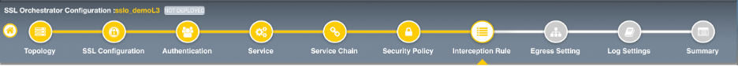
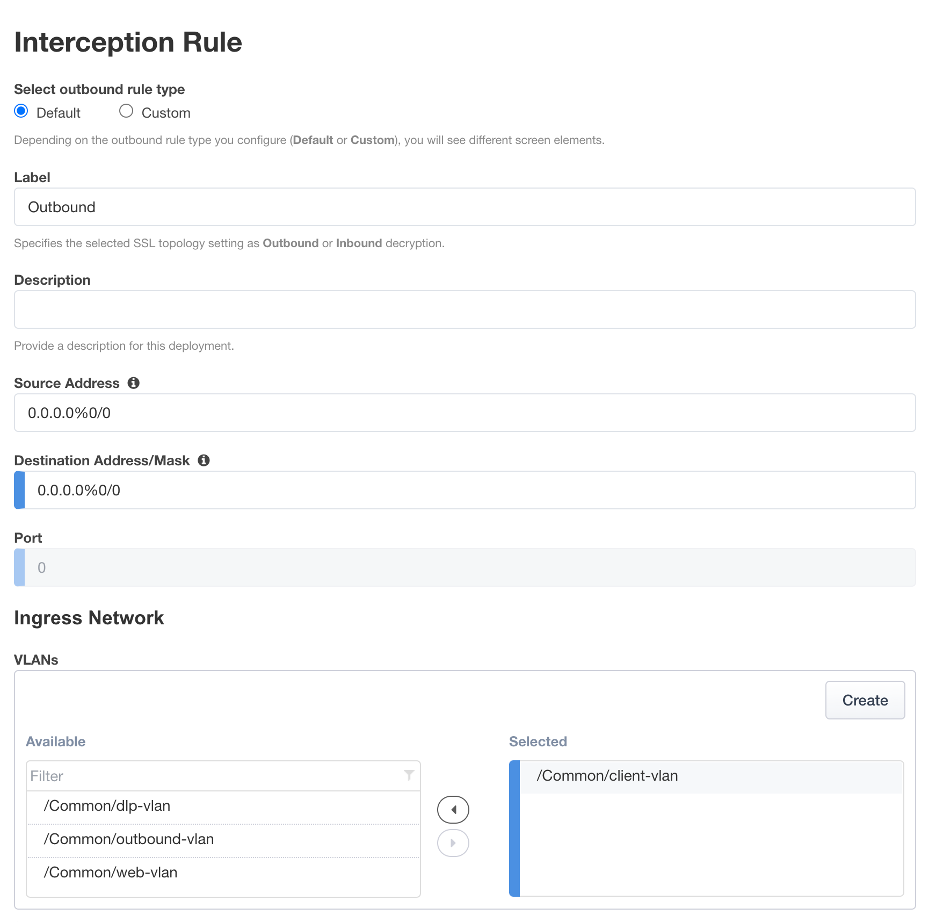
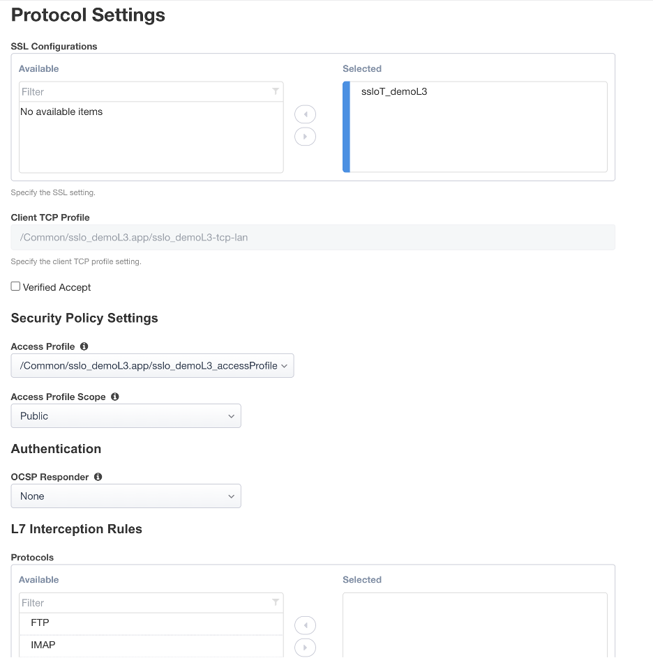

.. role:: red
.. role:: bred

Guided configuration Interception Rule
========================================

Interception rules are based on the selected topology and define the "listeners"
that accept and process different types of traffic (ex. TCP, UDP, other). The
resulting LTM virtual servers will bind the SSL settings, VLANs, IPs, and
security policies created in the topology workflow.

-  **Source Address** - the source address field provides a filter
   for incoming traffic based on source address and/or source subnet.
   It is usually appropriate to leave the default :red:`0.0.0.0%0/0`
   setting applied to allow traffic from all addresses to be processed.

-  **Destination Address/Mask** - the destination address/mask field
   provides a filter for incoming traffic based on destination
   address and/or destination subnet. As this is a transparent
   forward proxy configuration, it is appropriate to leave the
   default :red:`0.0.0.0%0/0` setting applied to allow all
   outbound traffic to be processed.

-  **Ingress Network - VLANs** - this defines the VLANs through which traffic
   will enter. For a transparent forward proxy topology, this would be a
   client-side VLAN. Select :red:`client-vlan` and move it to the right-hand
   side.

-  **Security Policy Settings - Access Profile** - the Access Profile
   selection is exposed for both explicit and transparent forward
   proxy topology deployments. In transparent forward proxy mode,
   this allows selection of an access policy to support captive
   portal authentication. For this lab,
   leave the default selection.

-  **L7 Interception Rules - Protocols** - FTP and email protocol traffic
   are all "server-speaks-first" protocols, and therefore SSLO must process
   these separately from typical client-speaks-first protocols like HTTP. This
   *optional* selection enables processing of each of these protocols, which create
   separate port-based listeners for each. For this lab,
   leave the default selection.

The **Interception Rule** has now been configured.
Click :red:`Save & Next` to continue to the next stage.

.. image:: ../images/module1-4.png
   :scale: 100 %
   :align: center
