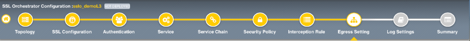

.. role:: red
.. role:: bred

Guided configuration Egress Setting
===================================

Traffic egress settings are defined per-topology and manage both the
default gateway route and outbound SNAT settings.

-  **Manage SNAT Settings** - enables per-topology instance SNAT settings. For
   this lab, select :red:`Auto Map`.

-  **Gateways** - enables per-topology instance gateway routing. The options
   include: use the system Default Route, use an existing gateway pool, or
   create a new gateway. For this lab, select :red:`Create New`.

-  **IPv4 Outbound Gateways** - when creating a new gateway, this section
   provides the ratio and gateway address settings.

   -  **Ratio** - multiple gateway IP addresses are load balanced in an LTM pool,
      and the ratio setting allows SSLO to proportion traffic to the gateway
      members, as required. A ratio of 1 for all members evenly distributes the
      load across them. For this lab, select :red:`1`.

   -  **Address** - this is the next hop gateway IP address. For this lab, enter
      :red:`10.1.20.1`.

.. image:: ../images/module1-48.png
   :scale: 50 %
   :align: center

The **Egress Settings** have now been configured.

-  Click :red:`Save & Next` to continue to the next stage.

.. image:: ../images/module1-4.png
   :scale: 100 %
   :align: center