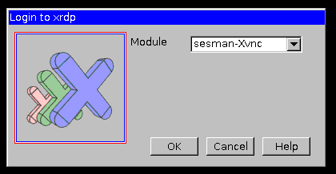
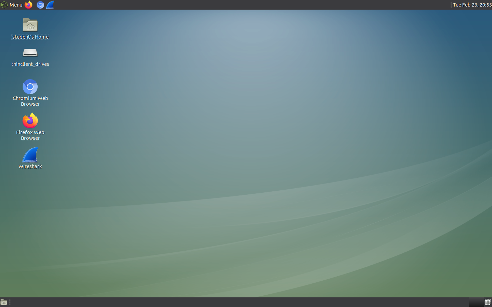
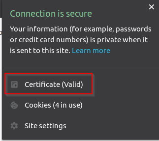

.. role:: red
.. role:: bred

Review behavior prior to decryption
===================================

This test will demonstrate that:

- Traffic is not being decrypted

- The "malicious" file will pass through the network-based scanner and be download to the client.

RDP to the Client machine
---------------------------------------------------

- From UDF, find the :red:`Ubuntu18.04 Client`.

- Click :red:`Access`.

- Under xRDP, choose your preferred resolution.

.. image:: ../images/module1-50.png
   :scale: 50 %
   :align: center 

- At the **Login to xrdp** window, click on the :red:`OK` button.

You will then see the Client desktop.

Server certificate test
-----------------------

Open a web browser (e.g., Firefox, Chromium) on the outbound client system and
navigate to any remote HTTPS site (e.g., https://www.google.com). Once the
site opens in the browser, check the server certificate of the site and notice
that it is signed by a public certificate authority (CA). 

**This confirms that the certificate re-write and SSL forward proxy decryption functionality provided by SSL Orchestrator is currently disabled.**

Encrypted traffic test on the security service
----------------------------------------------

Open a web browser (e.g., Firefox, Chromium) on the outbound client system and
navigate to https://eicar.org/?page_id=3950. Scroll down to the section labeled 
:red:`Download area using the secure, SSL enabled protocol HTTPS` and click on :red:`eicar.com`. 
This is a non-malicious file that antivirus products will detect for testing purposes. 

.. image:: ../images/module1-34.png
   :scale: 50 %
   :align: center

**Notice that the encrypted malware test file is scanned by CLAM_AV and downloaded 
to the client without issue.**

In the next section, you will perform the same test after enabling decryption.
