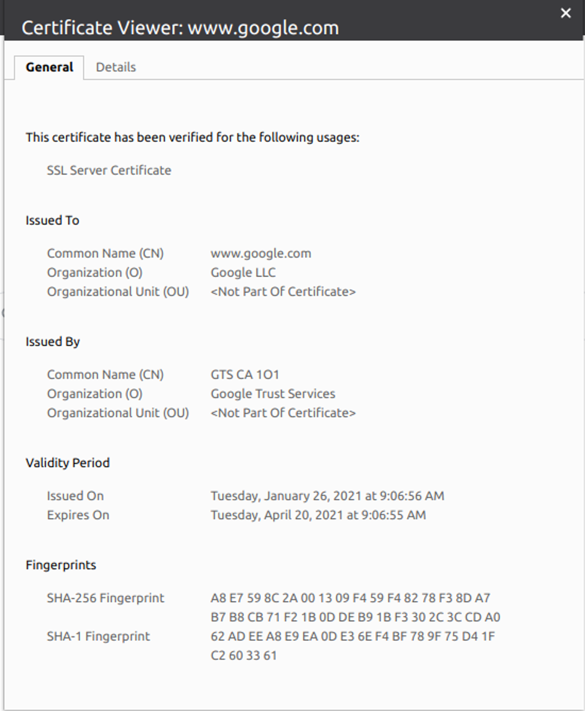

.. role:: red
.. role:: bred

Review behavior prior to decryption
===================================

This test is going to demonstrate the behavior of downloading a malicious encrypted file, WITHOUT decrypting and inspecting it.

RDP to the :red:`Ubuntu18.04 Client` machine
---------------------------------------------------

- At the **Login to xrdp** window, click on the :red:`OK` button.

.. image:: ../images/module1-18.png
   :scale: 50 %
   :align: center

|

You will then see the Client desktop.

.. image:: ../images/module1-19.png
   :scale: 50 %
   :align: center

|

Server certificate test
-----------------------

Open a web browser (e.g., Firefox, Chromium) on the outbound client system and
navigate to any remote HTTPS site (e.g., https://www.google.com). Once the
site opens in the browser, check the server certificate of the site and notice
that it is signed by a public certificate authority (CA). This confirms that
the SSL forward proxy and certificate re-write functionality provided by SSL Orchestrator is currently disabled.

|

Encrypted traffic test on the security service
----------------------------------------------

Open a web browser (e.g., Firefox, Chromium) on the outbound client system and
navigate to https://eicar.org/?page_id=3950. Scroll down to the section labeled 
:red:`Download area using the secure, SSL enabled protocol HTTPS` and click on :red:`eicar.com`. 
This is a non-malicious file that antivirus products will detect for testing purposes. 
Notice that the encrypted malware test file is scanned by CLAM_AV and downloaded 
to the client without issue.

.. image:: ../images/module1-19-3.png
   :scale: 50 %
   :align: center

The encrypted file should download to the client with no issue.

In the next section, you will perform the same test after enabling decryption.
