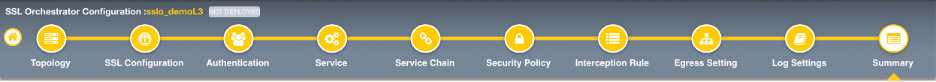
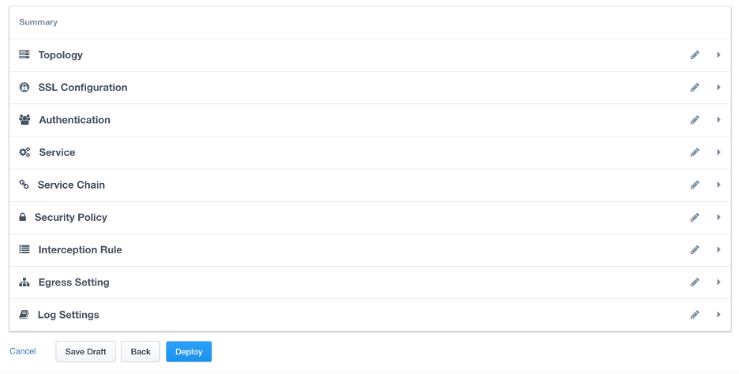
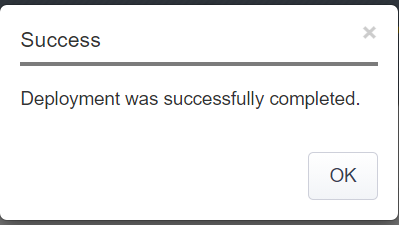
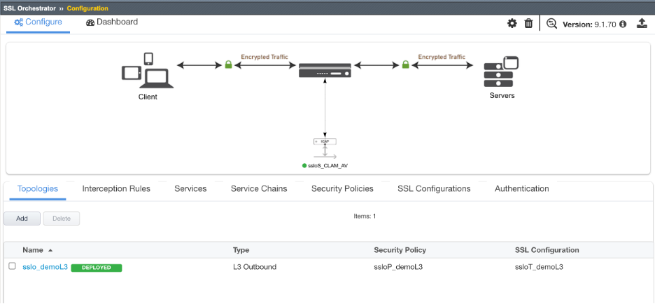
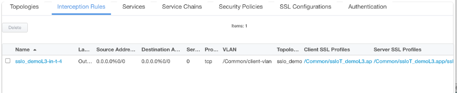

.. role:: red
.. role:: bred

Guided configuration summary
=============================

The summary page presents an expandable list of all of the workflow-configured
objects. To expand the details for any given setting, click the corresponding
arrow icon on the far right. To edit any given setting, click the corresponding
pencil icon. Clicking the pencil icon will send the workflow back to the
selected settings page.

- When satisfied with the defined settings, click :red:`Deploy`.

Upon successfully deploying the configuration, SSL Orchestrator will now
display a **Configure** view:

The **Interception Rules** tab shows the listener that were created per the
selected topology.

In the above list:

- The **-in-t-4** listener defines normal TCP IPv4 traffic.

- The **-in-u-4** listener defines normal UDP IPv4 traffic.

- The **-ot-4** listener defines normal non-TCP/non-UDP IPv4 traffic.

This completes the Guided Configuration of SSL Orchestrator as a
transparent forward proxy.

In the next section, you will use an internal client
**(Ubuntu18.04 Client)** to browse to external (Internet)
resources. Decrypted traffic will flow across the security service.
