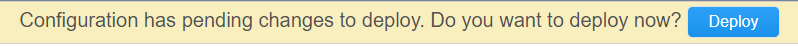
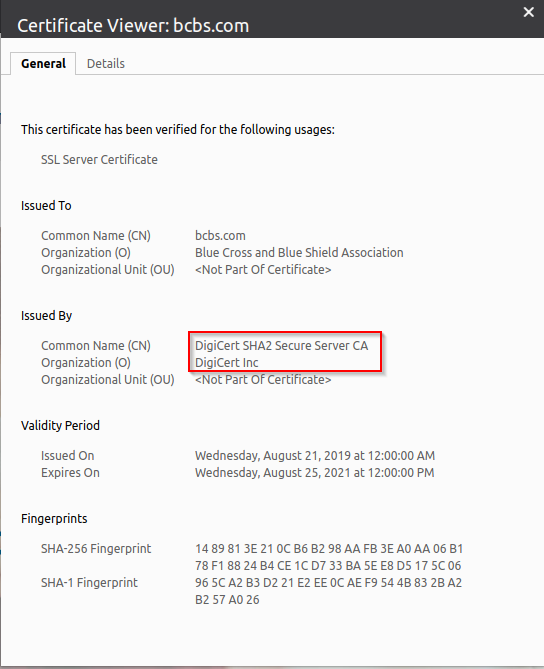

.. role:: red
.. role:: bred

Configure and test selective decryption by URL category
=======================================================

This test will demonstrate that traffic to select URLs (Financial and Medical) are no longer decrypted.

Enable SSL bypass
------------------ 

- Return to SSL Orchestrator Guided Configuration.  

- Click on the :red:`sslo_demoL3` topology.

- In the configuration summary, find the row labeled :red:`Security Policy` and click on the pencil at the far right.

Here, you will create a an additional rule for "Financial Data and
Services" and "Health and Medicine" URL categories.

   .. image:: ../images/module1-30.png
   :scale: 50 %
   :align: center

-  Click :red:`Add` to create a new rule.

-  **Name** - provide a unique name for the rule (ex. ":red:`urlf_bypass`").

-  **Conditions** - Select **Category Lookup (All)** from the drop-down list
   and then add the :red:`Financial Data and Services` and :red:`Health and Medicine`
   URL categories. Start typing the category name to narrow the list.

   .. NOTE::
      The **Category Lookup (All)** condition provides categorization for
      TLS SNI, HTTP Connect and HTTP Host information.

-  **Action** - select :red:`Allow`.

-  **SSL Forward Proxy Action** - select :red:`Bypass`.

-  **Service Chain** - select the :red:`all_services` service chain.

-  Click :red:`OK`.

   .. image:: ../images/module1-29.png
   :scale: 50 %
   :align: center

Rule list after URL-based selective decryption
   .. image:: ../images/module1-28.png
   :scale: 50 %
   :align: center

- Click :red:`Save & Next`.

- Pause for a few seconds and the yellow banner shown below will appear at the very top of the :red:`Interception Rule` settings.

- Click :red:`Deploy`.

Financial and medical site test
---------------------------------

- Return to your Ubuntu client RDP session.

- Open a web browser (e.g., Firefox, Chromium) on the outbound client system and navigate to https://bcbs.com. 

- Once the site opens in the browser, check the server certificate of the site.

**Notice that it now shows it is issued by a public CA (not SSL Orchestrator).  This means that this traffic is not decrypted because it belongs to the Health and Medicine URL category.**

- Try the same test for https://wellsfargo.com.  This certificate should also be signed by a public CA, and therefore not decrypted, as it belongs to the Financial Data and Services URL category.

.. image:: ../images/module1-26.png
   :scale: 50 %
   :align: center

**This certificate should also be signed by a public CA, and therefore not decrypted, as it belongs to the Financial Data and Services URL category.**

In the next section, you will review the SSL Orchestrator Dashboard.