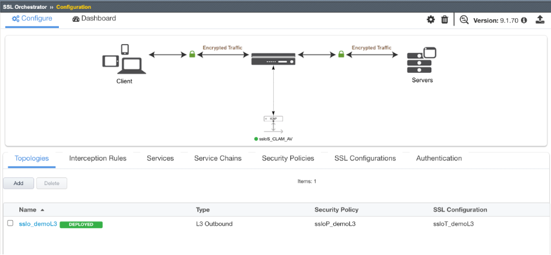

.. role:: red
.. role:: bred

View dashboard
=======================================================

The SSL Orchestrator dashboard provides valuable at-a-glance information regarding
availability, performance, TLS details, and more.

For this lab:

-  Navigate back to the SSL Orchestrator GUI.

-  Instead of re-entering the toplogy, click on :red:`Dashboard` as shown in the image below.

-  Review your dashboard, which should look similar to the image below.

.. image:: ../images/module1-25.png
   :scale: 100 %
   :align: center

.. note:: This is the end of the main section of this lab.  You are welcome to proceed to the remaining optional sections if time permits.
