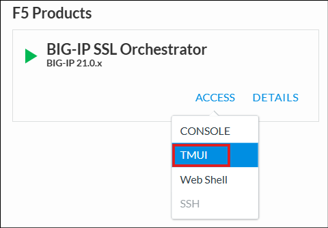
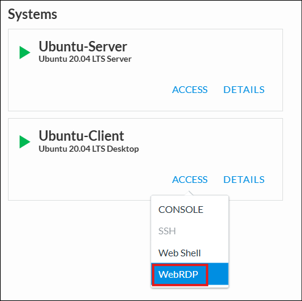

Accessing the Virtual Lab
================================================================================

If you are not familiar with the process for joining an F5 UDF-based course, refer to:

- |join_link|
- |interface_link|

#. You should have received a course registration email that contains the course link. Click on the link and log into the UDF student portal.

   .. important::
      If MFA is not configured for your account, you will be asked to set it up before proceeding.

#. In the UDF Dashboard, you will see a list of sessions that you are registered for. Find the session for this lab and click on the **Launch** link.

#. Click on the **JOIN** button to enter the lab session.

#. Review the information provided in the **Documentation** tab. It will also include a link to the Lab Guide (this document).

#. Click on the **DEPLOYMENT** tab to see all of your lab resources.

   .. image:: ./images/udf-deployment.png
      :align: center

   |

   .. note::

      It takes about 10 minutes for the lab resources to be provisioned and start up. Please wait until you see the green indicator beside all of the resources.

|

You will only need your local web browser to access the lab resources.

To access a lab VM, click on the **ACCESS** link to view the remote access methods and then click on the desired option. Here is an example:

|

Browser-based Remote Desktop access to the **Ubuntu-Client** is provided via the Guacamole service (**WEBRDP** access link) that runs on the **Ubuntu-Client** instance.

|

.. list-table::
   :header-rows: 1
   :widths: auto

   * - Virtual Machines
     - Access Methods Used In this Lab
   * - BIG-IP SSL Orchestrator
     - TMUI - Browser-based GUI session
   * - Ubuntu-Client
     - WEBRDP - Browser-based RDP to **Ubuntu-Client** Desktop
   * - Ubuntu-Server
     - WIRESHARK TAP - Wireshark Web Interface

.. |join_link| raw:: html

      <a href="https://help.udf.f5.com/en/articles/3832165-how-to-join-an-f5-training-course" target="_blank"> How to join an F5 training course </a>

.. |interface_link| raw:: html

      <a href="https://help.udf.f5.com/en/articles/3832340-f5-training-course-interface" target="_blank"> F5 Training Course Interface </a>

