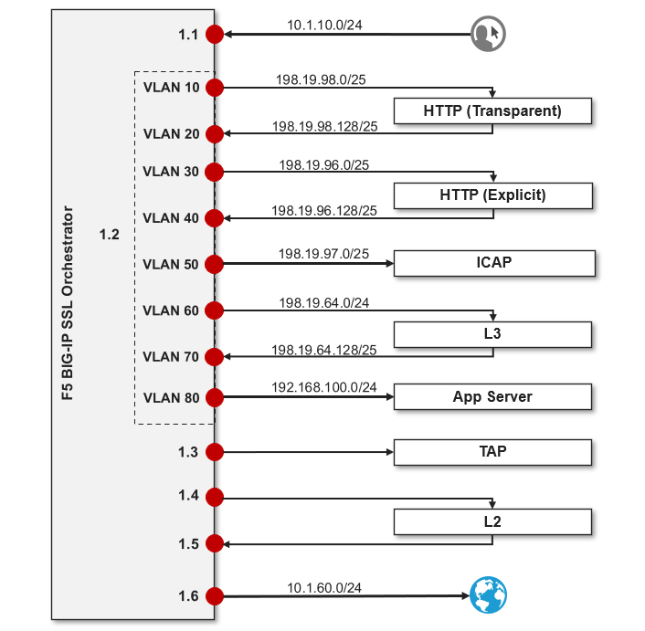

Lab Environment Details
================================================================================

About the Lab Blueprint
--------------------------------------------------------------------------------

This section acts as reference for the configuration and resources used in multiple AppWorld SSL Orchestrator labs. The corresponding UDF blueprint supports both both outbound and inbound SSL visibility and inspection use-cases.

|

.. note::
   **You will only use a subset of these interfaces and services in this course, so the relevant resources are noted at the beginning of each lab module.**

|

To simplify the creation of inspection services for this lab, this UDF blueprint uses a containerized services architecture. All security services are consolidated into a single Ubuntu server instance and built using a Docker Compose file which is made available `here <https://github.com/kevingstewart/sslo-consolidated-services>`_.

This is a diagram of the virtual lab environment from the perspective of the BIG-IP SSL Orchestrator. The numbers inside the SSL Orchestrator box indicate the interface  numbers and VLAN tags (if applicable). The VLANs and IP subnets are either pre-configured or will be configured as you work through the lab exercises.

The first interface is connected to the client-facing VLAN. The last interface is connected to the Internet-facing VLAN. One of the tagged interfaces connects to the application server VLAN. The remaining interfaces are connected to various types of security services: inline L2, inline L3, HTTP, ICAP, and passive Tap. The SSL Orchestrator management interface is not shown.

|

**Networking Summary**

.. list-table::
   :header-rows: 1
   :widths: auto

   * - Interface
     - IP
     - Description
   * - Management
     - 10.1.1.7/24
     - Management VLAN
   * - 1.1
     - 10.1.10.7/24
     - Client-Side VLAN (Ubuntu-Client)
   * - 1.2 (Tag 30)
     - 198.19.96.7/25
     - Inline HTTP service - Inbound
   * - 1.2 (Tag 40)
     - 198.19.96.245/25
     - Inline HTTP service - Outbound
   * - 1.2 (Tag 50)
     - 198.19.97.7/25
     - ICAP Service - Inbound/Outbound
   * - 1.2 (Tag 60)
     - 198.19.64.7/25
     - Inline L3 service - Inbound
   * - 1.2 (Tag 70)
     - 198.19.64.245/25
     - Inline L3 service - Outbound
   * - 1.2 (Tag 80)
     - 192.168.100.7/24
     - Server-side (lab webservers)
   * - 1.3
     - 198.19.97.7/25
     - TAP service - Inbound
   * - 1.4
     - N/A
     - Inline L2 service - Inbound
   * - 1.5
     - N/A
     - Inline L2 service - Outbound
   * - 1.6
     - 10.1.60.7/24
     - Internet

|

.. note::

   It is a security best practice to isolate security
   devices within the protected network enclaves provided by SSL
   Orchestrator. Administrators will often desire NOT to move or change
   existing security services. However, while possible, passing this
   decrypted traffic to points on an existing network architecture could
   create multiple points of data exposure. Usernames, passwords, credit
   card numbers and other personally identifiable information (PII) could be exposed to
   other devices on that network. It is thus recommended that security
   devices exist in a "private enclave" local to the BIG-IP instance(s).
   Please keep this in mind when defining the network
   settings for the inspection services.*

|

**Pre-defined Configuration**

The lab environment for this guide includes some prerequisite configuration settings that you
should be aware of. These are provided to simplify this course. If you wish to use
this lab guide with your own environment, please ensure that you create these objects in advance.

-  **Client side VLAN and subnet are pre-defined**

   This is the VLAN that a client connects to for traffic flows. SSL Orchestrator does
   not define the client-side VLAN(s) and self-IP(s).

   |

-  **Server side VLAN and subnet are pre-defined**

   This is the VLAN that traffic egresses from the F5 BIG-IP to the web servers. SSL
   Orchestrator does not define the server-side VLAN(s) and self-IP(s).
   Consequently, the consolidated architecture will use the same
   interface on separate tagged VLANs to establish connectivity to the
   L3, HTTP, and ICAP inspection services.

   |

-  **TAP service VLAN is pre-defined**

   This is the VLAN that traffic egresses from
   the F5 BIG-IP to the TAP inspection service.

   |

-  **All other VLANs and interfaces**

   These objects will be configured automatically via the SSL Orchestrator UI.

   |

-  **CA certificate and private key are installed**

   This is the CA certificate and private key that are used to re-issue (forge) remote
   server certificates to internal clients for outbound traffic flows.

   |

-  **Server certificate and private key are installed**

   For the inbound (reverse proxy) traffic flow use case, SSL traffic is
   terminated at the F5, and re-encrypted on the way to the internal
   application environment. A wildcard server certificate is installed
   to facilitate using any name under the "*f5labs.com*"
   sub-domain. 

   Individual server certificates are also included for the following applications: jsapp1.f5labs.com, jsapp2.f5labs.com, gwapp1.f5labs.com, gwapp2.f5labs.com, and gwapp3.f5labs.com.

|

**Credentials**

.. list-table:: 
   :header-rows: 1
   :widths: auto

   * - Username
     - Password
     - Description
   * - admin
     - admin
     - Admin account

|

Test Client
--------------------------------------------------------------------------------

**Ubuntu-Client VM**

This VM is used for testing inbound and outbound SSL Orchestrator deployment scenarios.

.. list-table::
   :header-rows: 1
   :widths: 200 300 300

   * - Interfaces
     - IP Address
     - VLAN
   * - eth1
     - 10.1.10.50
     - Client-Side VLAN

|

**Credentials**

.. list-table::
   :header-rows: 1
   :widths: auto

   * - Access
     - Username
     - Password
   * - WEB SHELL
     - N/A
     - N/A
   * - RDP / SUDO
     - ubuntu
     - agility

|

Consolidated Services
--------------------------------------------------------------------------------

**Ubuntu-Server VM**

This VM hosts all of the inspection services used for SSL Orchestrator deployments. Some inspection services run at the Linux host level, while others run as Docker containers (indicated for each service).

The host network interfaces and their mapping to various inspection services is shown below:

.. list-table:: 
   :header-rows: 1
   :widths: 200 300 300

   * - Interfaces
     - IP Address
     - VLAN
   * - eth1
     - 10.1.20.50
     - Inline L3 services
   * - eth2
     - 10.1.30.50
     - TAP service
   * - eth3
     - 10.1.40.50
     - Inline L2 service - Inbound
   * - eth4
     - 10.1.50.50
     - Inline L2 service - Outbound

|

**Credentials**

.. list-table::
   :header-rows: 1
   :widths: auto

   * - Access
     - Username
     - Password
   * - WEB SHELL
     - N/A
     - N/A
   * - WEBRDP (Guacamole)
     - user
     - user

The **WEBRDP** service leverages an instance of Guacamole running on the Ubuntu-Server. This acts as a web-based RDP client that connects to the Ubuntu-Client desktop GUI.

|

**Inline Layer 2 Service (host)**

.. list-table::
   :header-rows: 0
   :widths: auto

   * - **Description**
     - Ubuntu server host  -- ens8 and ens9

       br0 (bridge) tied to ens8 and ens9 interfaces on host
   * - **Services**
     - Suricata

|

.. list-table::
   :header-rows: 1
   :widths: auto

   * - Traffic Flow
     - BIG-IP Interface
   * - Inbound
     - 1.4
   * - Outbound
     - 1.5

|

**Inline Layer 3 Service (container)**

.. list-table::
   :header-rows: 0
   :widths: auto

   * - **Description**
     - Ubuntu server host -- ens6.60 and ens6.70
   * - **Services**
     - Firewall
   * - **Access**
     - $ ``docker exec -it layer3 /bin/bash``

|

.. list-table::
   :header-rows: 1
   :widths: auto

   * - Traffic Flow
     - BIG-IP Interface
     - Service IP Address
   * - Inbound
     - 1.2 tag 60
     - 198.19.64.30/25
   * - Outbound
     - 1.2 tag 70
     - 198.19.64.130/25

|

**HTTP Explicit Proxy Service (container)**

.. list-table::
   :header-rows: 0
   :widths: auto

   * - **Description**
     - Ubuntu server host -- ens6.30 and ens6.40
   * - **Services**
     - Squid - Port 3128
   * - **Access**
     - $ ``docker exec -it explicit-proxy /bin/bash``

|

.. list-table::
   :header-rows: 1
   :widths: auto

   * - Traffic Flow
     - BIG-IP Interface
     - Service IP Address
   * - Inbound
     - 1.2 tag 30
     - 198.19.96.30/25
   * - Outbound
     - 1.2 tag 40
     - 198.19.96.130/25

|

**TAP Service (container)**

.. list-table::
   :header-rows: 0
   :widths: auto

   * - **Description**
     - Ubuntu server host -- ens7

       ens7 interface tied to tap service on host
   * - **Services**
     - Passive TAP

|

.. list-table::
   :header-rows: 1
   :widths: auto

   * - Traffic Flow
     - BIG-IP Interface
     - MAC Address
   * - Bi-directional
     - 1.3
     - 12:12:12:12:12:12 (arbitrary if directly connected)

|

**ICAP Service (container)**

.. list-table::
   :header-rows: 0
   :widths: auto

   * - **Description**
     - Ubuntu server host -- ens6.50
   * - **Services**
     - ICAP Clamav
   * - **Access**
     - $ ``docker exec -it icap /bin/bash``

|

.. list-table::
   :header-rows: 1
   :widths: auto

   * - Traffic Flow
     - BIG-IP Interface
     - Service IP Address
   * - Bi-directional
     - 1.2 (Tag 50)
     - 198.19.97.50
   * - Req/Resp URLs
     - /avscan
     - Port 1344

|

**Generic Web Server (container - 3 instances)**

.. list-table::
   :header-rows: 0
   :widths: auto

   * - **Description**
     - Ubuntu server host -- ens6.80
   * - **Services**
     - Apache web server

       \*.f5labs.com
   * - **Access**
     - $ ``docker exec -it apache /bin/bash``

|

.. list-table::
   :header-rows: 1
   :widths: auto

   * - Traffic Flow
     - BIG-IP Interface
     - Service Access
   * - Bi-directional
     - 1.2 (Tag 80)
     - gwapp1.f5labs.com : 192.168.100.11 : Ports 80 & 443

       gwapp2.f5labs.com : 192.168.100.12 : Ports 80 & 443

       gwapp3.f5labs.com : 192.168.100.13 : Ports 80 & 443

|

**Juice Shop Vulnerable Application (container - 2 instances)**

.. list-table::
   :header-rows: 0
   :widths: auto

   * - **Description**
     - Ubuntu server host -- ens6.80
   * - **Services**
     - `OWASP Juice Shop <https://owasp.org/www-project-juice-shop/>`_ (running on NGINX): This is a modern insecure web application designed to demonstrate common security vulnerabilities that can easily be exploited.
   * - **Access**
     - $ ``docker exec -it nginx /bin/sh``

|

.. list-table::
   :header-rows: 1
   :widths: auto

   * - Traffic Flow
     - BIG-IP Interface
     - Service Access
   * - Bi-directional
     - 1.2 (Tag 80)
     - jsapp1.f5labs.com : 192.168.100.20 : Port 443

       jsapp2.f5labs.com : 192.168.100.21 : Port 443

|

.. warning::

   Simple passwords were used in this lab environment in order to make it easier for students to access the infrastructure. This does not follow recommended security practices of using strong passwords.

   This lab environment is only accessible via an authenticated student login.

