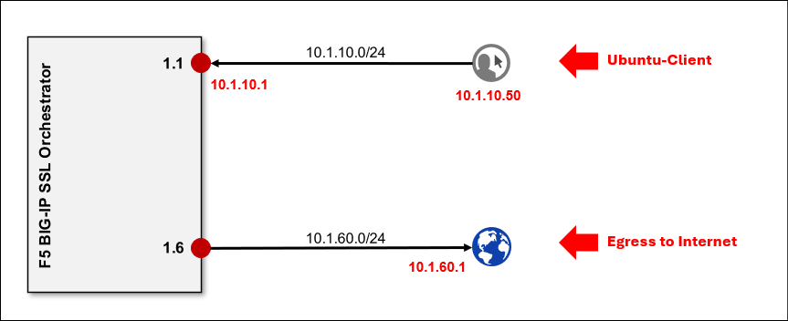
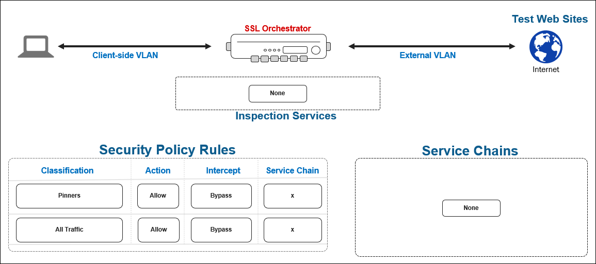

Lab Overview
================================================================================

You will use the SSL Orchestrator **Guided Configuration** wizard to deploy an **L3 Outbound** topology. At this initial stage, you will not create any inspection **Services** or **Service Chains**. The **Security Policy** will be configured to decrypt by default. You will then verify that it is able proxy outbound Internet traffic.

These are the lab resources that are relevant to this module:

|

The target deployment state is as follows:

|

.. note::
   The SSL Orchestrator solution runs on an F5 BIG-IP Application Delivery Controller (ADC) platform, so  **"BIG-IP"** and **"SSL Orchestrator"** may be used interchangeably in this lab guide.

