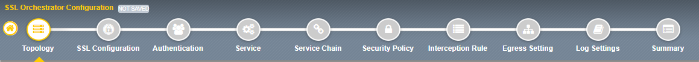

Deploying a Basic L3 Outbound Proxy Topology
================================================================================

You will now create a simple **L3 Outbound** topology. This topology type deploys a transparent forward proxy configuration. When you route the Client's outbound Internet traffic to the BIG-IP SSL Orchestrator's listening interface, the transparent forward proxy will process it. An SSL Orchestrator **Security Policy** will determine: (1) whether to allow or block the traffic, (2) whether to decrypt or bypass decryption, and (3) whether to forward the traffic to inspection services.

|

The SSL Orchestrator **Guided Configuration** wizard presents a step-by-step workflow map at the top of the page. The current step will be indicated in the map, with configuration options displayed below it. Note that you are currently at the **Topology** step.

|

To define topology properties:

#. Enter ``l3_outbound`` as the topology name.

   .. tip::
      As a general rule, avoid using **dashes** (e.g., ``sslo-demo-1``)
      when naming objects in SSL Orchestrator. **Underscores** (e.g., ``sslo_demo_1``)
      and **camel-case** (e.g., ``ssloDemo1``) are preferred.

#. Enter a description for your topology.

#. Select **Any** from the **Protocol** drop-down list. This will allow the SSL Orchestrator to accept TCP, UDP, and non-TCP/non-UDP traffic.

#. Leave the default **IP Family** setting (IPv4).

#. Select the **L3 Outbound** topology type.

   .. image:: ./images/l3outbound-1-topology-1.png
      :align: center

#. Scroll down to the bottom of the page and click on the **Save & Next** button to proceed to the next step in the configuration workflow.

   .. image:: ./images/l3outbound-1-topology-2.png
      :align: center

