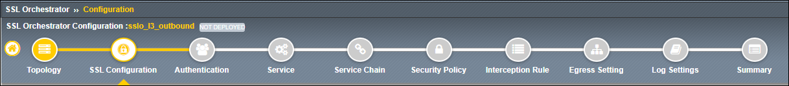
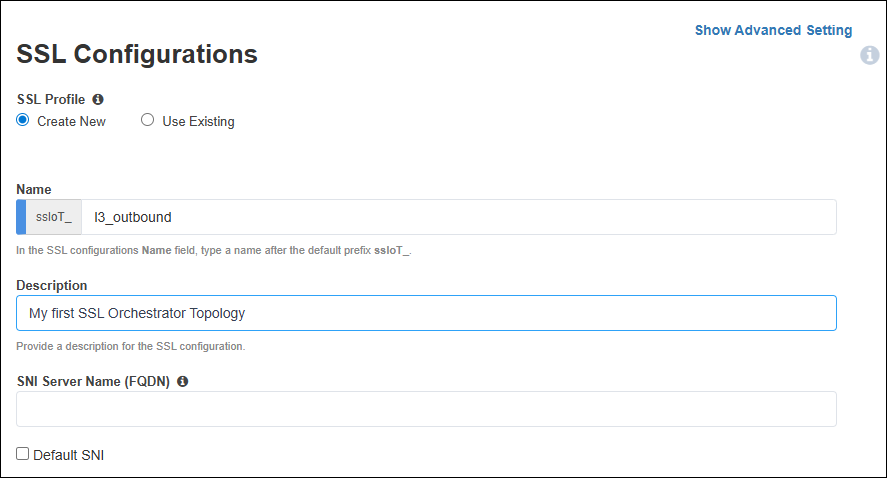

Create SSL Configurations
================================================================================

|

On the **SSL Configurations** page, create the **Client-side SSL** profile for the L3 Outbound forward proxy.

#. In the **Name** field, leave the default value as ``l3_outbound``.

#. Enter a description for the SSL configuration.

#. Leave the **SNI Server Name (FQDN)** field empty and do not select the **Default SNI** checkbox. These settings are not applicable to the current scenario.

|

**Client-side SSL Settings**

#. In the **Client-side SSL** > **Certificate Key Chain** section, leave the default settings as is (default certificate and key).

   .. important::

      Since this is an outbound forward proxy deployment, the SSL Orchestrator will be using a subordinate (intermediate) CA certificate and private key to sign the re-issued (forged) certificates delivered to clients. This is configured in the **CA Certificate Key Chains** section, **not** the **Certificate Key Chains** section.

   |

#. In the **CA Certificate Key Chain** section, click on the **Edit** (pencil) icon.

   .. image:: ./images/l3outbound-2-ssl-2.png
      :align: center

   |

#. In the **Certificate** drop-down list, select **subrsa.f5labs.com** to replace the default value.

#. In the **Key** drop-down list, select **subrsa.f5labs.com** to replace the default value.

#. Ensure that the **Passphrase** field is empty (clear it if not empty).

#. Click  the **Done** button to continue.

   .. image:: ./images/l3outbound-2-ssl-3.png
      :align: center

   |

   .. image:: ./images/l3outbound-2-ssl-4.png
      :align: center

   |

.. note::

   When using subordinate (intermediate) CA certificates, both the subordinate and root CA certificates must be imported into the client browser's trusted certificates store. The **Ubuntu-Client** machine in the lab environment already has these installed.

|

**Server-side SSL Settings**

These settings define the ciphers that SSL Orchestrator can use when initiating TLS connections to remote servers, as well as the Certificate Authorities that are trusted.

#. The default **Server-side SSL** settings are sufficient for outbound Internet forward proxy use-cases.

   .. image:: ./images/l3outbound-2-ssl-5.png
      :align: center

   |

#. Click on the **Save & Next** button to proceed to the next step in the configuration workflow.

