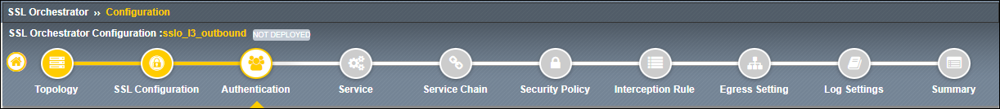
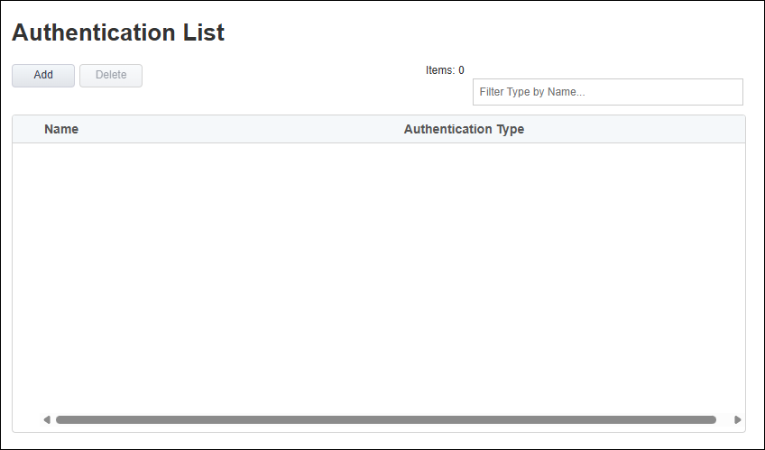

User Authentication
================================================================================

|

SSL Orchestrator can require a user to authenticate before traffic will be proxied.

.. note::
   This feature leverages the BIG-IP Access Policy Manager (APM) software module, so requires the APM module to be licensed and provisioned on the SSL Orchestrator system to function. To learn more about APM, click |apm-link|.

|

.. |apm-link| raw:: html

   <a href="https://www.f5.com/products/big-ip-services/access-policy-manager" target="_blank">here</a>

|

No user authentication will be enabled at this time. This topic is covered in one of the advanced-level SSL Orchestrator courses.

#. Click on the **Save & Next** button to proceed to the next step in the configuration workflow.

