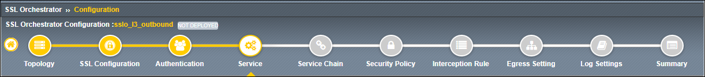
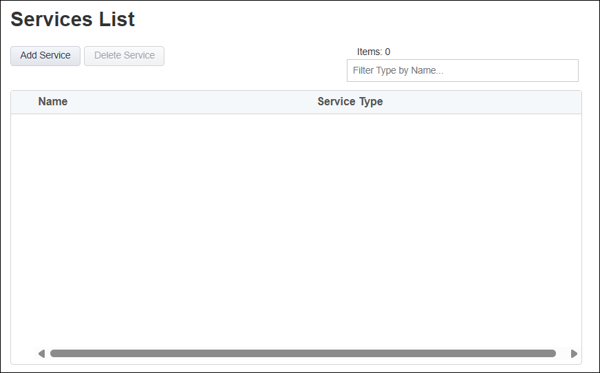

Create Services
================================================================================

|

The **Services List** page is used to define security services that SSL Orchestrator can steer traffic to. 

You will not create any **Services** at this time.

|

#. Click on the **Save & Next** button to proceed to the next step in the configuration workflow.
