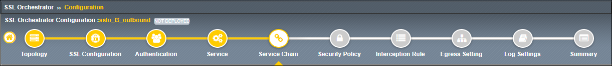
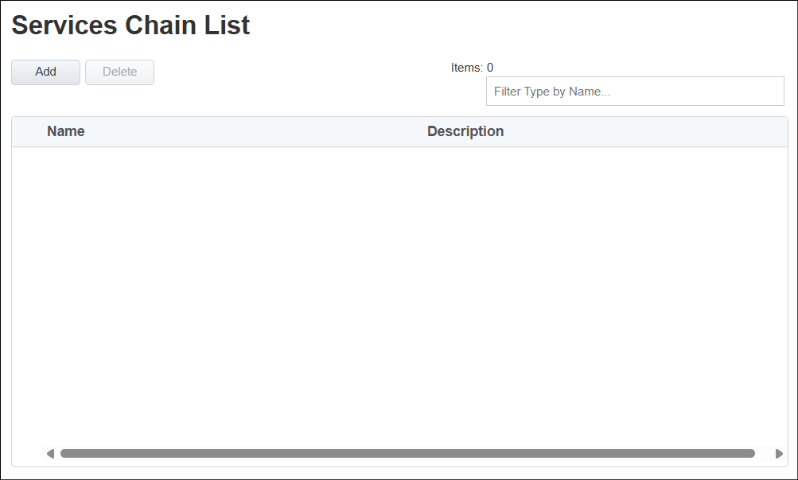

Create Service Chains
================================================================================

|

**Service Chains** are used to group **Services** together, and are referenced by a **Security Policy** rule.

You will not create any **Service Chains** at this time.

|

#. Click on the **Save & Next** button to continue.

