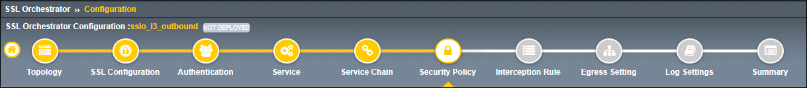
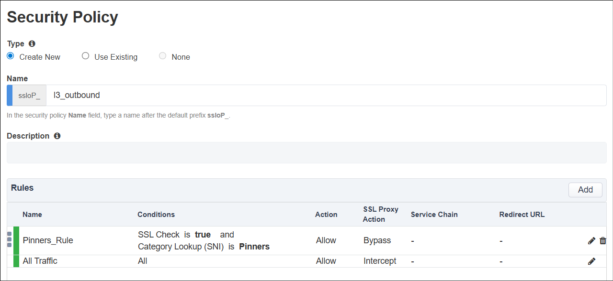

Create Security Policy
================================================================================

|

A **Security Policy** contains rules to apply conditional logic for traffic forwarding, decryption, and service chaining.

The default **Security Policy** contains 2 rules:

- **Pinners_Rule**: This rule applies if there is a match to one of the sites found within the *Pinners* URL Category database. These sites may not support SSL interception due to certificate pinning or mutual TLS enforcement. As a result, decryption is *bypassed* so that users do not experience page load failures when trying to access these sites. No **Service Chain** is selected by default.

- **All Traffic**: This rule is the default rule that is processed when no other rules match. It allows all traffic and *intercepts* (decrypts) by default. Like the **Pinners*** rule, no **Service Chain** is selected by default.

|

No **Security Policy** rule changes are required at this time.

#. Scroll down to the bottom of the page and click on the **Save & Next** button to continue.

