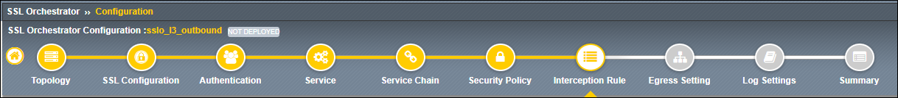

Create Interception Rule
================================================================================

|

The **Interception Rule** determines which traffic to process. For an L3 Outbound topology, you will accept traffic from and to all destinations and ports on the client-facing interface.

#. Leave the default **Destination Address/mask** value as ``0.0.0.0%0/0``.

#. Leave the default **Port** as ``0``.

#. In the **Ingress Network** section, select the client-side VLAN by either double-clicking on  **/Common/client-vlan** or selecting it and then clicking on the right-facing arrow button.

   .. image:: ./images/l3outbound-7-intercept-1.png
      :align: center

#. Leave the default values for the remaining sections:

   - **Protocol Settings**
   - **Security Policy Settings**
   - **Authentication**
   - **L7 Interception Rules**

   |

   .. image:: ./images/l3outbound-7-intercept-2.png
      :align: center

#. Click on the **Save & Next** button to continue.

