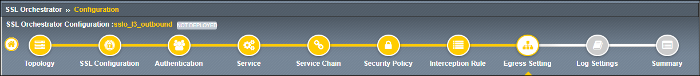

Create Egress Settings
================================================================================

|

The **Egress** settings define outbound routes and provide the option to source-NAT outbound traffic.

You will enable **SNAT Auto Map** for all egress traffic and use the system default route to reach the Internet.

#. In the **Manage SNAT Settings** drop-down list, select **Auto Map**.

#. Ensure that **Default Route** is selected in the **Gateways** list.

   .. image:: ./images/l3outbound-8-egress-1.png
      :align: center

   |

#. Click on the **Save & Next** button to continue.

