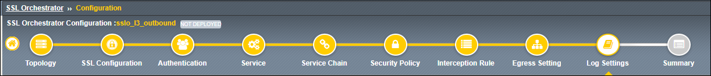

Create Log Settings
================================================================================

|

The options in the **Log Settings** step can be used to enable logging for selected facilities at various levels of severity. Facilities describe the specific element of the system generating the message: **Per-Request Policy, FTP, IMAP, POP3, SMTPS, SSL Orchestrator Generic**.

The following levels describe the message severity (lowest to highest):

   - **Emergency**: Specifies the emergency system panic messages.
   - **Alert**: Serious errors that require administrator intervention.
   - **Critical**: Critical errors, including hardware and filesystem failures.
   - **Error**: Non-critical, but possibly very important, error messages.
   - **Warning**: Warning messages that should at least be logged for review.
   - **Notice**: Messages that contain useful information, but may be ignored.
   - **Information**: Messages that contain useful information, but may be ignored.
   - **Debug**: Messages that are only necessary for troubleshooting.

Generally, the options that are further down the list include all of the messages for the options that appear higher up on the list. For example, the **Alert** level will generally also report all messages from the **Emergency** level, and the **Debug** level will generally report all messages for all levels.

#. Leave the default log settings.

   .. image:: ./images/l3outbound-9-log-1.png
      :align: center

#. Click on the **Save & Next** button to continue.

