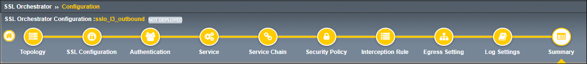
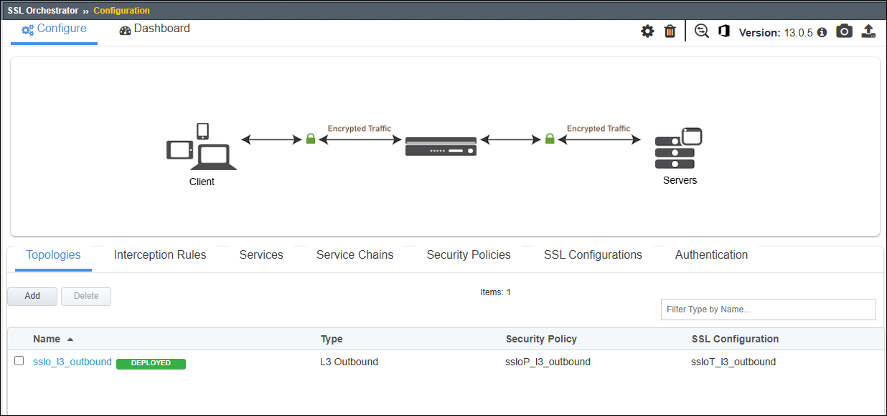

Deploy Topology
================================================================================

|

The **Summary** step shows all configuration options and offers an opportunity to revised any of the settings before deploying.

#. Click on the **Deploy** button to create the new topology configuration.

   .. image:: ./images/l3outbound-10-summary-1.png
      :align: center

   |

#. You will see a message below the **Guided Configuration** workflow path. Wait for the configuration to be deployed.

   .. image:: ./images/l3outbound-11-deploy-1.png
      :align: center

   |

#. A status message will appear when the deployment completes. Click on the **OK** button to close the dialog box.

   .. image:: ./images/l3outbound-11-deploy-2.png
      :align: center

   |

You will return to the **Topologies** page, showing the new **L3 Outbound** topology in the list.

