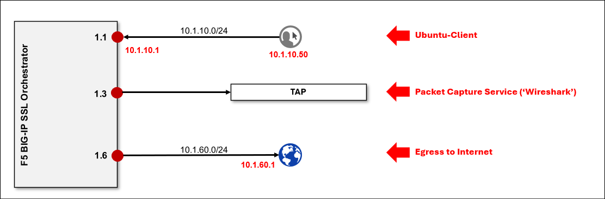
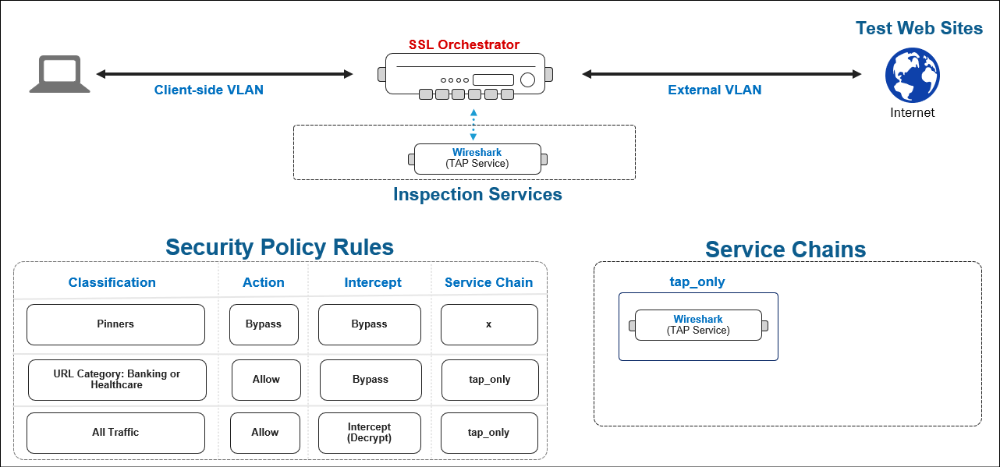

Lab Overview
================================================================================

You will edit the previously deployed SSL Orchestrator topology to create a **TAP** inspection **Service** and add it to a **Service Chain**. Then, you will create a **Security Policy** to apply inspection logic. The **TAP** service is an instance of **Wireshark** that is connected to interface **1.3** of the BIG-IP SSL Orchestrator.

You will create a rule to send decrypted traffic to the TAP service for visual confirmation in the Wireshark web interface. Furthermore, to meet your organization's privacy policy requirements, you will create a decryption bypass rule for sensitive banking and personal health-related URL categories.

|

These are the SSL Orchestrator lab resources that are relevant to this module:

|

The target deployment state is illustrated as follows:

|

