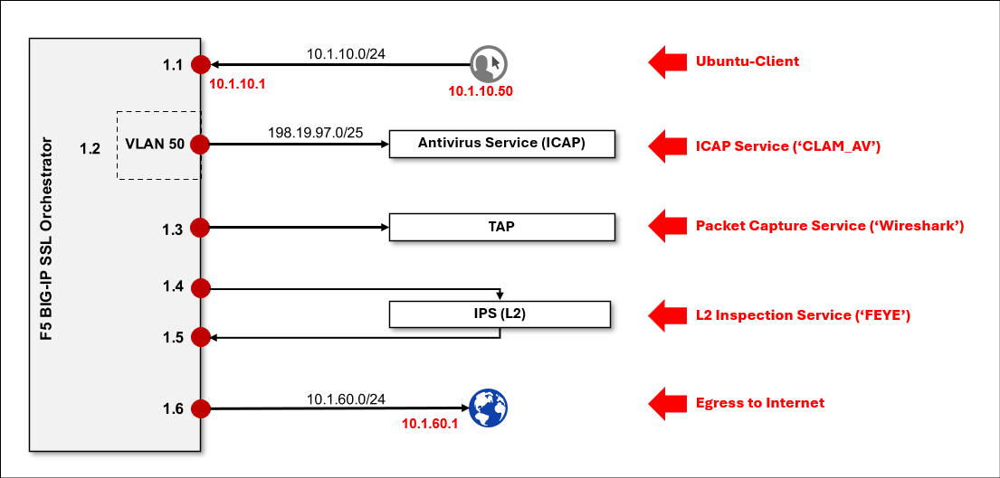
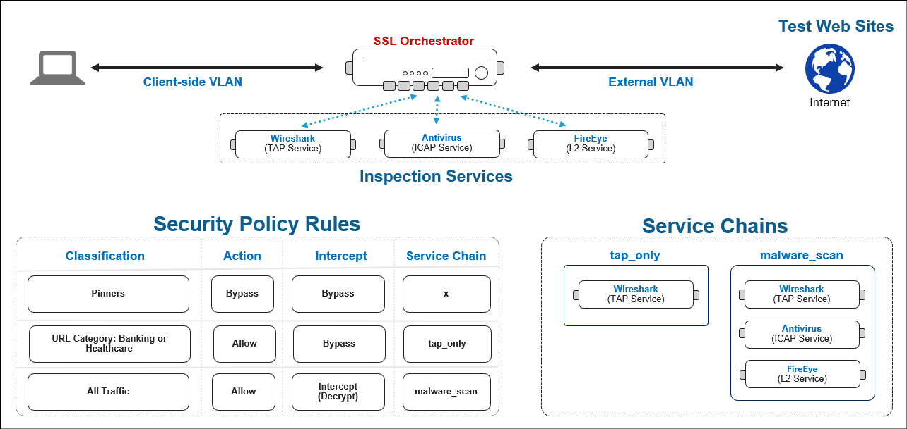

Lab Overview
================================================================================

You will edit your previous topology deployment to create two additional inspection **Services**. The first service integrates an **ICAP** server to detect and block file downloads for viruses. The second service illustrates how to integrate an **Inline L2** device (such as a FireEye appliance) for malware mitigation. Next, you will add the additional services to a new **Service Chain**. Finally, you will test the Antivirus service by attempting to download an infected (test) file.

|

These are the SSL Orchestrator lab resources that are relevant to this module:

|

-  **Antivirus Service (ICAP) VLAN and self-IP**

   This VLAN and self-IP connects the antivirus inspection tool (CLAM AV) to the BIG-IP. In this lab, that is the **197.19.97.0/25** subnet and interface **1.2 (tag 50)**. The inspection tool is listening on IP address **198.19.97.50** and port **1344** (ICAP).

   |

-  **IPS (Inline L2) Service VLANs and self-IPs**

   The VLANs mapped to interfaces **1.4** and **1.5**, as well as associated subnets, will be created automatically by the SSL Orchestrator Guided Configuration wizard.

|

The target deployment state is illustrated as follows:

