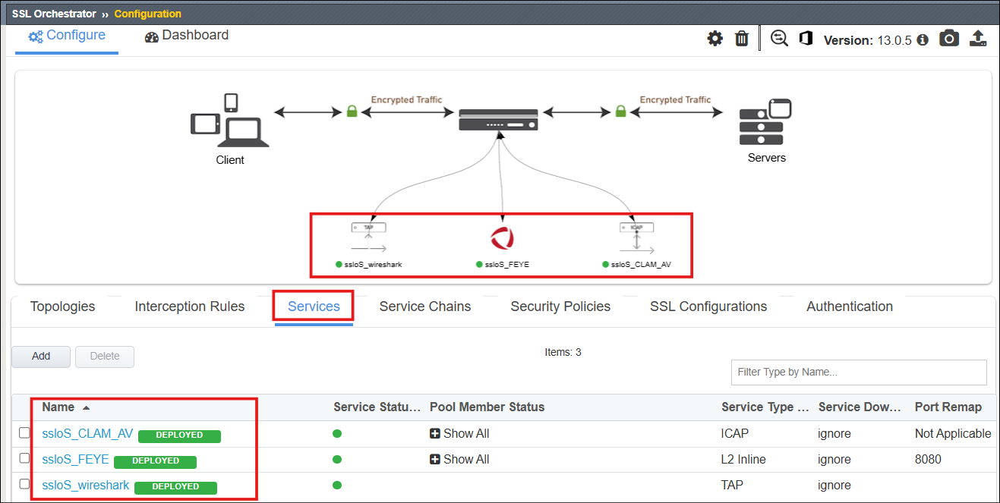

Create Additional Services
================================================================================

Use the **Guided Configuration** wizard to edit the **Services**.

Create an ICAP Service
--------------------------------------------------------------------------------

Use the following steps to create an **ICAP** inspection **Service**.

#. In the **Topologies** tab of the **SSL Orchestrator > Configuration** page, click on the **sslo_l3_outbound** Topology to edit it using the **Guided Configuration** UI.

   .. image:: ./images/service-icap-0.png
      :align: center

   |

#. To edit the **Services**, click on the **Service** icon at the top (or click on the *pencil* icon to the right of the **Service** menu item).

   .. image:: ./images/service-icap-1.png
      :align: center

   |

#. Click on the **Add Service** button to create a new Service.

   .. image:: ./images/service-icap-2.png
      :align: center

   |

#. Click the **ICAP** tab to show template for common ICAP solutions.

#. Click on the **Generic ICAP Service** tile and click **Add** (or simply double-click the **Generic ICAP Service** tile) to continue.

   .. image:: ./images/service-icap-3.png
      :align: center

   |

#. On the settings input form, enter ``CLAM_AV`` in the **Name** field.

   .. image:: ./images/service-icap-4.png
      :align: center

   |

   .. note::
      Only edit the fields that are explicitly mentioned below.  Other fields may be left at their default values.

   |

#. In the **ICAP Devices** section, click on the **Add** button to show the input form.

#. Enter ``198.19.97.50`` for the **IP Address**.

#. Leave the default **Port** value (``1344``).

   .. image:: ./images/service-icap-5.png
      :align: center

   |

#. Click **Done** to close the input form.

   .. image:: ./images/service-icap-6.png
      :align: center

   |

#. Scroll down to the **Request Modification URI Path** field and enter ``/avscan``.

#. Enter ``/avscan`` for the **Response Modification URI Path**.

#. Enter ``1048576`` for the **Preview Max Length(bytes)**.

   .. image:: ./images/service-icap-7.png
      :align: center

   |

#. Click **Save** to return to the **Service** list.

   |

   .. attention::

      A yellow "pending changes to deploy" notification banner will appear below the **Guided Configuration** workflow path. As tempting as it may be, **DO NOT click** on the Deploy button until instructed to (later on).

      .. image:: ./images/service-icap-8.png
         :align: center

   |

|

Create Inline L2 (FireEye) service 
--------------------------------------------------------------------------------

Now you will create an **Inline L2** service for a **FireEye NX** appliance.

|

#. Click on the **Add Service** button to create a new **Service**.

   .. image:: ./images/service-l2-0.png
      :align: center

   |

#. The service catalog will default to the **Inline L2** tab. Double-click on the **FireEye NX Inline Layer 2** tile to start configuring it.

   .. image:: ./images/service-l2-1.png
      :align: center

   |

#. Leave the default **Name** of ``FEYE``.

   .. image:: ./images/service-l2-2.png
         :align: center

   |

#. In the **Network Configuration** section, click on the **Add** button and use the following settings:

   - Under **From BIGIP VLAN**, click on the **Create New** radio button.
   - Enter ``FEYE_in`` in the **Name** field.
   - Select **1.4** from the **Interface** drop-down list.
   - Leave the **Tag** field empty.

   - Under **To BIGIP VLAN**, click on the **Create New** radio button.
   - Enter ``FEYE_out`` in the **Name** field.
   - Select **1.5** from the **Interface** drop-down list.
   - Leave the **Tag** field empty.

   |

   .. image:: ./images/service-l2-3.png
      :align: center

   |

   
#. Click on the **Done** button to apply the settings.

   |

   .. image:: ./images/service-l2-4.png
      :align: center

   |

#. Leave the default **gateway_icmp** **Device Monitor** selection.

#. Select **Enable Port Remap** and set the port to ``8080``.

   .. image:: ./images/service-l2-5.png
      :align: center

   |

#. Some additional **Resources** will be shown. Do not modify them.

   .. image:: ./images/service-l2-6.png
      :align: center

   |

#. Click on the **Save** button to return to the **Services** list.

#. A yellow "pending changes" notification banner will appear again below the **Guided Configuration** workflow path.

   This time, click on the **Deploy** button to create the new **Services**.

   .. image:: ./images/service-l2-7.png
      :align: center

   |

#. Click on the **OK** button when the deployment has completed and you will return to the **Topologies** list.

|

Deployed Services List
--------------------------------------------------------------------------------

#. Click on the **Services** tab to check that all three **Services** are present.

|

Note that the **Services** are also represented in the SSL Orchestrator configuration diagram.

