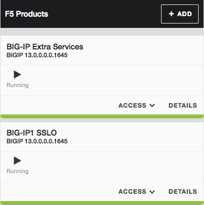

Appendix - Things to do with the Extra Services BIG-IP
======================================================

This lab environment contains an additional BIG-IP machine named "BIG-IP Extra
Services" and has no specific use in the previously-described demo environment.

However, a BIG-IP can be a useful tool in an SSL Orchestrator environment. In
most cases it just needs to be re-licensed and reconfigured on required
networks. Building any tools is beyond the scope of the guide, but here is a
quick list of things you can do with it.

- Create a transparent proxy security service.

- Create an explicit proxy security service.

- Create an upstream routed path to serve as an alternate path to the
  Internet - this would test the ability to use the Proxy Select agent in the
  SSLO service visual policy to redirect flows through alternate gateways.

- Create an upstream explicit proxy path - this would also serve to test the
  ability to use the Proxy Select agent for alternate explicit proxy gateway
  paths.

- Create am additional web server to test inbound traffic flows.

- Create an ADC between SSLO and the web server to more accurately test SSLO as
  an inbound gateway.
