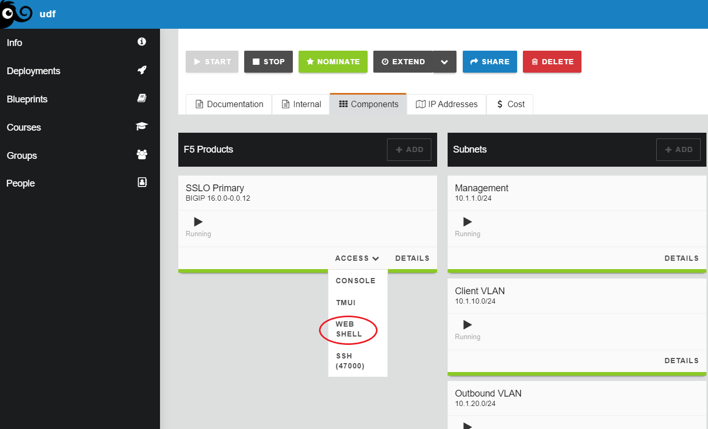
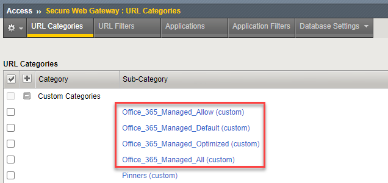

.. role:: red

Office 365 URL Category Automation Script
============================================

In this step, you will download and install the Office 365 URL Category automation script on the F5 SSL Orchestrator. The script will periodically download the list of URL endpoints used by Office 365 services, and store them in a custom **URL Category** for SSL Orchestrator to reference in **Security Policies**.

- First, connect to the BIG-IP Advanced Shell using the ** UDF Web Shell**.

- Download the script onto the F5 BIG-IP:

  .. code-block:: bash

     cd /shared/tmp
     curl -k https://raw.githubusercontent.com/f5devcentral/sslo-o365-update/main/sslo_o365_update.py -o sslo_o365_update.py

|

- Run the script with the install option and an update interval (in seconds). The update interval determines the
  frequency of script execution. The endpoint version number is tracked internally, so a full URL
  download will only happen if there is a new version.
  
  .. code-block:: bash

     python sslo_o365_update.py --install 3600

|

  You should see the following output:

  .. code-block:: bash

     Installation in progress
     ..Working directory created: /shared/o365/
     ..Script copied to working directory: sslo_o365_update.py
     ..Configuration iFile created: o365_config.json
     ..iCall script created: sslo_o365_update
     ..Periodic script handler created and set to 3600 seconds
     ..Installation complete

|

- In the TMUI, verify that the URL Category was created successfully by navigating to **Access > Secure Web Gateway > URL Categories**.

.. image:: ../images/appendix1-0-2.png
   :align: center

- Click on the **Custom Categories** category to expand the list. You should see several **Office_365_Managed_xxxxxx** categories in the list.

|

.. note::
   This script is documented in the F5 DevCentral Github repository:
   `F5 SSL Orchestrator Office 365 URL Update Script <https://github.com/f5devcentral/sslo-o365-update>`_.
   
   Additional details for modifying and uninstalling the script configuration can also be found there.

.. warning::

   When updating to a new version, you must first remove the existing installation.
