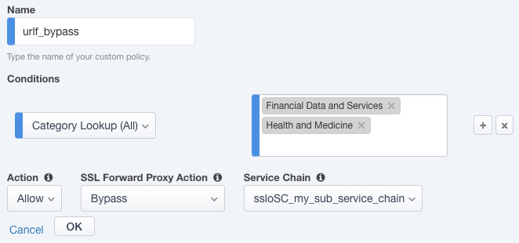
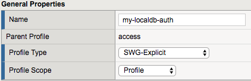

Participant Hands-on Lab Guide

|image0|

    Last Updated: *12.2018*

©2016 F5 Networks, Inc. All rights reserved. F5, F5 Networks, and the F5
logo are trademarks of F5 Networks, Inc. in the U.S. and in certain
other countries. Other F5 trademarks are identified at f5.com.

Any other products, services, or company names referenced herein may be
trademarks of their respective owners with no endorsement or
affiliation, express or implied, claimed by F5.

These training materials and documentation are F5 Confidential
Information and are subject to the F5 Networks Reseller Agreement. You
may not share these training materials and documentation with any third
party without the express written permission of F5.

What is the F5 SSL Orchestrator?
================================

F5 SSL Orchestrator (SSLO) provides an all-in-one appliance solution
designed specifically to optimize the SSL infrastructure, provide
security devices with visibility of SSL/TLS encrypted traffic, and
maximize efficient use of that existing security investment. This
solution supports policy-based management and steering of traffic flows
to existing security devices, designed to easily integrate into existing
architectures, and centralizes the SSL decrypt/encrypt function by
delivering the latest SSL encryption technologies across the entire
security infrastructure.

**Multi-layered security**

In order to solve specific security challenges, security administrators
are accustomed to manually chaining together multiple point products,
creating a bare-bones “security stack” consisting of multiple services.
A typical stack may include components like Data Leak Prevention (DLP)
scanners, Web Application Firewalls (WAF), Intrusion Prevention and
Detection Systems (IPS and IDS), Malware Analysis tools, and more. In
this model, all user sessions are provided the same level of security,
as this “daisy chain” of services is hard-wired.

**Dynamic service chaining**

Dynamic service chaining effectively breaks the daisy chain paradigm by
processing specific connections based on context provided by the
Security Policy, that then allows specific types of traffic to flow
through arbitrary chains of services. These service chains can include
five types of services: layer 2 inline services, layer 3 inline
services, receive-only services, ICAP services, and HTTP web proxy
services.

**Topologies**

Different environments call for different network implementations. While
some can easily support SSL visibility at layer 3 (routed), others may
require these devices to be inserted at layer 2. SSL Orchestrator can
support all of these networking requirements with the following topology
options:

+---------------------------------+----------------------------+
| -  Outbound transparent proxy   | -  Inbound reverse proxy   |
|                                 |                            |
| -  Outbound explicit proxy      | -  Existing application    |
|                                 |                            |
| -  Outbound layer 2             | -  Inbound layer 2         |
+=================================+============================+
+---------------------------------+----------------------------+

**Security Policy**

The SSLO Security Policy provides a rich set of context-aware methods to
dynamically determine how best to optimize traffic flow through the
security stack. Context can minimally come from the following:

+--------------------------------------------------------+-----------------------+
| -  Source and destination address/subnet               | -  Destination port   |
|                                                        |                       |
| -  URL filtering and IP intelligence - Subscriptions   | -  IP geolocation     |
|                                                        |                       |
| -  Host and domain name                                | -  Protocol           |
+========================================================+=======================+
+--------------------------------------------------------+-----------------------+

|image1|

What’s new in SSLO 4.0 and 5.0?
===============================

SSLO 4.0 provides significant architectural improvements over previous
versions. Here are just a few of those updates:

-  SSLO 4.0 replaces the complex iRules-based traffic classification and
   service chaining functions of previous versions with an Access
   per-request policy engine, providing much greater flexibility in
   traffic management options.

-  SSLO 4.0 optimizes traffic flow through security services by
   replacing the complex “proxy hops” with a new “tee connector” –
   essentially a mid-proxy tap – that allows decrypted traffic to flow
   through security devices out-of-band from the main client-server
   proxy traffic. This is implemented as new “Service” and “Connector”
   profiles.

-  SSLO 4.0 introduces new “split session” client and server SSL
   profiles, that are now responsible for carrying SNI signaling
   information across the inspection zone.

-  SSLO 4.0 further optimizes traffic flow by reducing the amount of
   iRule data plane management, also making it easier to add
   customization iRules.

-  SSLO 4.0 introduces three new network topologies. Along with the
   existing outbound transparent and explicit proxy flows, 4.0 now also
   supports inbound layer 3 (reverse proxy) inspection, and layer 2
   transparent inbound and outbound topologies.

SSLO 4.0 also includes the following new functionality features:

-  Explicit and transparent web proxy devices as an inline security
   service.

-  Front-end explicit proxy authentication via APM integration (relies
   on existing SWG-Explicit access policy).

-  FTPS (passive), SMTPS, POP3S, and IMAPS protocols inspection.

-  ICAP advanced filtering via LTM CPM policy (relies on an existing CPM
   policy).

-  URL filtering as a function of the Access per-request service
   chaining policy.

-  Authentication headers - ability to define additional HTTP headers to
   pass to inline security services.

-  vCMP support - ability to select existing VLANs for inbound and
   outbound to/from inline services.

SSLO 5.0 includes the following updates:

-  Guided Configuration user experience, a complete refresh of the SSLO
   UI based on the Access Guided Configuration engine.

-  Discreet “topology” definitions and the ability to define how SSLO
   listens for and processes traffic flows.

-  Re-entrant, wizard-driven workflows. Based on the selected topology,
   SSLO 5.0 presents an intuitive workflow UI that walks the user
   through a simplified object creation process.

**Note**: Viprion chassis platform support is not available in SSLO 4.0
and 5.0.

What’s new in SSLO 5.1?
=======================

SSL Orchestrator 5.1 was released on December 17\ :sup:`th`, 2018, a few
days after the release of BIG-IP 14.1 with SSLO 5.0. SSLO 5.1 contains
significant updates to the product and is therefore recommended (over
5.0) for customer environments.

Additional information about SSLO 5.1, including updates and fixes, can
be found in the official release notes:
https://support.f5.com/kb/en-us/products/ssl-orchestrator/releasenotes/product/relnote-ssl-orchestrator-14-1-0-iapp-5-1.html

SSL Orchestrator 5.1 is available on the F5 downloads site,
https://downloads.f5.com, under the SSL Orchestrator section, as
**f5-iappslx-ssl-orchestrator-14.1.0-5.1.254.rpm**.

This lab guide and corresponding Ravello lab environment are prepared
for SSLO 5.1. If installing a fresh BIG-IP 14.1 instance, it is
recommended to immediately download the 5.1 package and install over the
built-in 5.0 version. To do this, in the SSLO UI, click on **SSL
Orchestrator** -> **Configuration** -> **Upgrade SSL Orchestrator**,
choose the downloaded SSLO 5.1 package and then upload and install.

SSL Orchestrator lab environment
================================

The lab environment for this guide has provided some prerequisite
settings that you should be aware of. These are provided to make the
demo simpler. All of the following would need to be configured manually
in another environment.

-  **Client side VLAN and subnet are defined** – this is the VLAN that
   an internal client connects to for outbound traffic flows. SSLO does
   not define the client-side VLAN(s) and self-IP(s). A web server also
   exists on the client side VLAN to facilitate an inbound (reverse
   proxy) use case – external client to an internal set of websites.

-  **Outbound side VLAN and subnet are defined** – this is the VLAN that
   traffic egresses from SSLO to the Internet gateway. SSLO does not
   define the server-side VLAN(s) and self-IP(s).

-  **ICAP service VLAN and subnet are defined** – SSLO does not define
   the networking for this service type, so it has been pre-created in
   this lab.

-  **CA certificate and private key are installed** – this is the CA
   certificate and private key that are used to re-issue (forge) remote
   server certificates to internal clients for outbound traffic flows.

-  **Server certificate and private key are installed** – for the
   inbound (reverse proxy) traffic flow use case, SSL traffic is
   terminated at the F5, and re-encrypted on the way to the internal
   application environment. A wildcard server certificate is installed
   to facilitate using any name under the “.\ *f5demolabs.com*\ ”
   sub-domain.

**Note**: It is a security best practice to isolate security devices
within the protected network enclaves provided by SSLO. Customers will
often desire NOT to move or change existing security services. However,
while possible with SSLO 4.0 and beyond, passing this decrypted traffic
to points on an existing network architecture could create a provide
multiple points of data exposure. Usernames, passwords, credit card
numbers and other sensitive information could be exposed to other
devices on that network. Each inline layer 3 security service definition
includes an “Auto Manage” option. This option, enabled by default,
provides internal network settings for security services to use, so that
only the interface (and 802.1q VLAN tag as needed) is required to be
defined for the inbound and outbound interfaces. Should customers opt to
not follow security best practices, or simply need different networking
settings, you can disable the Auto Manage option and define all of the
required inbound and outbound networking setting manually.

+------------------------+------------------------+-------------------------------+----------------+
| **SSL Orchestrator**   | BIG-IP management IP   | 10.10.0.110                   |                |
+========================+========================+===============================+================+
|                        | Gateway IP/DNS         | 10.30.0.1                     |                |
+------------------------+------------------------+-------------------------------+----------------+
|                        | Login                  | admin:admin \| root:default   |                |
+------------------------+------------------------+-------------------------------+----------------+
|                        | Interfaces             | Client VLAN                   | 1.1            |
+------------------------+------------------------+-------------------------------+----------------+
|                        |                        | Outbound VLAN                 | 1.2            |
+------------------------+------------------------+-------------------------------+----------------+
|                        |                        | Inline L3/HTTP services       | 1.3 (tagged)   |
+------------------------+------------------------+-------------------------------+----------------+
|                        |                        | TAP service                   | 1.4            |
+------------------------+------------------------+-------------------------------+----------------+
|                        |                        | ICAP service                  | 1.5            |
+------------------------+------------------------+-------------------------------+----------------+
|                        |                        | Inline L2 service inbound     | 1.6            |
+------------------------+------------------------+-------------------------------+----------------+
|                        |                        | Inline L2 service outbound    | 1.7            |
+------------------------+------------------------+-------------------------------+----------------+

+------------------------------+---------+-------------------+
| **Inline layer 2 service**   | Login   | student:agility   |
+==============================+=========+===================+
+------------------------------+---------+-------------------+

+------------------------------+--------------+----------------------+--------------+--------------------+
| **Inline layer 3 service**   | Login        | student:agility      |              |                    |
+==============================+==============+======================+==============+====================+
|                              | Interfaces   | Inbound interface    | 1.3 tag 50   | 198.19.64.64/25    |
+------------------------------+--------------+----------------------+--------------+--------------------+
|                              |              | Outbound interface   | 1.3 tag 60   | 198.19.64.130/25   |
+------------------------------+--------------+----------------------+--------------+--------------------+

+------------------------------+--------------+----------------------+---------------+--------------------+
| **Explicit proxy service**   | Login        | student:agility      |               |                    |
+==============================+==============+======================+===============+====================+
|                              | Interfaces   | Inbound interface    | 1.3 tag 110   | 198.19.96.66/25    |
+------------------------------+--------------+----------------------+---------------+--------------------+
|                              |              | Outbound interface   | 1.3 tag 120   | 198.19.96.136/25   |
+------------------------------+--------------+----------------------+---------------+--------------------+
|                              | Services     | Squid                | Port 3128     |                    |
+------------------------------+--------------+----------------------+---------------+--------------------+
|                              |              |                      |               |                    |
+------------------------------+--------------+----------------------+---------------+--------------------+

+----------------------------+---------------+---------------------------------------------+
| **Receive-only service**   | Login         | student:agility                             |
+============================+===============+=============================================+
|                            | MAC address   | 12:12:12:12:12:12 (arbitrary if isolated)   |
+----------------------------+---------------+---------------------------------------------+

+--------------------+-------------------+-------------------+
| **ICAP service**   | Login             | student:agility   |
+====================+===================+===================+
|                    | IP Address:port   | 10.70.0.10:1344   |
+--------------------+-------------------+-------------------+
|                    | REQ/RES URLs      | /squidclamav      |
+--------------------+-------------------+-------------------+

+---------------------------+---------------------+--------------------------------------------------------------+
| **Internal web server**   | Login               | student:agility                                              |
+===========================+=====================+==============================================================+
|                           | IP Addresses        | 10.20.0.90                                                   |
|                           |                     |                                                              |
|                           | \*.f5demolabs.com   | 10.20.0.91                                                   |
|                           |                     |                                                              |
|                           |                     | 10.20.0.92 (Apache2 instances listening on HTTPS port 443)   |
+---------------------------+---------------------+--------------------------------------------------------------+

+-----------------------+--------------+----------------------------+
| **Outbound client**   | Login        | student:agility            |
+=======================+==============+============================+
|                       | IP address   | 10.20.0.60 (RDP and SSH)   |
+-----------------------+--------------+----------------------------+

+----------------------+--------------+----------------------------+
| **Inbound client**   | Login        | student:agility            |
+======================+==============+============================+
|                      | IP address   | 10.30.0.70 (RDP and SSH)   |
+----------------------+--------------+----------------------------+

Lab 1 – Create a transparent forward Proxy SSLO
===============================================

The majority of enterprise forward proxy configurations will involve a
single F5 platform performing the SSL visibility task. The SSL
Orchestrator has been designed with that principle in mind and performs
robust security service chaining of security devices attached to a
single appliance. SSL Orchestrator 5.0 now makes configuration of a
single-box deployment simple and intuitive. Please follow the steps
below to create a transparent forward proxy SSL Orchestrator
configuration.

Step 1: Review the lab environment and map out the services and endpoints
-------------------------------------------------------------------------

Review the “SSL Orchestrator Lab Environment” section above. This lab
will attach one of each type of security service (HTTP, ICAP, L2, L3,
TAP) to SSLO for an outbound forward proxy traffic flow. Afterwards, an
internal client will be able to access remote (Internet) resources
through SSLO, providing decrypted, inspectable traffic to the security
services.

-  The client is attached to a *10.20.0.0/24* network and is assigned
   the IP *10.20.0.60*. This network is attached to the BIG-IP 1.1
   interface.

-  The **L2 device** is an Ubuntu 14.04 LTS server configured to bridge
   its eth1 and eth2 interfaces. Its inbound VLAN (traffic to it) is
   attached to the BIG-IP *1.6* interface. Its outbound interface
   (traffic coming from it) is attached to the BIG-IP *1.7* interface.

-  The **L3 device** is an Ubuntu 14.04 LTS server configured to route
   between its eth1.10 and eth1.20 (tagged) interfaces. Its inbound VLAN
   (traffic to it) is attached to the BIG-IP *1.3 (VLAN tag 30)*
   interface and has an IP of *198.19.64.64/25*. Its outbound interface
   (traffic coming from it) is attached to the BIG-IP *1.3 (VLAN tag
   60)* interface and has an IP of *198.19.64.130/25*. Its default
   gateway is *198.19.64.245*, which will be a VLAN self-IP on the
   BIG-IP.

-  The **TAP** device is an Ubuntu 14.04 LTS server configured with a
   single eth1 interface. That interface is attached to the BIG-IP *1.4*
   interface.

-  The **DLP/ICAP** device is an Ubuntu 14.04 LTS server configured with
   a single eth1 interface. That interface is attached to the BIG-IP
   *1.5* interface and has an IP of *10.70.0.10 and listening on port
   1344*. The box is running c-icap and Squid/Clamav.

-  The **Explicit Proxy device** is an Ubuntu 14.04 LTS server
   configured with Squid. Its interfaces are eth1.30 and eth1.40
   (tagged). Its inbound VLAN (traffic to it) is attached to the BIG-IP
   *1.3 (VLAN tag 110)* interface and has an IP of *198.19.96.66/25*.
   Its outbound interface (traffic coming from it) is attached to the
   BIG-IP *1.3 (VLAN tag 120)* interface and has an IP of
   *198.19.96.136/25*. Its default gateway is *198.19.96.245*, which
   will be a VLAN self-IP on the BIG-IP.

-  The outbound network is attached to the BIG-IP *1.2* interface, in
   the *10.30.0.0/24* subnet, and has a gateway of *10.30.0.1*.

-  In the lab, client inbound, Internet outbound, and DLP VLANs and
   self-IPs are already created.

Step 2: Fulfill the SSL Orchestrator prerequisites
--------------------------------------------------

There are a number of objects that SSL Orchestrator does not create and
expects to exist before deploying the iApp. You must create the
following objects before starting the iApp:

-  **Import the CA certificate and private key** – in order to terminate
   and re-encrypt outbound SSL traffic, SSL Forward Proxy must re-issue,
   or rather “forge” a new server certificate to the client. In order to
   perform this re-issuance process, the BIG-IP must possess a
   certificate authority (CA) certificate and associated private key.
   *This lab environment already has a subordinate CA certificate and
   private key installed*.

-  **Create the client inbound VLAN and self-IP** – create the VLAN and
   self-IP that connects the client to the BIG-IP. In this lab that’s
   the *10.20.0.0/24* subnet and interface *1.1* on the BIG-IP. This lab
   environment already has this VLAN and self-IP created.

-  **Create the Internet outbound VLAN and self-IP** – create the VLAN
   and self-IP that connects the BIG-IP to the outbound Internet router.
   In this lab that’s the *10.30.0.0/24* subnet and interface *1.2* on
   the BIG-IP. *This lab environment already has this VLAN and self-IP
   created*.

-  **Create the DLP VLAN and self-IP** – if it is desired to isolate the
   DLP/ICAP device, create the VLAN and self-IP that connects the DLP
   device to the BIG-IP. In this lab that’s the *10.70.0.0/24* subnet
   and interface *1.5* on the BIG-IP. The DLP security device is
   listening on *10.70.0.10* and ICAP is listening on port *1344*. *This
   lab environment already has this VLAN and self-IP created*.

-  **Create the default internet route for outbound traffic** – the iApp
   provides an option to leverage a defined gateway pool or use the
   system default route. If a gateway pool is not used, they system
   route table will need to have a default route used to reach Internet
   destination. *We’ll use a gateway pool defined within SSLO*.

As a general rule, avoid using names with dashes (ex. sslo-demo-1) while
creating objects in SSL Orchestrator. Underscores (ex. sslo\_demo\_1)
and camel-casing (ex. ssloDemo1) are preferred.

Step 3: Create the SSL Orchestrator deployment through Guided Configuration
---------------------------------------------------------------------------

The SSL Orchestrator Guided Configuration presents a completely new and
streamlined user experience. This workflow-based architecture provides
intuitive, re-entrant configuration steps tailored to the selected
topology.

|image2|

The following steps will walk through the Guided Configuration (GC) to
build a simple transparent forward proxy.

The following provides verbose details on each setting. For a more
concise set of lab steps, without details, skip to the bottom of this
lab (Lab 1).

-  \ **Initialization** – if this is the first time accessing SSLO in a
   new BIG-IP build, upon first access, GC will automatically load and
   deploy the built-in SSLO package.

   |image3|

-  \ **Configuration review and prerequisites** – take a moment to
   review the topology options and workflow configuration steps
   involved. Optionally satisfy any of the DNS, NTP and Route
   prerequisites from this page. Keep in mind, however, that aside from
   NTP, the SSLO GC will provide an opportunity to define DNS and route
   settings later in the workflow. No other configurations are required
   on this page, so click Next.

   NTP settings have already been defined in this lab.

   |image4|

   |image5|

-  \ **Topology Properties** – SSLO now creates *discreet*
   configurations based on the selected topology. For example, in
   previous versions of SSLO, a transparent and explicit forward proxy
   might be defined together. In SSLO 5.0, these are configured
   separately. An explicit forward proxy topology will ultimately create
   an explicit proxy listener and its relying transparent proxy lister,
   but the transparent listener will be bound only to the explicit proxy
   tunnel. If a subsequent transparent forward proxy topology is
   configured, it will not overlap the existing explicit proxy objects.
   The Topology Properties page provides the following options,

   The Protocol option presents four protocol types:

   -  **TCP** – this option creates a single TCP wildcard interception
      rule for the L3 Inbound, L3 Outbound L3, and L3 Explicit Proxy
      topologies.

   -  **UDP** – this option creates a single UDP wildcard interception
      rule for L3 Inbound and L3 Outbound topologies.

   -  **Other** – this option creates a single any protocol wildcard
      interception rule for L3 Inbound and L3 Outbound topologies,
      typically used for non-TCP/UDP traffic flows.

   -  **Any** – this option creates the TCP, UDP and non-TCP/UDP
      interception rules for outbound traffic flows.

      The SSL Orchestrator Topologies option page presents six
      topologies:

   -  **L3 Explicit Proxy** – this is the traditional explicit forward
      proxy.

   -  **L3 Outbound** – this is the traditional transparent forward
      proxy.

   -  **L3 Inbound** – this is a reverse proxy “gateway” configuration.
      In its simplest form, this topology builds an SSLO environment
      designed to sit ***in front of*** another ADC or routed path.
      Advanced options allow it to define a pool for more directed
      traffic flow, but alone does not provide the same flexibility
      afforded a typical LTM reverse proxy virtual server. It also must
      perform re-encryption on egress. The primary use case for this
      topology is as a gateway SSL visibility solution, potentially
      sitting at a boundary edge in front of multiple internal ADC
      environments.

   -  **L2 Inbound** – the layer 2 topology options insert SSLO as a
      bump-in-the-wire in an existing routed path, where SSLO presents
      no IP addresses on its outer edges. The L2 Inbound topology
      provides a transparent path for inbound traffic flows.

   -  **L2 Outbound** – the layer 2 topology options insert SSLO as a
      bump-in-the-wire in an existing routed path, where SSLO presents
      no IP addresses on its outer edges. The L2 Outbound topology
      provides a transparent path for outbound traffic flows.

      It is important to distinguish SSLO’s layer 2 topology from those
      of other traditional layer 2 SSL visibility vendors. “True” layer
      2 solutions like Blue Coat’s SSL visibility appliance (SSLVA)
      limit the types of devices that can be inserted into the
      inspection zone to layer 2 and below, and devices must be directly
      connected to the appliance. SSLO’s layer 2 topology only exists at
      the outer edges. Inside the inspection zone, full-proxy routing is
      still happening, so layer 3 and HTTP services can still function
      normally.

   -  **Existing Application** – this topology is designed to work with
      existing LTM applications. Whereas the L3 Inbound topology
      provides an inbound gateway function for SSLO, Existing
      Application works with LTM virtual servers that already perform
      their own SSL handling and client-server traffic management. The
      Existing Application workflow proceeds directly to service
      creation and security policy definition, then exits with an
      SSLO-type access policy and per-request policy that can easily be
      consumed by an LTM virtual server.

      |image6|

      For this lab,

   -  **Name**: some name (ex. “demo”)

   -  **Protocol**: Any – this will create separate TCP, UDP and
      non-TCP/UDP interception rules.

   -  **IP Family**: IPv4

   -  **Topology**: L3 Outbound

   -  Click Save & Next.

|image7|

-  \ **SSL Configurations** – this page defines the specific SSL
   settings for the selected topology, in this case a forward proxy, and
   controls both client-side and server-side SSL options. If existing
   SSL settings are available (from a previous workflow), it can be
   selected and re-used. Otherwise the SSL Configurations page creates
   new SSL settings for this workflow. For this lab, create a new SSL
   profile,

   -  **Client-side SSL**

      -  **Cipher Type** – cipher type can be a Cipher Group or Cipher
         String. If the former, select a previously-defined cipher group
         (from Local Traffic – Ciphers – Groups). If the latter, enter a
         cipher string that appropriately represents the client-side TLS
         requirement. For most environments, DEFAULT is optimal. For
         this lab, lease Cipher String selected.

      -  **Certificate Key Chain** – the certificate key chain
         represents the certificate and private key used as the
         “template” for forged server certificates. While re-issuing
         server certificates on-the-fly is generally easy, private key
         creation tends to be a CPU-intensive operation. For that
         reason, the underlying SSL Forward Proxy engine forges server
         certificates from a single defined private key. This setting
         gives customers the opportunity to apply their own template
         private key, and optionally store that key in a FIPS-certified
         HSM for additional protection. The built-in “default”
         certificate and private key uses 2K RSA and is generated from
         scratch when the BIG-IP system is installed. The pre-defined
         default.crt and default.key can be left as is. Click Done.

      -  **CA Certificate Key Chain** – an SSL forward proxy must
         re-sign, or “forge” remote server certificate to local clients
         using a local certificate authority (CA) certificate, and local
         clients must trust this local CA. This setting defines the
         local CA certificate and private key used to perform the
         forging operation. Click the pencil icon to Edit, then select
         subca.f5demolabs.com for both Certificate and Key, and click
         Done.

         SSL Settings minimally require RSA-based template and CA
         certificates but can also support Elliptic Curve (ECDSA)
         certificates. In this case, SSLO would forge an EC certificate
         to the client if the TLS handshake negotiated an ECDHE\_ECDSA
         cipher. To enable EC forging support, add both an EC template
         certificate and key, and EC CA certificate and key.

      -  **[Advanced] Bypass on Handshake Alert** – this setting allows
         the underlying SSL Forward Proxy process to bypass SSL
         decryption if an SSL handshake error is detected on the server
         side. It is recommended to leave this disabled.

      -  **[Advanced] Bypass on Client Certificate Failure** – this
         setting allows the underlying SSL Forward Proxy process to
         bypass SSL decryption if it detects a Certificate request
         message from the server, as in when a server requires mutual
         certificate authentication. It is recommended to leave this
         disabled.

         The above two Bypass options can create a security
         vulnerability. If a colluding client and server can force an
         SSL handshake error, or force client certificate
         authentication, they can effectively bypass SSL inspection. It
         is recommended that these settings be left disabled.

   -  **Server-side SSL**

      -  **Cipher Type** – cipher type can be a Cipher Group or Cipher
         String. If the former, select a previously-defined cipher group
         (from Local Traffic – Ciphers – Groups). If the latter, enter a
         cipher string that appropriately represents the server-side TLS
         requirement. For most environments, DEFAULT is optimal.

      -  **Trusted Certificate Authority** – browser vendors routinely
         update the CA certificate stores in their products to keep up
         with industry security trends, and to account for new and
         revoked CAs. In the SSL forward proxy use case, however, the
         SSL visibility product now performs all server-side certificate
         validation, in lieu of the client browser, and should therefore
         do its best to maintain the *same* industry security trends.
         BIG-IP ships with a CA certificate bundle that maintains a list
         of CA certificates common to the browser vendors. However, a
         more comprehensive bundle can be obtained from the F5 Downloads
         site. For this lab, select the built-in ca-bundle.crt.

      -  **[Advanced] Expire Certificate Response** – SSLO performs
         validation on remote server certificates and can control what
         happens if it receives an expired server certificate. The
         options are **drop**, which simply drops the traffic, and
         **ignore**, which mirrors an expired forged certificate to the
         client. The default and recommended behavior for forward proxy
         is to drop traffic on an expired certificate.

      -  **[Advanced] Untrusted Certificate Authority** – SSLO performs
         validation on remote server certificates and can control what
         happens if it receives an untrusted server certificate, based
         on the Trusted Certificate Authority bundle. The options are
         **drop**, which simply drops the traffic, and **ignore**, which
         allows the traffic and forges a good certificate to the client.
         The default and recommended behavior for forward proxy is to
         drop traffic on an untrusted certificate.

      -  **[Advanced] OCSP** – this setting selects an existing or can
         create a new OCSP profile for server-side Online Certificate
         Status Protocol (OCSP) and OCSP stapling. With this enabled, if
         a client issues a Status\_Request message in its ClientHello
         message (an indication that it supports OCSP stapling), SSLO
         will issue a corresponding Status\_Request message in its
         server-side TLS handshake. SSLO will then forge the returned
         OCSP stapling response back to the client. If the server does
         not respond with a staple but contains an Authority Info Access
         (AIA) field that points to an OCSP responder URL, SSLO will
         perform a separate OCSP request. The returned status is then
         mirrored in the stapled client-side TLS handshake.

      -  **[Advanced] CRL** – this setting selects an existing or can
         create a new CRL profile for server-side Certificate Revocation
         List (CRL) validation. With this enabled, SSLO attempts to
         match server certificates to locally-cached CRLs.

   -  Click Save & Next.

      |image8|

-  \ **Services List** – the Services List page is used to define
   security services that attach to SSLO. The 5.0 SSLO Guided
   Configuration now includes a services catalog that contains common
   product integrations. Beneath each of these catalog options is one of
   the five basic service types. The service catalog also provides
   “generic” security services. Depending on screen resolution, it may
   be necessary to scroll down to see additional services.

    |image9|

    This lab will create one of each type of security service. Click Add
    Service, then either select a service from the catalog and click
    Add, or simply double-click the service to go to its configuration
    page.

-  **Inline layer 2 service** – select the FireEye Inline Layer 2
   service from the catalog and click Add, or simply double-click the
   FireEye Inline Layer 2 service, or any other Inline Layer 2 service
   in the catalog.

   -  **Name** – provide a unique name to this service (example
      “FireEye”).

   -  **Network Configuration** – paths define the network interfaces
      that take inspectable traffic to the inline service and receive
      traffic from the service. Click Add.

      -  **Ratio** – inline security services are natively load
         balanced, so this setting defines a ratio, if any for the load
         balanced pool members. Enter 1.

      -  **From BIGIP VLAN** – this is the interface taking traffic to
         the inline service. Select the Create New option, enter a
         unique name (ex. FireEye\_in), select the F5 interface
         connecting to the inbound side of the service, and add a VLAN
         tag value if required. For this lab, select interface 1.6.

      -  **To BIGIP VLAN** – this is the interface receiving traffic
         from the inline service. Select the Create New option, enter a
         unique name (ex. FireEye\_out), select the F5 interface
         connecting to the outbound side of the service, and add a VLAN
         tag value if required. For this lab, select interface 1.7.

      -  Click Done.

   -  **Service Action Down** – SSLO also natively monitors the load
      balanced pool of security devices, and if all pool members fail,
      can actively bypass this service (**Ignore**), or stop all traffic
      (**Reset**, **Drop**). For this lab, leave it set to Ignore.

   -  **Enable Port Remap** – this setting allows SSLO to remap the port
      of HTTPS traffic flowing across this service. This is advantageous
      when a security service defines port 443 traffic as encrypted
      HTTPS and natively ignores it. By remapping HTTPS traffic to, say,
      port 8080, the security service will inspect the traffic. For this
      lab, enable (check) this option and enter a port value value (ex.
      8080).

   -  **iRules** – SSLO now allows for the insertion of additional iRule
      logic at different points. An iRule defined at the service only
      affects traffic flowing across this service. It is important to
      understand, however, that these iRules must not be used to control
      traffic flow (ex. pools, nodes, virtuals, etc.), but rather should
      be used to view/modify application layer protocol traffic. For
      example, an iRule assigned here could be used to view and modify
      HTTP traffic flowing to/from the service. Additional iRules are
      not required, however, so leave this empty.

   -  Click Save.

-  **Inline layer 3 service** – select the Generic Inline Layer 3
   service from the catalog and click Add, or simply double-click the
   Generic Inline Layer 3 service.

   -  **Name** – provide a unique name to this service (example “IPS”).

   -  **IP Family** – this setting defines the IP family used with this
      layer 3 service. Leave it set to IPv4.

   -  **Auto Manage Addresses** – when enabled the Auto Manage Addresses
      setting provides a set of unique, non-overlapping, non-routable IP
      addresses to be used by the security service. If disabled, the To
      and From IP addresses must be configured manually. It is
      recommended to leave this option enabled (checked).

      In environments where SSLO is introduced to existing security
      devices, it is a natural tendency to not want to have to move
      these devices. And while SSLO certainly allows it, by not moving
      the security devices into SSLO-protected enclaves, customers run
      the risk of exposing sensitive decrypted traffic, unintentionally,
      to other devices that may be connected to these existing networks.
      It is therefore *highly* recommended, and a security best
      practice, to remove SSLO-integrated security devices from existing
      networks and place them entirely within the isolated enclave
      created and maintained by SSLO.

   -  **To Service Configuration** – the “To Service” defines the
      network connectivity from SSLO to the inline security device.

      -  **To Service** – with the Auto Manage Addresses option enabled,
         this IP address will be pre-defined, therefore the inbound side
         of the service must match this IP subnet. With the Auto Manage
         Addresses option disabled, the IP address must be defined
         manually. For this lab, leave the 198.19.64.7/25 address
         intact.

      -  **VLAN** – select the Create New option, provide a unique name
         (ex. IPS\_in), select the F5 interface connecting to the
         inbound side of the service, and add a VLAN tag value if
         required. For this lab, select interface 1.3 and VLAN tag 50.

   -  **Service Down Action** – SSLO also natively monitors the load
      balanced pool of security devices, and if all pool members fail,
      can actively bypass this service (**Ignore**), or stop all traffic
      (**Reset**, **Drop**). For this lab, leave it set to Ignore.

   -  **L3 Devices** – this defines the inbound-side IP address of the
      inline layer 3 service, used for routing traffic to this device.
      Multiple load balanced IP addresses can be defined here. Click
      Add, enter 198.19.64.64, then click Done.

   -  **From Service Configuration** – the “From Service” defines the
      network connectivity from the inline security device to SSLO.

      -  **From Service** – with the Auto Manage Addresses option
         enabled, this IP address will be pre-defined, therefore the
         outbound side of the service must match this IP subnet. With
         the Auto Manage Addresses option disabled, the IP address must
         be defined manually. For this lab, leave the 198.19.64.245/25
         address intact.

      -  **VLAN** – select the Create New option, provide a unique name
         (ex. IPS\_out), select the F5 interface connecting to the
         outbound side of the service, and add a VLAN tag value if
         required. For this lab, select interface 1.3 and VLAN tag 60.

   -  **Enable Port Remap** – this setting allows SSLO to remap the port
      of HTTPS traffic flowing across this service. This is advantageous
      when a security service defines port 443 traffic as encrypted
      HTTPS and natively ignores it. By remapping HTTPS traffic to, say,
      port 8181, the security service will inspect the traffic. For this
      lab, enable (check) this option and enter a port value value (ex.
      8181).

   -  **Manage SNAT Settings** – SSLO now defines an option to enable
      SNAT (source NAT) across an inline layer 3/HTTP service. The
      primary use case for this is horizontal SSLO scaling, where
      independent SSLO devices are scaled behind a separate load
      balancer but share the same inline layer 3/HTTP services. As these
      devices must route back to SSLO, there are now multiple SSLO
      devices to route back to. SNAT allows the layer 3/HTTP device to
      know which SSLO sent the packets for proper routing. SSLO scaling
      also requires that the Auto Manage option be disabled, to provide
      separate address spaces on each SSLO. For this, leave it set to
      None.

   -  **iRules** – SSLO now allows for the insertion of additional iRule
      logic at different points. An iRule defined at the service only
      affects traffic flowing across this service. It is important to
      understand, however, that these iRules must not be used to control
      traffic flow (ex. pools, nodes, virtuals, etc.), but rather should
      be used to view/modify application layer protocol traffic. For
      example, an iRule assigned here could be used to view and modify
      HTTP traffic flowing to/from the service. Additional iRules are
      not required, however, so leave this empty.

   -  Click Save.

-  **Inline HTTP service** – an inline HTTP service is defined as an
   explicit or transparent proxy for HTTP (web) traffic. Select the WSA
   HTTP Proxy service from the catalog and click Add, or simply
   double-click the WSA HTTP Proxy service, or any other HTTP Proxy
   service in the catalog.

   -  **Name** – provide a unique name to this service (example
      “Proxy”).

   -  **IP Family** – this setting defines the IP family used with this
      layer 3 service. Leave it set to IPv4.

   -  **Auto Manage Addresses** – when enabled the Auto Manage Addresses
      setting provides a set of unique, non-overlapping, non-routable IP
      addresses to be used by the security service. If disabled, the To
      and From IP addresses must be configured manually. It is
      recommended to leave this option enabled (checked).

      In environments where SSLO is introduced to existing security
      devices, it is a natural tendency to not want to have to move
      these devices. And while SSLO certainly allows it, by not moving
      the security devices into SSLO-protected enclaves, customers run
      the risk of exposing sensitive decrypted traffic, unintentionally,
      to other devices that may be connected to these existing networks.
      It is therefore *highly* recommended, and a security best
      practice, to remove SSLO-integrated security devices from existing
      networks and place them entirely within the isolated enclave
      created and maintained by SSLO.

   -  **Proxy Type** – this defines the proxy mode that the inline HTTP
      service is in. For this lab, set this option to Explicit.

   -  **To Service Configuration** – the “To Service” defines the
      network connectivity from SSLO to the inline security device.

      -  **To Service** – with the Auto Manage Addresses option enabled,
         this IP address will be pre-defined, therefore the inbound side
         of the service must match this IP subnet. With the Auto Manage
         Addresses option disabled, the IP address must be defined
         manually. For this lab, leave the 198.19.96.7/25 address
         intact.

      -  **VLAN** – select the Create New option, provide a unique name
         (ex. Proxy\_in), select the F5 interface connecting to the
         inbound side of the service, and add a VLAN tag value if
         required. For this lab, select interface 1.3 and VLAN tag 110.

   -  **Service Down Action** – SSLO also natively monitors the load
      balanced pool of security devices, and if all pool members fail,
      can actively bypass this service (**Ignore**), or stop all traffic
      (**Reset**, **Drop**). For this lab, leave it set to Ignore.

   -  **HTTP Proxy Devices** – this defines the inbound-side IP address
      of the inline HTTP service, used for passing traffic to this
      device. Multiple load balanced IP addresses can be defined here.
      For a transparent proxy HTTP service, only an IP address is
      required. For an explicit proxy HTTP service, the IP address and
      listening port is required. Click Add, enter 198.19.96.66 for the
      IP Address, and 3128 for the Port, then click Done.

   -  **From Service Configuration** – the “From Service” defines the
      network connectivity from the inline security device to SSLO.

      -  **From Service** – with the Auto Manage Addresses option
         enabled, this IP address will be pre-defined, therefore the
         outbound side of the service must match this IP subnet. With
         the Auto Manage Addresses option disabled, the IP address must
         be defined manually. For this lab, leave the 198.19.96.245/25
         address intact.

      -  **VLAN** – select the Create New option, provide a unique name
         (ex. Proxy\_out), select the F5 interface connecting to the
         outbound side of the service, and add a VLAN tag value if
         required. For this lab, select interface 1.3 and VLAN tag 120.

   -  **Manage SNAT Settings** – SSLO now defines an option to enable
      SNAT (source NAT) across an inline layer 3/HTTP service. The
      primary use case for this is horizontal SSLO scaling, where
      independent SSLO devices are scaled behind a separate load
      balancer but share the same inline layer 3/HTTP services. As these
      devices must route back to SSLO, there are now multiple SSLO
      devices to route back to. SNAT allows the layer 3/HTTP device to
      know which SSLO sent the packets for proper routing. SSLO scaling
      also requires that the Auto Manage option be disabled, to provide
      separate address spaces on each SSLO. For this, leave it set to
      None.

   -  **Authentication Offload** – when an Access authentication profile
      is attached to an explicit forward proxy topology, this option
      will present the authenticated username value to the service as an
      X-Authenticated-User HTTP header. For this lab, leave it disabled
      (unchecked).

   -  **iRules** – SSLO now allows for the insertion of additional iRule
      logic at different points. An iRule defined at the service only
      affects traffic flowing across this service. It is important to
      understand, however, that these iRules must not be used to control
      traffic flow (ex. pools, nodes, virtuals, etc.), but rather should
      be used to view/modify application layer protocol traffic. For
      example, an iRule assigned here could be used to view and modify
      HTTP traffic flowing to/from the service. Additional iRules are
      not required, however, so leave this empty.

   -  Click Save.

-  **ICAP service** – an ICAP service is an RFC 3507-defined service
   that provides some set of services over the ICAP protocol. Select the
   Digital Guardian ICAP service from the catalog and click Add, or
   simply double-click the Digital Guardian ICAP service, or any other
   ICAP service in the catalog.

   -  **Name** – provide a unique name to this service (example “DLP”).

   -  **IP Family** – this setting defines the IP family used with this
      layer 3 service. Leave it set to IPv4.

   -  **ICAP Devices** – this defines the IP address of the ICAP
      service, used for passing traffic to this device. Multiple load
      balanced IP addresses can be defined here. Click Add, enter
      10.70.0.10 for the IP Address, and 1344 for the Port, and then
      click Done.

   -  **ICAP Headers** – select either **Default** or **Custom** to
      specify additional ICAP headers. To add custom headers, select
      Custom, otherwise leave as Default.

   -  **OneConnect** – the F5 OneConnect profile improves performance by
      reusing TCP connections to ICAP servers to process multiple
      transactions. If the ICAP servers do not support multiple ICAP
      transactions per TCP connection, do not enable this option. For
      this lab, leave the OneConnect setting enabled.

   -  **Request URI Path** – this is the RFC 3507-defined URI request
      path to the ICAP service. Each ICAP security vendor will differ
      with respect to request and response URIs, and preview length, so
      it is important to review the vendor’s documentation. In this lab,
      enter /squidclamav.

   -  **Response URI Path** – this is the RFC 3507-defined URI response
      path to the ICAP service. Each ICAP security vendor will differ
      with respect to request and response URIs, and preview length, so
      it is important to review the vendor’s documentation. In this lab,
      enter /squidclamav.

   -  **Preview Max Length(bytes)** – this defines the maximum length of
      the ICAP preview. Each ICAP security vendor will differ with
      respect to request and response URIs, and preview length, so it is
      important to review the vendor’s documentation. A zero-length
      preview length implies that data will be streamed to the ICAP
      service, similar to an HTTP 100/Expect process, while any positive
      integer preview length defines the amount of data (in bytes) that
      are transmitted first, before streaming the remaining content. The
      ICAP service in this lab environment does not support a complete
      stream, so requires a modest amount of initial preview. In this
      lab, enter 524288.

   -  **Service Down Action** – SSLO also natively monitors the load
      balanced pool of security devices, and if all pool members fail,
      can actively bypass this service (**Ignore**), or stop all traffic
      (**Reset**, **Drop**). For this lab, leave it set to Ignore.

   -  **HTTP Version** – this defines whether SSLO sends HTTP/1.1 or
      HTTP/1.0 requests to the ICAP service.

   -  **ICAP Policy** – an ICAP policy is a pre-defined LTM CPM policy
      that can be configured to control access to the ICAP service based
      on attributes of the HTTP request or response. ICAP processing is
      enabled by default, so an ICAP CPM policy can be used to disable
      the request and/or response ADAPT profiles.

   -  Click Save.

-  **TAP service** – a TAP service is a passive device that simply
   receives a copy of traffic. Select the Cisco Sourcefire TAP service
   from the catalog and click Add, or simply Double-click the Cisco
   Sourcefire TAP service, or any other TAP service in the catalog.

   -  **Name** - provide a unique name to this service (example “TAP”).

   -  **Mac Address** – for a tap service that is not directly connected
      to the F5, enter the device’s MAC address. For a tap service that
      is directly connected to the F5, the MAC address does not matter
      and can be arbitrarily defined. For this lab, enter
      12:12:12:12:12:12.

   -  **VLAN** – this defines the interface connecting the F5 to the TAP
      service. Click Create New and provide a unique name (ex. TAP\_in).

   -  **Interface** – select the 1.4 interface.

   -  **Enable Port Remap** – this setting allows SSLO to remap the port
      of HTTPS traffic flowing to this service. For this lab, leave the
      option disabled (unchecked).

   -  Click Save.

-  Click Save & Next.

|image10|

-  \ **Service Chain List** – service chains are arbitrarily-ordered
   lists of security devices. Based on environmental requirements,
   different service chains may contain different re-used sets of
   services, and different types of traffic can be assigned to different
   service chains. For example, HTTP traffic may need to go through all
   of the security services, while non-HTTP traffic goes through a
   subset, and traffic destined to a financial service URL can bypass
   decryption and still flow through a smaller set of security services.

    |image11|

-  Click Add to create a new service chain containing all of the
   security services.

-  **Name** – provide a unique name to this service (ex.
   “my\_service\_chain”).

-  **Services** – select any number of desired service and move them
   into the **Selected Service Chain Order** column, optionally also
   ordering them as required. In this lab, select all of the services.

-  Click Save.

-  Click Add to create a new service chain for just the L2 (ex. FireEye)
   and TAP services.

   -  **Name** – provide a unique name to this service (ex.
      “my\_sub\_service\_chain”).

   -  **Services** – select the inline layer 2 (ex. FireEye) and TAP
      services.

   -  Click Save.

-  Click Save & Next.

   |image12|

-  \ **Security Policy** – security policies are the set of rules that
   govern how traffic is processed in SSLO. The “actions” a rule can
   take include,

   -  Whether or not to allow the traffic

   -  Whether or not to decrypt the traffic

   -  Which service chain (if any) to pass the traffic through

    The SSLO Guided Configuration presents an intuitive rule-based,
    drag-and-drop user interface for the definition of security
    policies.

    |image13|

    In the background, SSLO maintains these security policies as visual
    per-request policies. If traffic processing is required that exceeds
    the capabilities of the rule-based user interface, the underlying
    per-request policy can be managed directly.

    Note that once the per-request policy is manipulated, the
    rules-based interface can no longer be used.

For the lab, create an additional rule to bypass SSL for “Financial Data
and Services” and “Health and Medicine” URL categories.

-  Click Add to create a new rule.

   -  **Name** – provide a unique name for the rule (ex.
      “urlf\_bypass”).

   -  **Conditions**

      -  **Category Lookup (All)** – add Financial Data and Services and
         Health and Medicine.

         The Category Lookup (All) condition provides categorization for
         TLS SNI, HTTP Connect and HTTP Host information.

   -  **Action** – select Allow.

   -  **SSL Forward Proxy Action** – select Bypass.

   -  **Service Chain** – select the L2/TAP service chain.

   -  Click OK.

      |image14|

    Notice in the list of rules that the **All Traffic** rule intercepts
    but does not send traffic to a service chain. For the lab, edit this
    rule to send all intercepted traffic to a service chain.

-  Click the pencil icon to edit this rule.

-  Service Chain – select the service chain containing all of the
   services.

-  Click OK.

|image15|

    Click Save & Next.

|image16|

-  \ **Interception Rule** – interception rules are based on the
   selected topology and define the “listeners”, analogous to LTM
   virtual servers, that accept and process different types of traffic
   (ex. TCP, UDP, other). The resulting LTM virtual servers will bind
   the SSL settings, VLANs, IPs, and security policies created in the
   topology workflow.

   -  **Ingress Network (VLANs)** – this defines the VLANs through which
      traffic will enter. For a transparent forward proxy topology, this
      would be a client-side VLAN. Select client-net.

   -  **L7 Interception Rules** – FTP and email protocol traffic are all
      “server-speaks-first” protocols, and therefore SSLO must process
      these separately from typical client-speaks-first protocols like
      HTTP. This selection enables processing of each of these
      protocols, which create separate port-based listeners for each. As
      required, selectively enable the additional protocols that need to
      be decrypted and inspected through SSLO.

   -  Click Save & Next.

|image17|

\ **Egress Setting** – traffic egress settings are now defined
per-topology and manage both the gateway route and outbound SNAT
settings.

-  **Manage SNAT Settings** – enables per-topology instance SNAT
   settings. For this lab, select Auto Map.

-  **Gateways** – enables per-topology instance gateway routing. Options
   are to use the system default route, to use an existing gateway pool,
   or to create a new gateway. For this lab, select Create New.

-  **IPv4 Outbound Gateways** – when creating a new gateway, this
   section provides the ratio and gateway address settings.

-  **Ratio** – multiple gateway IP addresses are load balanced in an LTM
   pool, and the ratio setting allows SSLO to proportion traffic to the
   gateway members, as required. A ratio on 1 for all members evenly
   distributes the load across them. For this lab, select 1.

-  **Address** – this is the next hop gateway IP address. For this lab,
   enter 10.30.0.1.

-  Click Save & Next.

|image18|

-  \ **Summary** – the summary page presents an expandable list of all
   of the workflow-configured objects. To expand the details for any
   given setting, click the corresponding arrow icon on the far right.
   To edit any given setting, click the corresponding pencil icon.
   Clicking the pencil icon will send the workflow back to the selected
   settings page.

   -  When satisfied with the defined settings, click Deploy.

Upon successfully deploying the configuration, SSL Orchestrator will now
display a **Dashboard** view:

|image19|

The **Interception Rules** tab shows the listeners that were created per
the selected topology.

|image20|

In the above,

-  The **-in-t-4** listener defines normal TCP IPv4 traffic.

-  The **-in-u-4** listener defines normal UDP IPv4 traffic.

-  The **-ot-4** listener defines normal non-TCP/non-UDP IPv4 traffic.

-  The **-ftp**, **-ftps**, **-pop3**, **-smtp25** and **-smtp587**
   listeners create paths for each respective protocol.

+------------------------------------------------------------------------------------------------------------------------------------------------------------------------------------------------------------------------------------------------------+
| This completes the configuration of SSL Orchestrator as a transparent forward proxy. At this point an internal client should be able to browse out to external (Internet) resources, and decrypted traffic will flow across the security services.   |
+------------------------------------------------------------------------------------------------------------------------------------------------------------------------------------------------------------------------------------------------------+

Step 4: Test the solution
-------------------------

To test the deployed solution, use the following options:

-  **Server certificate test**

    |image21|\ Open a browser on the client system and navigate to any
    remote HTTPS site, for example, https://www.google.com. Once the
    site opens in the browser, check the server certificate of the site
    and verify that it has been issued by the local CA configured in
    SSLO. This confirms that the SSL forward proxy functionality enabled
    by SSL Orchestrator is working correctly.

-  **Decrypted traffic analysis on the F5**

    Perform a tcpdump on the F5 system to observe the decrypted clear
    text traffic. This confirms SSL interception by SSLO.

    tcpdump –lnni [interface or VLAN name] -Xs0

As a function of adding a new service, the UI requires a name for each
(source and destination) network. SSL Orchestrator will then create
separate source and destination VLANs for inline security devices, and
those VLANs will be encapsulated within separate application service
paths. For example, given an inline layer 2 service named “FireEye” with
its “From BIGIP VLAN” named “\ **FireEye\_in**\ ”, and its “To BIGIP
VLAN” named “\ **FireEye\_out**\ ”, its corresponding BIG-IP VLANs would
be accessible via the following syntax:

***ssloN\_** + [network name] + **.app/ssloN\_** + [network name]*

Example:

*ssloN\_FireEye\_in.app/ssloN\_FireEye\_in*

*ssloN\_FireEye\_in.app/ssloN\_FireEye\_in*

A tcpdump on the source side VLAN of this FireEye service would
therefore look like this:

*tcpdump -lnni ssloN\_FireEye\_in.app/ssloN\_FireEye\_in -Xs0*

The security service VLANs and their corresponding application services
are all visible from the BIG-IP UI under Network -> VLANs.

-  **Decrypted traffic analysis on the security services**

    Depending on the type of security service, it may easier to log into
    the console shell and run a similar tcpdump capture on the inbound
    or outbound interface, to tail its capture logs, or to log into its
    management UI and capture analytics. A tcpdump capture usually
    requires root or sudo access.

    *tcpdump -lnni [interface] -Xs0*

Lab 2 – Create a gateway Reverse Proxy SSLO
===========================================

SSL Orchestrator generally defines inbound traffic flows with a
“gateway” architecture. That is, SSLO is designed to sit in front of a
separate ADC/load balancer or routed path, and not directly in front of
applications, though it is technically possible to support a “single
instance” listener going to a single pool of resources. This lab will be
re-using the security services created in the first lab to create a
single inbound “gateway” service SSLO configuration.

This lab will consist of an abbreviated set of steps, as some of the
objects created in Lab 1 (services and service chains) will be fully
re-usable here. If any of these objects have not been created, please
review Lab 1 for more detailed configuration instructions.

**Step 1: Review the lab diagram and map out the services and
endpoints**

Specifically, note that in this lab there is a web server on the
internal network (the client’s network in this case) that external users
want to get to. An external client desktop exists on the
external/outbound network, that accesses these resources through SSLO.

-  The external client is attached to a *10.30.0.0/24* network and is
   assigned the IP *10.30.0.70*. This network is attached to the BIG-IP
   1.2 interface.

-  The web server is an Ubuntu 14.04 LTS server configured with Apache2
   and PHP5, and listens on five addresses:

   -  10.20.0.90

   -  10.20.0.91

   -  10.20.0.92

      Each instance includes a simple Apache2 text page that also shows
      which site was accessed. The pages are all (only) hosted via HTTPS
      port 443.

-  In lieu of a separate DNS server in the lab, the external client has
   static /etc/hosts entries that map the above addresses to the
   following URLs, respectively:

   -  test0.f5demolabs.com

   -  test1.f5demolabs.com

   -  test3.f5demolabs.com

-  A wildcard (\*.f5demolabs.com) server certificate and private key
   have been installed on the SSL Orchestrator.

The external client has two options for accessing the internal websites:
via wildcard (0.0.0.0/0) gateway, and direct IP listener. The lab will
explore both options below.

**Note**: SSL Orchestrator sends all traffic through an inline layer 3
or HTTP device in the same direction – entering through the inbound
interface. It is likely, therefore, that the layer 3 device may not be
able to correctly route both outbound (forward proxy) and inbound
(reverse proxy) traffic at the same time. Please see the appendix,
“Routing considerations for layer 3 devices” for more details.

**Step 2: Configure an L3 inbound SSLO deployment through Guided
Configuration**

In this scenario, an SSLO L3 inbound listener is configured as a gateway
service. It will listen on a wildcard VIP (0.0.0.0/0), or otherwise
specific subnet (vs. a dedicated single IP), and terminate inbound TLS
traffic flows via wildcard or subject alternative name (SAN)
certificate. Follow the L3 Inbound topology workflow to build this
solution. In the SSL Orchestrator dashboard view, select the Topologies
tab (bottom) and click Add.

-  **Configuration review and prerequisites** – take a moment to review
   the topology options and workflow configuration, then click Next.

-  **Topology Properties**

   -  **Name**: provide some name (ex. “sslo\_inbound\_1”)

   -  **Protocol**: TCP

   -  **IP Family**: IPv4

   -  **Topology**: select L3 Inbound

   -  Click Save & Next

-  **SSL Configuration** – an inbound topology requires different SSL
   settings.

   -  Click Show Advanced Setting

   -  **Client-side SSL**

      -  **Cipher Type**: Cipher String

      -  **Cipher String**: DEFAULT

      -  **Certificate Key Chain** – the certificate key chain
         represents the certificate and private key of an endpoint
         server instance (the target of a remote client’s request). In a
         gateway-mode configuration, this would typically be a wildcard
         of Subject Alternative Name (SAN) certificate in the event the
         SSLO inbound listener was intended to service multiple sites.
         In this lab a wildcard certificate has been provided. Select
         the pencil icon to edit, then select the
         wildcard.f5demolabs.com certificate and private key and click
         Done.

         SSL Settings minimally require RSA-based template and CA
         certificates but can also support Elliptic Curve (ECDSA)
         certificates.

   -  **Server-side SSL**

      -  **Cipher Type**: Cipher String

      -  **Cipher String**: DEFAULT

      -  **Trusted Certificate Authority** – as an inbound solution, the
         server-side SSL would be pointing to internal servers. While
         definitely possible to perform validation against internal
         server certificates, it is likely less important to do so.
         Leave this setting as is.

      -  **Expire Certificate Response** – Assuming no internal
         certificate validation is needed, the default **drop** setting
         will cause the connection to fail, so set this to Ignore.

      -  **Untrusted Certificate Authority** – Assuming no internal
         certificate validation is needed, the default **drop** setting
         will cause the connection to fail, so set this to Ignore.

      -  **[Advanced] OCSP** – Assuming no internal certificate
         validation is needed, any OCSP configuration will cause the
         connection to fail, so leave this as is.

      -  **[Advanced] CRL** – Assuming no internal certificate
         validation is needed, any CRL configuration will cause the
         connection to fail, so leave this as is.

   -  Click Save & Next.

-  **Services List** – the same services can be leveraged here, so
   simply click Save & Next.

-  **Service Chain List** – the same service chains can be leveraged
   here, so simply click Save & Next.

-  **Security Policy** – the security policy requirements are specific
   to each organization, though an inbound security policy would likely
   be less complex than an outbound policy.

   SSL Orchestrator sends all traffic through an inline layer 3 or HTTP
   device in the same direction – entering through the service’s
   “inbound” interface. It is likely, therefore, that the layer 3 device
   may not be able to correctly route both outbound (forward proxy) and
   inbound (reverse proxy) traffic at the same time. Please see the
   appendix, “Routing considerations for layer 3 devices” for more
   details.

   Minimally remove the built-in “Pinners\_Rule”, edit the “All Traffic”
   policy to add the service chain with the L2 and TAP services (only),
   and click Save & Next.

-  **Interception Rule** – here is where a gateway-mode topology and the
   existing application topology generally differ. Where an explicit
   application topology “bolts onto” an existing application that
   performs its own SSL management (SSL offload), traffic management
   (pools) and traffic intelligence (iRules, profiles), the gateway-mode
   SSLO topology provides a single, generic entry point for potentially
   multiple applications, and would sit *in front of* another ADC or
   routing device. This is mostly useful when an SSL visibility device
   must sit closer to the outer edge of an environment, and/or when the
   SSL visibility product “owner” does not otherwise own the
   applications or ADC(s).

   It is possible to configure an L3 Inbound topology configuration with
   a single target IP address and port and destination pool (targeted
   mode). However, an L3 Inbound topology must re-encrypt the inbound
   traffic. Therefore, there are two options for this lab (choose one):

   -  **Gateway mode** – interception rule listening on a wildcard IP,
      port 443, with a wildcard or SAN certificate. Clients route
      through SSLO.

      -  Hide Advanced Setting

      -  **Source Address**: 0.0.0.0/0

      -  **Destination Address/Mask**: 0.0.0.0/0

      -  **Port**: 443

      -  **VLANs**: outbound (this is the server-side VLAN)

      -  **[Protocol Settings] L7 Profile Type** – this setting enables
         or disables HTTP processing.

      -  **[Protocol Settings] L7 Profile** – if the above option is set
         to HTTP, this option selects a specific HTTP profile. Set both
         to None, or both to HTTP and /Common/http.

   -  **Targeted mode** – interception rule listening on a dedicated IP,
      port 443, with any server certificate. Clients route to SSLO.

      -  Show Advanced Setting

      -  **Source Address**: 0.0.0.0/0

      -  **Destination Address/Mask**: 10.30.0.200

      -  **Port**: 443

      -  **VLANs**: outbound (this is the server-side VLAN)

      -  **[Protocol Settings] Client TCP Profile** – allows setting a
         custom client-side TCP profile.

      -  **[Protocol Settings] Server TCP Profile** – allows setting a
         custom server-side TCP profile.

      -  **[Protocol Settings] SSL Configuration** – allows setting a
         custom SSL setting.

      -  **[Protocol Settings] L7 Profile Type** – this setting enables
         or disables HTTP processing.

      -  **[Protocol Settings] L7 Profile** – if the above option is set
         to HTTP, this option selects a specific HTTP profile.

      -  **Pool** – webserver-pool (pre-created server pool)

    Click Save & Next

-  \ **Egress Settings** – traffic egress settings are now defined
   per-topology and manage both the gateway route and outbound SNAT
   settings.

-  **Manage SNAT Settings** – enables per-topology instance SNAT
   settings. For this lab, select Auto Map.

-  **Gateways** – enables per-topology instance gateway routing. Options
   are to use the system default route, to use an existing gateway pool,
   or to create a new gateway. For this lab, select Default Route.

-  **Summary** – the summary page presents an expandable list of all of
   the workflow-configured objects. To expand the details for any given
   setting, click the corresponding arrow icon on the far right. To edit
   any given setting, click the corresponding pencil icon. Clicking the
   pencil icon will send the workflow back to the selected settings
   page.

   -  When satisfied with the defined settings, click Deploy.

-  **Testing** – for gateway-mode testing, the lab’s inbound desktop
   client includes static Hosts entries that match the *real* IPs of the
   internal web server,

   -  test0.f5demolabs.com = 10.20.0.90

   -  test1.f5demolabs.com = 10.20.0.91

   -  test3.f5demolabs.com = 10.20.0.92

      and a static persistent route that points 10.1.10.0/24 traffic to
      the BIG-IP outbound (external) VLAN self-IP (10.1.20.100). For
      targeted-mode testing, create a static Hosts entry in /etc/hosts
      for,

   -  `www.f5demolabs.com <http://www.f5demolabs.com>`__ = 10.30.0.200

Lab 3 – Create an explicit forward Proxy SSLO
=============================================

SSL Orchestrator creates discreet, non-overlapping interception rules
(listeners) based on the selected topology. For example, the explicit
forward proxy workflow minimally creates an explicit proxy listener and
relying transparent proxy listener attached to the explicit proxy
tunnel. If a separate transparent proxy workflow was created, the
resulting listener would not conflict with or overlap the existing
transparent proxy listener. Therefore, assuming a transparent forward
proxy already exists from Lab 1, the following workflow will create a
separate set of non-overlapping listeners to satisfy an explicit forward
proxy use case.

This lab will consist of an abbreviated set of steps, as all of the
objects created in Lab 1 (SSL settings, services, service chains and
security policies) will be fully re-usable here. If any of these objects
have not been created, please review Lab 1 for more detailed
configuration instructions.

**Step 1: Review the lab diagram and map out the services and
endpoints**

Review the same step in Lab 1 for more details. This lab uses the exact
same environment, so SSL settings, services, service chains and security
policy will be re-used.

**Step 2: Configure an explicit proxy SSLO deployment through Guided
Configuration**

-  **Configuration review and prerequisites** – take a moment to review
   the topology options and workflow configuration, then click Next.

-  **Topology Properties**

   -  **Name**: provide some name (ex. “sslo\_explicit”)

   -  **Protocol**: TCP

   -  **IP Family**: IPv4

   -  **Topology**: select L3 Explicit Proxy

   -  Click Save & Next

-  **SSL Configurations** – the existing outbound SSL settings from Lab
   1 can be re-used here.

   -  **SSL Profile**: Use Existing, select existing outbound SSL
      settings.

   -  Click Save & Next

      Whenever repurposing a topology setting, a warning will appear,
      “There are other configuration items that are referencing this
      item. Editing this item will affect the referencing ones mentioned
      below”. Click OK to acknowledge.

-  **Services List** – there are no new services to create.

   -  Click Save & Next

-  **Service Chain List** – there are no new service chains to create.

   -  Click Save & Next

-  **Security Policy** – the existing outbound Security Policy from Lab
   1 can be re-used here.

   -  **Type**: Use Existing, select existing outbound SSL settings.

   -  Click Save & Next

-  **Interception Rule** – an explicit proxy requires a unique IP
   address and port listener.

   -  **IPV4 Address**: 10.20.0.150

   -  **Port**: 3128

   -  **Access Profile**: if enabling explicit proxy authentication,
      select an existing SWG-Explicit access profile here.

   -  **VLANs**: client-net

   -  Click Save & Next

-  \ **Egress Setting** – traffic egress settings are now defined
   per-topology and manage both the gateway route and outbound SNAT
   settings.

-  **Manage SNAT Settings** – enables per-topology instance SNAT
   settings. For this lab, select Auto Map.

-  **Gateways** – enables per-topology instance gateway routing. Options
   are to use the system default route, to use an existing gateway pool,
   or to create a new gateway. For this lab, select Use Existing Gateway
   Pool, then select the “-ex-pool-4” gateway pool.

   -  Click Save & Next

-  **Summary** – the summary page presents an expandable list of all of
   the workflow-configured objects. To expand the details for any given
   setting, click the corresponding arrow icon on the far right. To edit
   any given setting, click the corresponding pencil icon. Clicking the
   pencil icon will send the workflow back to the selected settings
   page.

   -  When satisfied with the defined settings, click Deploy.

-  **Testing** – configure the browser to use 10.20.0.150:3128 for
   explicit proxy access. An explicit proxy request test can also be
   done using command-line cURL:

   curl -vk –proxy 10.20.0.150:3128 https://www.example.com

**Step 3: Add DNS and Logging settings**

Minimally an explicit proxy requires DNS settings. To enable this for
the L3 Explicit topology, in the SSLO UI click System Settings.

-  **DNS Query Resolution** – select Local Forwarding Nameserver.

-  **Local Forwarding Nameserver(s)** – enter 10.30.0.1.

-  **[Optional] Logging Level** – select the logging level most
   appropriate for the deployment. Keep in mind, however, that DEBUG
   logging produces an enormous amount of local Syslog traffic and is
   not recommended when processing production traffic flows.

-  Click Deploy to commit the changes.

**Step 4: [Optional] Add explicit proxy authentication**

Enabling explicit proxy authentication in SSLO requires two steps,

-  **Create an SWG-Explicit access policy** – explicit proxy
   authentication is defined as an access policy of type SWG-Explicit.

   |image22|

   This policy will typically contain an HTTP 407 Response challenge,
   and then some form of authentication, which could HTTP Basic, NTLM or
   Kerberos.

   |image23|

-  **Create or edit an Explicit Proxy SSLO topology and attach the
   SWG-Explicit access policy** – to attach the SWG-Explicit access
   policy to SSLO, create or edit an Explicit proxy SSLO topology. On
   the Interception Rules page, select this policy under the **Access
   Profile** option.

Lab 4 – Create an SSLO for existing applications
================================================

SSL Orchestrator defines an existing application as a typical reverse
proxy LTM virtual server, performing its own SSL handling and traffic
management. The Existing Application SSLO topology therefore only needs
to create the components that this virtual server can consume,
specifically the services, service chains, and security policy. The
Existing Application SSLO workflow skips SSL management and interception
rules, and ultimately produces an SSLO-type per-request policy that can
be attached to an existing LTM virtual server.

This lab will consist of an abbreviated set of steps, as all of the
relevant objects created in Lab 1 (services, service chains and security
policies) will be fully re-usable here. If any of these objects have not
been created, please review Lab 1 for more detailed configuration
instructions.

**Step 1: Review the lab diagram and map out the services and
endpoints**

Review the same step in Lab 1 for more details. This lab uses the exact
same environment, so SSL settings, services, service chains and security
policy will be re-used.

**Step 2: Create an LTM application**

For the lab, create a simple LTM application,

-  **Create a pool** – use one (or multiple) of the internal webserver
   IPs and select port 80.

   -  10.20.0.90:80

   -  10.20.0.91:80

   -  10.20.0.92:80

-  **Create a client SSL profile** – use the wildcard.f5demolabs.com
   certificate and private key.

-  **Create an LTM virtual server** – use the following basic settings,

   -  **Destination Address/Mask**: 10.30.0.205

   -  **Service Port**: 443

   -  **HTTP Profile**: http

   -  **SSL Profile (Client)**: wildcard.f5demolabs.com SSL profile

   -  **VLANs and Tunnels**: outbound VLAN

   -  **Source Address Translation**: Auto Map

   -  **Pool**: previously-created pool

-  **Test access to the LTM virtual server** – the webserver should be
   accessible via HTTPS request to the LTM virtual server.

   -  Optionally create a Hosts entry on the client by editing
      /etc/hosts (as root) to point 10.30.0.205 to
      `www.f5demolabs.com <http://www.f5demolabs.com>`__, and test
      access to https://www.f5demolabs.com. The certificate is a
      wildcard, so any \*.f5demolabs.com hostname would also work.

**Step 3: Configure an Existing Application deployment through Guided
Configuration**

-  **Configuration review and prerequisites** – take a moment to review
   the topology options and workflow configuration, then click Next.

-  **Topology Properties**

   -  **Name**: provide some name (ex. “existing\_app\_1”)

   -  **IP Family**: IPv4

   -  **Topology**: select Existing Application

   -  Click Save & Next

-  **Services List** – there are no new services to create.

   -  Click Save & Next

-  **Services Chain List** – there are no new service chains to create.

   -  Click Save & Next

-  **Security Policy** – the security policy requirements are specific
   to each organization, though an inbound security policy would likely
   be less complex than an outbound policy.

   SSL Orchestrator sends all traffic through an inline layer 3 or HTTP
   device in the same direction – entering through the service’s
   “inbound” interface. It is likely, therefore, that the layer 3 device
   may not be able to correctly route both outbound (forward proxy) and
   inbound (reverse proxy) traffic at the same time. Please see the
   appendix, “Routing considerations for layer 3 devices” for more
   details.

   Minimally remove the built-in “Pinners\_Rule”, edit the “All Traffic”
   policy to add the service chain with the L2 and TAP services (only),
   and click Save & Next.

-  **Summary** – the summary page presents an expandable list of all of
   the workflow-configured objects. To expand the details for any given
   setting, click the corresponding arrow icon on the far right. To edit
   any given setting, click the corresponding pencil icon. Clicking the
   pencil icon will send the workflow back to the selected settings
   page.

   -  When satisfied with the defined settings, click Deploy.

**Step 4: Attach the SSLO objects to an existing LTM application**

The Existing Application topology workflow produces a single SSLO
per-request policy. To attach this to the LTM virtual server, edit the
virtual server properties,

-  **Access Policy (Access Profile**): attach the single
   “ssloDefault\_accessProfile”.

-  **Access Policy (Per-Request Policy)**: attach the existing
   application per-request policy.

Lab 5 – Manage the SSLO security policy
=======================================

SSL Orchestrator provides a rich, interactive, rules-based security
policy through the Guided Configuration.

|image24|

The security policy itself is a front-end to an access per-request
engine that converts the rules into visual elements in this policy. Also
note that the order of rules affects the order of events in the visual
policy. Rules are read top-to-bottom and converted into corresponding
visual agents nesting from left to right.

|image25|

While security policy rules work well for most traffic processing
scenarios, it may be necessary to go beyond their capabilities and
manipulate the visual per-request policy directly.

Keep in mind, however, that the rules engine converts rules to visual
elements in one direction only. It cannot convert visual elements back
to rules, therefore once the visual per-request policy has been
manipulated, the Guided Configuration security policies user interface
will no longer be available.

This lab will explore some of the different options for manipulating
SSLO security policies.

**Step 1: Review and edit the existing security policy rules**

In the SSLO dashboard view, navigate to the Security Policies tab and
click on a security policy (Name). The Guided Configuration will present
the rules engine previously seen as part of the topology workflow. New
rules can be added, and existing rules edited. Notice also that the “All
Traffic” rule is anchored to the security policy and cannot be moved or
removed. This is the default action rule for the policy, similar to a
default deny rule in a firewall policy. By default, it Intercepts
(decrypts) traffic, but does not send traffic to any service chain. This
can be edited to Intercept, bypass or block (reject), and to send
traffic to a service chain.

Additional rules can use **AND** (Match All) or **OR** (Match Any) logic
to create complex decisions. Review the **Conditions** options to see
the possibilities.

**Step 2: Review and edit the visual per-request policy**

To view the underlying visual security policy, in the SSLO dashboard
view, navigate to the Security Policies tab and click on a security
policy (Per Request Policies). This will open a new tab with a view of
the visual per-request policy. By default, the security policy is locked
and prevents any changes to the visual per-request policy. To edit the
visual policy, first unlock the policy in the SSLO dashboard, Security
Policies tab.

Keep in mind, however, that the rules engine converts rules to visual
elements in one direction only. It cannot convert visual elements back
to rules, therefore once the visual per-request policy has been
manipulated, the Guided Configuration security policies user interface
will no longer be available.

**Step 3: Practice creating Security Policies**

The following are a few examples of security policy use cases,

-  Create a new security policy that matches source addresses in the
   outbound desktop client’s subnet, intercepts SSL, and sends to a
   service chain. All other traffic is bypassed with no service chain.

   |image26|

-  Add a rule to the above security policy that matches a specific URL
   category, bypasses SSL and sends to a service chain. Move this rule
   to the top of the list.

   |image27|

-  Add a new rule to the above security policy that matches a specific
   destination IP and blocks this traffic. Move this rule below the URL
   category rule, but above the client network rule.

   |image28|

-  Click Deploy, then navigate to the **Security Policies** tab in the
   SSL Orchestrator UI. For the newly-created security policy, click the
   link under the **Per Request Policies** header. This will open a new
   tab to the visual per-request policy.

   |image29|

    Notice that the visual policy elements are nested in accordance with
    the ordered set of rules,

-  If the URL category is “Financial Data and Services” (urlf\_bypass),
   bypass SSL and send to a service chain.

-  Otherwise, if the destination IP is 93.184.216.34/32 (host\_block),
   reject the traffic.

-  Otherwise, if the client IP matches 10.0.0.0/8 (client\_network),
   send to a service chain (SSL interception implied).

-  Otherwise, bypass SSL and do not send to a service chain.

    Note that the **L7 Protocol Lookup** and **URL Match** options must
    assume that incoming traffic is either unencrypted or decrypted,
    therefore any rules that use these, and any rules after these cannot
    select to intercept or bypass the SSL.

    Apply the new rule to an existing outbound topology and test that a)
    financial sites are bypassed, b) https://www.example.com is blocked,
    c) and all other client traffic flows through the defined service
    chain. View the APM log to follow the policy logic:

    tail -f /var/log/apm \|grep “Following rule”

Lab 6 – Create outbound channels for services
=============================================

An inline security device may need to access external resources. For
example, an inline HTTP explicit proxy service would minimally need
access to DNS services, while any security device may need to “phone
home” for software and license updates, and to maintain malware
signatures. Inline layer 3 devices, specifically, default route back to
SSLO, so this is the path they would normally take to reach those
external services. However, service-originating traffic is not “tagged”
by SSLO, so cannot natively pass through the SSLO inspection zone.
Therefore, to allow an internal service to reach external resources,
separate service channels can be created that define listeners for
specific source, destination, port and protocol combinations. Service
channel requires an abbreviated L3 Outbound topology workflow.

Service-originating traffic cannot pass through the SSLO inspection
zone, so the L3 Outbound service channel configuration must not define
SSL and security policy settings.

**Step 1: Review the service’s remote access requirements**

For this lab, the inline proxy service simply needs external DNS access
to 8.8.8.8 UDP.

**Step 2: Create an L3 Outbound service channel through Guided
Configuration**

-  **Configuration review and prerequisites** – take a moment to review
   the topology options and workflow configuration, then click Next.

-  **Topology Properties**

   -  **Name**: provide some name (ex. “proxy\_sc\_dns”)

   -  **Protocol**: UDP

   -  **IP Family**: IPv4

   -  **Topology**: select L3 Outbound

   -  Click Save & Next

-  **Services List** – there are no new services to create.

   -  Click Save & Next

-  **Services Chain List** – there are no new service chains to create.

   -  Click Save & Next

-  **Security Policy** – service channel traffic cannot pass through the
   inspection services, so the security policy must be empty, with the
   “All Traffic” rule set to Allow, bypass SSL, and with no assigned
   service chain.

   -  Click Save & Next

-  **Interception Rule**

   -  Select Custom outbound rule type and click Show Advanced Setting
      (top right).

   -  **Source Address** – this will be the source address of the inline
      proxy server. The proxy server’s default route is through its
      outbound interface, so the source address in this case will be
      198.19.96.136/32.

   -  **Destination Address/Mask** – the destination address is the
      specific target service, in this case Google DNS at 8.8.8.8/32.

   -  **Port** – this will be port 53 for DNS.

   -  **VLANs** – this will be the security service’s outbound-side
      VLAN, so in this case the Proxy\_out VLAN.

   -  **Protocol Settings (L7 Profile Type)** – select None.

   -  **Protocol Settings (L7 Profile)** – select None.

   -  Click Save & Next

-  **Summary** – the summary page presents an expandable list of all of
   the workflow-configured objects. To expand the details for any given
   setting, click the corresponding arrow icon on the far right. To edit
   any given setting, click the corresponding pencil icon. Clicking the
   pencil icon will send the workflow back to the selected settings
   page.

   -  When satisfied with the defined settings, click Deploy.

-  **Test** – to verify the service channel is working, SSH to the proxy
   service and attempt to perform a DNS query to 8.8.8.8,

    dig @8.8.8.8 `www.example.com <http://www.example.com>`__

    Assuming this works, the proxy service can be configured to use this
    DNS service. Additional service channels can be created to provide
    direct access to other applications.

    A service channel works by creating a more specific listener on the
    destination side of the security service, based on some combination
    of source, destination, destination port and protocol (TCP/UDP).
    This can have adverse and unintentional effects if a service channel
    is defined too loosely. For example, if a service channel is simply
    defined with a destination IP (ex. 93.184.216.34), port (443), and
    protocol (TCP), outbound user traffic legitimately trying to get to
    https://www.example.com will be incorrectly subverted through the
    service channel.

Lab 7 – Delete an SSLO configuration
====================================

One of the benefits of the new SSLO architecture is that configurations
can be edited, deployed and re-deployed without affecting existing
traffic flows. For this capability, the SSLO packaging is now broken
into separate independent components. When deleting a defined topology,
most of the attached components are also deleted. However, some objects,
particularly those that can be consumed by multiple topologies, are not
automatically deleted. This lab explores the different methods for
deleting SSL Orchestrator objects.

**Step 1: Deleting a topology**

Deleting a topology will also delete any relying Interception Rules. The
deletion process performs a complex set of REST-based tasks, therefore
only one topology can be deleted at a time. In the SSLO UI, select a
topology and click the Delete button. Confirm that both the topology and
respective interception rules are removed.

**Step 2: Deleting other objects**

While deleting a topology also removes its respective interception
rules, it does not remove the other objects - services, service chains,
security policies and SSL settings. These can all be removed
individually, however must be deleted in a hierarchical order. Once the
topology and interception rules have been deleted,

-  SSL Settings can be deleted any time

-  Delete any unused Security Policies

-  Delete any unused Service Chains

-  Delete any unused Services

**Step 3: Deleting everything**

To completely remove the SSLO configuration and start from scratch,

-  In the SSLO UI, click Delete Configurations and then click OK. This
   process will take some time as SSLO walks through all of the objects
   and dependencies to remove all configurations.

-  Under the iApps menu, Application Services, Applications LX –
   un-deploy any remaining SSL orchestrator objects. If using any other
   Guided Configuration engine (ex. Access GC), ensure that only SSLO
   objects are deleted here.

-  Under the iApps menu, Templates, Templates LX – delete all of the SSL
   Orchestrator templates.

-  Under the iApps menu, Package management LX – delete the SSL
   Orchestrator package.

The next time the SSL Orchestrator configuration menu is accessed, SSLO
will automatically restore the on-box package.

**Optional: Deleting everything…the hard way**

In the unlikely event that the above steps do not work, and some SSLO
objects remain and cannot be deleted, one of the following steps can be
used,

-  If the topology and interception rules are gone but other objects
   remain and will not uninstall in the SSL Orchestrator UI, in the
   BIG-IP UI navigate to iApps -> Application Services -> Applications
   LX. The remaining objects will all be here in states of deployed
   (green), undeployed (gray), and error (red). Delete any objects in an
   error state and toggle the other objects from deployed to undeployed
   and back until they enter an error state and can also be deleted.

-  If the above fails, the following script can be used to automate
   destruction of SSLO objects.

   -  Copy the script to the BIG-IP (ex. cleaner.sh)

   -  Chmod the script to give it execute privileges: chmod +x
      cleaner.sh

   -  Execute the script: ./cleaner.sh

   -  It will typically be necessary to execute the script several times
      to get through dependencies. It is completely done when the script
      returns quickly with no additional output. Validate that all SSLO
      objects are gone from the BIG-IP UI under the Local Traffic and
      Network sections.

-  Under the iApps menu, Application Services, Applications LX –
   un-deploy any remaining SSL orchestrator objects. If using any other
   Guided Configuration engine (ex. Access GC), ensure that only SSLO
   objects are deleted here.

-  Under the iApps menu, Templates, Templates LX – delete all of the SSL
   Orchestrator templates.

-  Under the iApps menu, Package management LX – delete the SSL
   Orchestrator package.

*#!/bin/bash*

*user\_pass='admin:admin'*

* *

*for svc in \`curl -sk -X GET
"*\ `*https://localhost/mgmt/tm/sys/application/service* <https://localhost/mgmt/tm/sys/application/service>`__\ *"
-u ${user\_pass} \| jq -r '.items[].fullPath' \|sed 's/\\/Common\\///g'
\|grep ^sslo\`; do*

*tmsh modify sys application service ${svc} strict-updates disabled*

*tmsh delete sys application service ${svc}*

*done*

* *

*for block in \`curl -sk -X GET
'*\ `*https://localhost/mgmt/shared/iapp/blocks?$select=id,state,name&$filter=state%20eq%20%27\*%27%20and%20state%20ne%20%27TEMPLATE%27* <https://localhost/mgmt/shared/iapp/blocks?$select=id,state,name&$filter=state%20eq%20%27*%27%20and%20state%20ne%20%27TEMPLATE%27>`__\ *'
-u ${user\_pass} \| jq -r '.items[] \| [.name, .id] \|join(":")' \|grep
-E '^sslo\|f5-ssl-orchestrator' \| awk -F":" '{print $2}'\`; do*

*curl -sk -X PATCH
"*\ `*https://localhost/mgmt/shared/iapp/blocks/${block}* <https://localhost/mgmt/shared/iapp/blocks/$%7bblock%7d>`__\ *"
-d '{state:"UNBINDING"}' -u ${user\_pass}*

*curl -sk -X DELETE
"*\ `*https://localhost/mgmt/shared/iapp/blocks/${block}* <https://localhost/mgmt/shared/iapp/blocks/$%7bblock%7d>`__\ *"
-u ${user\_pass}*

*done*

-  If the above fails, manually clear the REST database from the command
   line,

   -  Break any HA configuration

   -  Issue the ‘clear-rest-storage [options]’ command, where the
      options are “-l” (lowercase L) to delete the restjavad log files
      as well as the stored state, and “-d” to reset the system
      configuration to default. This command will remove all SSL
      Orchestrator objects from the restnoded database. After issuing
      this command, follow with ‘bigstart restart restnoded’ and
      ‘bigstart restart restjavad’, clear the browser cache, log out and
      back in.

   -  Issue the ‘tmsh delete sys application service recursive’ command
      to also delete any remaining SSL Orchestrator application service
      objects.

   -  Once all SSLO objects have been removed, also uninstall the SSLO
      RPM package under the iApps menu, Package management LX – delete
      the SSL Orchestrator package.

   -  Rebuild HA and redeploy SSLO by navigating to the SSL Orchestrator
      configuration UI. On first visit it will automatically restore the
      on-box package.

Troubleshoot SSLO
=================

While the SSL Orchestrator product has certainly evolved, as with
anything in the computing world, problems are usually inevitable and
poorly timed. In the event that an SSL Orchestrator configuration has
failed, or that it has succeeded but not behaving as expected, the
following troubleshooting tools should be useful.

**Step 1: Test the configuration**

It is important to first define “normal” behavior. If the SSL
Orchestrator deployment process was successful, it will be possible to
access remote Internet sites from the client workstation without issue,
and HTTPS sites appear to have a locally-trusted, re-issued server
certificate. This would be considered normal behavior. If any of these
do not happen, use the tools below to troubleshoot.

**Step 2: Troubleshoot**

Below is a reasonably-ordered list of troubleshooting steps.

-  If the SSL Orchestrator deployment process fails, review the ensuing
   error message. It would be impossible to list here all of the
   possible error messages and their meanings, but often enough the
   messages will reveal the issue.

-  Re-review the lab steps for any missing or misconfigured settings.

-  Enable debug logging in the SSL Orchestrator configuration. Tail the
   APM log from a BIG-IP command line or from the logs page in the
   management UI. Debug logging will very often reveal important issues.
   Specifically, it will indicate traffic classification matches,
   mismatches or deployment issues.

    *tail –f /var/log/apm*

    *tail -f /var/log/restnoded/restnoded.log*

    *tail -f /vr/log/restjavad.0.log*

-  If the SSL Orchestrator deployment process succeeds, but traffic
   isn’t flowing through the environment made evident by lack of access
   to remote sites from the client:

   -  Ensure that the client is properly configured to either default
      route to the ingress VLAN and self-IP of the BIG-IP for
      transparent proxy access or has the correct browser proxy settings
      defined for explicit proxy access.

   -  Ensure that traffic is flowing to the BIG-IP from the client with
      a tcpdump capture at the ingress interface.

   -  Review the LTM configuration created by the SSL Orchestrator.
      Specifically, look at the pools and respective monitors for any
      failures.

   -  Isolate service chain services. If at least one service chain has
      been created, and debug logging indicates that traffic is matching
      this chain, remove all but one service from that chain and test.
      Add one service back at a time until traffic flow stops. If a
      single added service breaks traffic flow, this service will
      typically be the culprit.

   -  If a broken service is identified, insert probes to verify inbound
      and outbound traffic flow. Inline services will have a source (S)
      VLAN and destination (D) VLAN, and ICAP and receive only services
      will each have a single source VLAN. Insert a tcpdump capture at
      each VLAN in order to determine if traffic is getting to the
      device, and if traffic is leaving the device through its outbound
      interface.

   -  If no service chains are defined, it may be necessary to remove
      all of the defined services and re-create them one-by-one to
      validate flow through the built-in All chain. If a broken service
      is identified, insert tcpdump probes as described above.

   -  If traffic is flowing through all of the security devices, insert
      a tcpdump probe at the egress point to verify traffic is leaving
      the BIG-IP to the gateway router.

   -  If traffic is flowing to the gateway router, perform a more
      extensive packet analysis to determine if SSL if failing between
      the BIG-IP egress point and the remote server.

      *tcpdump –i 0.0:nnn –nn –Xs0 –vv –w <file.pcap> <any additional
      filters>*

      Then either export this capture to WireShark are send to ssldump:

      *ssldump –nr <file.pcap> -H –S crypto > text-file.txt*

   -  If the WireShark or ssldump analysis verifies an SSL issue:

      -  Plug the site’s address into the SSLLabs.com server test site
         at:

         https://www.ssllabs.com/ssltest/

         This report will indicate any specific SSL requirements that
         this site has.

      -  Verify that the SSL Orchestrator server SSL profiles (two of
         them) have the correct cipher string to match the requirements
         of this site. To do that, perform the following command at the
         BIG-IP command line:

         *tmm --clientciphers ‘CIPHER STRING AS DISPLAYED IN SERVER SSL
         PROFILES’*

      -  Further SSL/TLS issues are beyond the depth of this lab guide.
         Seek assistance.

-  If all else fails, seek assistance.

Appendix – Common testing commands
==================================

The following are some simple, but powerful commands that are useful in
developing and troubleshooting SSL visibility projects.

**Control the SSLFWD certificate cache**

The behavior of the SSL Forward Proxy changes after a certificate is
cached, which will make it difficult to troubleshoot some issues. The
following allows you to both list and delete the certificates in the
cache.

*tmsh show ltm clientssl-proxy cached-certs clientssl-profile [CLIENTSSL
PROFILE] virtual [INGRESS TCP VIP]*

*tmsh delete ltm clientssl-proxy cached-certs clientssl-profile
[CLIENTSSL PROFILE] virtual [INGRESS TCP VIP]*

**Isolate SSLO traffic**

Any given website will be full of images, scripts, style sheets, and
very often references to document objects on other sites (like a CDN).
This can make troubleshooting very complex. The following cURL commands
allow you to isolate traffic to a single request and response.

*curl –vk* `*https://www.bing.com* <https://www.bing.com/>`__

*curl –vk --proxy 10.30.0.150:3128*
`*https://www.bing.com* <https://www.bing.com/>`__

*curl –vk --proxy 10.30.0.150:3128 --location*
`*https://www.bing.com* <https://www.bing.com/>`__

Optionally, between each cURL test, delete the certificate cache and
start logging:

*tmsh delete ltm clientssl-proxy cached-certs clientssl-profile
[CLIENTSSL PROFILE] virtual [INGRESS TCP VIP] && tail –f /var/log/apm*

**Debugging**

There is simply nothing better than debug logging for troubleshooting
SSL intercept issues. The SSL Orchestrator in debug mode pumps out an
enormous set of logs, describing every step along a connection’s path.
Remember to never leave debug logging enabled.

*tail –f /var/log/apm*

**Packet capture**

Second only to debug logging, packet captures are crucial to
troubleshooting any network-dependent issue.

*tcpdump –lnni [VLAN] [-Xs0]*

In-line services create “source” (S) and “destination” (D) VLANs, and
ICAP and receive-only services attach to existing VLANs. Drop a probe at
each point in the path and observe flow.

**SSL inspection**

*ssldump –AdNd –i [VLAN] port 443 <and additional filters>*

*tcpdump –i 0.0:nnn –nn –Xs0 –vv –w <file.pcap> <and additional
filters>*

*ssldump –nr <file.pcap> -H –S crypto > text-file.txt*

TLS is rarely the issue, but a sight or configuration error may render
some sites inaccessible.

**Control the URL Filtering database**

To show the current status of the database:

*tmsh list sys url-db download-result*

To initiate (force) the URL DB to update:

*tmsh modify sys url-db download-schedule all status true download-now
true*

To verify that the URL DB is actively updating:

*tcpdump -lnni 0.0 port 80 and host 204.15.67.80*

**External testing**

Plug the site’s address into SSLLabs.com server test site at
`**https://www.ssllabs.com/ssltest/** <https://www.ssllabs.com/ssltest/>`__
to see if the site has any unusual SSL/TLS requirements.

Appendix – Routing considerations for layer 3 devices
=====================================================

SSL Orchestrator sends all traffic through an inline layer 3 or HTTP
device in the same direction – entering through the inbound interface.
It is likely, therefore, that the layer 3 device may not be able to
correctly route both outbound (forward proxy) and inbound (reverse
proxy) traffic at the same time. Please see the appendix, “Routing
considerations for layer 3 devices” for more details. For example, in a
simple Linux-type environment there would be two routes needed for SSLO:

-  The default gateway to send traffic back to SSLO through the
   service’s outbound interface

-  A static return route to allow client traffic to return through the
   service’s inbound interface

Example:

*Destination Gateway Genmask Flags Metric iFace*

*default 198.19.64.245 0.0.0.0 UG 0 eth2*

*10.1.10.0 198.19.64.7 255.255.255.0 UG o eth1*

In the above, configured for an outbound traffic flow, the default
gateway is on the outbound side interface (eth2), with a static route
for 10.1.10.0/24 (client-sourced) traffic flowing back through the
inbound interface (eth1). An inbound flow, however, would require the
opposite:

*Destination Gateway Genmask Flags Metric iFace*

*default 198.19.64.7 0.0.0.0 UG 0 eth1*

*10.1.10.0 198.19.64.245 255.255.255.0 UG o eth2*

There are generally a few options for handling inbound and outbound
traffic flows:

-  Do not use the same layer 3 device for inbound and outbound flows –
   the simplest option, but not always possible in some environments.

-  Create a policy route, if the device supports it, to create multiple
   gateways.

We will explore the second and second options below.

**Configuring a policy route on the layer 3 device**

If a service supports it, policy routing allows you to create multiple
gateways on a layer 3 (routed) device. In lieu of creating separate
inbound and outbound services, and service chains for a single L3
device, all traffic in this use case still flows through the inbound
side interface, but the policy route will effectively steer traffic in
the correct direction. Policy routing can be a complex topic in and of
itself, and each security product will have its own way of configuring
policy routing anyway, so it cannot be covered in total in this guide.
Please refer to product-specific documentation to learn more about your
policy routing options.

The following is an example script to enable a policy route on a generic
Linux device (most of which have iproute2 installed by default). In the
script, it is only necessary to modify the top eight variables, defining
attributes of the inbound and outbound networks. Once complete, chmod
the script to make it executable, test it, and then call it from a
startup process like /etc/rc.local or /etc/init.d/rc.local. If the
script is successful, you should be able to send inbound and outbound
SSLO traffic flows through this device.

#!/bin/bash

## Inbound interface

inbound\_interface=eth1.10

inbound\_ip=198.19.64.65

inbound\_mask=25

inbound\_gw=198.19.64.7

## Outbound interface

outbound\_interface=eth1.20

outbound\_ip=198.19.64.130

outbound\_mask=25

outbound\_gw=198.19.64.245

### ---------------------------------------------- ###

### ---------------------------------------------- ###

## static table names

inbound\_table=av\_in

outbound\_table=av\_out

## function to get network from mask and IP

get\_network () {

IFS=. read -r io1 io2 io3 io4 <<< "$2"

set -- $(( 5 - ($1 / 8) )) 255 255 255 255 $(( (255 << (8 - ($1 % 8))) &
255 )) 0 0 0

[ $1 -gt 1 ] && shift $1 \|\| shift

NET\_ADDR="$((${io1} & ${1-0})).$((${io2} & ${2-0})).$((${io3} &
${3-0})).$((${io4} & ${4-0}))"

echo "$NET\_ADDR"

}

## stop if iproute2 isn not installed

if ! [ -d "/etc/iproute2/" ]; then

echo "iproute2 policy routing is not available on this system - exiting"

exit

fi

## create the ipproute2 tables

if ! grep -q ${inbound\_table} /etc/iproute2/rt\_tables; then

echo "200 ${inbound\_table}" >> /etc/iproute2/rt\_tables

fi

if ! grep -q ${outbound\_table} /etc/iproute2/rt\_tables; then

echo "201 ${outbound\_table}" >> /etc/iproute2/rt\_tables

fi

## get the inbound and outbound networks from function

inbound\_net=$(get\_network ${inbound\_mask} ${inbound\_ip})

outbound\_net=$(get\_network ${outbound\_mask} ${outbound\_ip})

## create policy routes

ip rule add iif ${inbound\_interface} table ${inbound\_table}

ip rule add iif ${outbound\_interface} table ${outbound\_table}

ip addr add ${inbound\_ip}/${inbound\_mask} brd + dev
${inbound\_interface}

ip addr add ${outbound\_ip}/${outbound\_mask} brd + dev
${outbound\_interface}

ip route add ${inbound\_net}/${inbound\_mask} dev ${inbound\_interface}
src ${inbound\_ip} table ${inbound\_table}

ip route add ${inbound\_net}/${inbound\_mask} dev ${inbound\_interface}
src ${inbound\_ip} table ${outbound\_table}

ip route add ${outbound\_net}/${outbound\_mask} dev
${outbound\_interface} src ${outbound\_ip} table ${inbound\_table}

ip route add ${outbound\_net}/${outbound\_mask} dev
${outbound\_interface} src ${outbound\_ip} table ${outbound\_table}

ip route add default via ${outbound\_gw} table ${inbound\_table}

ip route add default via ${inbound\_gw} table ${outbound\_table}

Appendix – Things to do with the extra services BIG-IP
======================================================

This lab environment contains an additional BIG-IP machine named “BIG-IP
Extra Services” and has no specific use in the previously-described demo
environment.

|image30|

However, a BIG-IP can be a useful tool in an SSL Orchestrator
environment. In most cases it just needs to be re-licensed and
reconfigured on required networks. Building any tools is beyond the
scope of the guide, but here is a quick list of things you can do with
it.

-  Create a transparent proxy security service.

-  Create an explicit proxy security service.

-  Create an upstream routed path to serve as an alternate path to the
   Internet – this would test the ability to use the Proxy Select agent
   in the SSLO service visual policy to redirect flows through alternate
   gateways.

-  Create an upstream explicit proxy path – this would also serve to
   test the ability to use the Proxy Select agent for alternate explicit
   proxy gateway paths.

-  Create am additional web server to test inbound traffic flows.

-  Create an ADC between SSLO and the web server to more accurately test
   SSLO as an inbound gateway.

Appendix – Demo Scripts
=======================

Lab 1 demo script
-----------------

**Configuration review and prerequisites**

1. Optionally define DNS, NTP and gateway route

2. Click Next

**Topology Properties**

1. Name - some name

2. Protocol: Any

3. IP Family: IPv4

4. Topology: L3 Outbound

5. Click Save & Next

**SSL Configuration**

1. Create a New SSL Profile

2. Client-side SSL (Cipher Type): Cipher String

3. Client-side SSL (Cipher String): DEFAULT

4. Client-side SSL (Certificate Key Chain): default.crt and default.key

5. Client-side SSL (CA Certificate Key Chain): subca.f5demolabs.com

6. Server-side SSL (Cipher Type): Cipher String

7. Server-side SSL (Cipher String): DEFAULT

8. Server-side SSL (Trusted Certificate Authority): ca-bundle.crt

9. Click Save & Next

**Service List**

1. **Inline Layer 2 service**

a. Name: some name (ex. FireEye)

b. Network Configuration

- Ratio: 1

- From BIGIP VLAN: Create New, name (ex. FireEye\_in), int 1.6

- To BIGIP VLAN: Create New, name (ex. FireEye\_out), int 1.7

- Click Done

c. Service Action Down: Ignore

d. Enable Port Remap: Enable, 8080

3. Click Save

2. **Inline layer 3 service**

a. Name: some name (ex. IPS)

b. IP Family: IPv4

c. Auto Manage: Enabled

d. To Service Configuration

- To Service: 198.19.64.7/25

- VLAN: Create New, name (ex. IPS\_in), interface 1.3, tag 50

e. Service Action Down: Ignore

f. L3 Devices: 198.19.64.64

g. From Service Configuration

- From Service: 198.19.64.245/25

- VLAN: Create New, name (ex. IP\_out), interface 1.3, tag 60

h. Enable Port Remap: Enabled, 8181

i. Manage SNAT Settings: None

j. Click Save

3. **Inline HTTP service**

a. Name: some name (ex. Proxy)

b. IP Family: IPv4

c. Auto Manage: Enabled

d. Proxy Type: Explicit

e. To Service Configuration

- To Service: 198.19.96.7/25

- VLAN: Create New, name (ex. Proxy\_in), interface 1.3, tag 110

f. Service Action Down: Ignore

g. HTTP Proxy Devices: 198.19.96.66, Port 3128

h. From Service Configuration

- From Service: 198.19.96.245/25

- VLAN: Create New, name (ex. Proxy\_out), interface 1.3, tag 120

i. Manage SNAT Settings: None

j . Authentication Offload: Disabled

k. Click Save

4. **ICAP Service**

a. name: some name (ex. DLP)

b. IP Family: IPv4

c. ICAP Devices: 10.70.0.10, Port 1344

d. Request URI Path: /squidclamav

e. Response URI Path: /squidclamav

f. Preview Max Length(bytes): 524288

g. Service Action Down: Ignore

h. Click Save

5. **TAP Service**

a. Some Name (ex. TAP)

b. Mac Address: 12:12:12:12:12:12

c. VLAN: Create New, name (ex. TAP\_in)

d. Interface: 1.4

e. Service Action Down: Ignore

f. Click Save

6. Click Save & Next

**Service Chain List**

1. Add

a. Name: some name (ex. my-service-chain)

b. Services: all of the services

c. Click Save

2. Add

a. name: some name (ex. my-sub-service-chain)

b. Services: L2 and TAP services

c. Click Save

3. Click Save & Next

**Security Policy**

1. Add a new rule

a. Name: some name (ex. urlf\_bypass)

b. Conditions

- Category Lookup (All)

- SNI Category: Financial Data and Services, Health and Medicine

c. Action: Allow

d. SSL Forward Proxy Action: bypass

e. Service Chain: L2/TAP service chain

f. Click OK

2. Modify the All rule

a. Service Chain: all services chain

b. Click OK

3. Click Save & Next

**Interception Rule**

a. Select Outbound Rule Type: Default

b. Ingress Network (VLANs): client-side

c. L7 Interception Rules: apply FTP and email protocols as required

d. Click Save & Next

**Egress Setting**

a. Manage SNAT Settings: Auto Map

b. Gateways: New, ratio 1, 10.30.0.1

**Summary**

a. Review configuration

b. Click Deploy

Lab 2 demo script
-----------------

**Configuration review and prerequisites**

1. Optionally define DNS, NTP and gateway route

2. Click Next

**Topology Properties**

1. Name: some name (ex. sslo-inbound-1)

2. Protocol: TCP

3. IP Family: IPv4

4. Topology: L3 Inbound

5. Click Save & Next

**SSL Configuration**

1. Show Advanced Setting

2. Client-side SSL (Cipher Type): Cipher String

3. Client-side SSL (Cipher String): DEFAULT

4. Client-side SSL (Certificate Key Chain): default.crt and default.key

5. Server-side SSL (Cipher Type): Cipher String

6. Server-side SSL (Cipher String): DEFAULT

7. Server-side SSL (Trusted Certificate Authority): ca-bundle.crt

8. Advanced (Expire Certificate Control): Ignore

9. Advanced (Untrusted Certificate Authority): Ignore

10. Click Save & Next

**Services List**

1. Click Save & Next

**Service Chain List**

1. Click Save & Next

**Security Policy**

1. Remove Pinners\_Rule

2. Edit All Traffic rule and add L2/TAP service chain

3. Click Save & Next

**Interception Rule**

1. Gateway-mode

a. Hide Advanced Setting

b. Source Address: 0.0.0.0/0

c. Destination Address/Mask: 0.0.0.0/0

d. Port: 443

e. VLANs: outbound

2. Targeted-mode

a. Show Advanced Setting

b. Source Address: 0.0.0.0/0

c. Destination Address: 10.30.0.200

d. Port: 443

e. VLANs: outbound

f. Pool: webserver-pool

3. Click Save & Next

**Egress Settings**

1. Manage SNAT Settings: Auto Map

2. Gateways: Default Route

**Summary**

1. Review configuration

2. Click Deploy

Lab 3 demo script
-----------------

**Configuration review and prerequisites**

1. Optionally define DNS, NTP and gateway route

2. Click Next

**Topology Properties**

1. Name: some name (ex. sslo-explicit)

2. Protocol: TCP

3. IP Family: IPv4

4. Topology: L3 Explicit Proxy

5. Click Save & Next

**SSL Configuration**

1. SSL Profile: Use Existing, existing outbound SSL settings

2. Click Save & Next

**Services List**

1. Click Save & Next

**Service Chain List**

1. Click Save & Next

**Security Policy**

1. Type: Use Existing, existing outbound security policy

2. Click Save & Next

**Interception Rule**

1. IPV4 Address: 10.20.0.150

2. Port: 3128

3. VLANs: client-net

4. Click Save & Next

**Egress Settings**

1. Manage SNAT Settings: Auto Map

2. Gateways: Existing Gateway Pool, -ex-pool-4 pool

**Summary**

1. Review configuration

2. Click Deploy

**System Settings**

1. DNS Query Resolution: Local Forwarding Nameserver

2. Local Forwarding Nameserver(s): 10.1.20.1

3. Click Deploy

.. |image0| image:: images/image1.png
   :width: 1.93667in
   :height: 0.61667in
.. |image1| image:: images/image3.emf
   :width: 5.52777in
   :height: 1.83660in
.. |image2| image:: images/image4.emf
   :width: 7.05000in
   :height: 0.60069in
.. |image3| image:: images/image5.png
   :width: 4.00000in
   :height: 1.70331in
.. |image4| image:: images/image6.png
   :width: 3.89781in
   :height: 1.79686in
.. |image5| image:: images/image7.emf
   :width: 7.05000in
   :height: 0.65417in
.. |image6| image:: images/image8.png
   :width: 6.50902in
   :height: 0.94378in
.. |image7| image:: images/image9.emf
   :width: 7.05000in
   :height: 0.65417in
.. |image8| image:: images/image10.emf
   :width: 7.05000in
   :height: 0.65417in
.. |image9| image:: images/image11.png
   :width: 6.57147in
   :height: 1.40984in
.. |image10| image:: images/image12.emf
   :width: 7.05000in
   :height: 0.65417in
.. |image11| image:: images/image13.emf
   :width: 6.51721in
   :height: 0.76073in
.. |image12| image:: images/image14.emf
   :width: 7.05000in
   :height: 0.65417in

.. |image14| image:: images/image16.png
   :width: 4.59722in
   :height: 2.15278in
.. |image15| image:: images/image17.png
   :width: 7.05000in
   :height: 1.31875in
.. |image16| image:: images/image18.emf
   :width: 7.05000in
   :height: 0.65417in
.. |image17| image:: images/image18.emf
   :width: 7.05000in
   :height: 0.65417in
.. |image18| image:: images/image19.emf
   :width: 7.05000in
   :height: 0.65417in
.. |image19| image:: images/image20.png
   :width: 7.05000in
   :height: 3.99583in
.. |image20| image:: images/image21.png
   :width: 7.05000in
   :height: 2.83611in
.. |image21| image:: images/image22.emf
   :width: 2.51181in
   :height: 3.15278in

.. |image23| image:: images/image24.png
   :width: 4.50737in
   :height: 1.47179in
.. |image24| image:: images/image25.png
   :width: 6.30140in
   :height: 1.33323in
.. |image25| image:: images/image26.png
   :width: 6.23611in
   :height: 1.41667in
.. |image26| image:: images/image27.png
   :width: 6.48125in
   :height: 1.62353in
.. |image27| image:: images/image28.png
   :width: 6.48125in
   :height: 1.93278in
.. |image28| image:: images/image29.png
   :width: 6.46715in
   :height: 1.59746in
.. |image29| image:: images/image30.png
   :width: 6.45927in
   :height: 1.82482in
.. |image30| image:: images/image31.png
   :width: 4.41667in
   :height: 4.41667in
