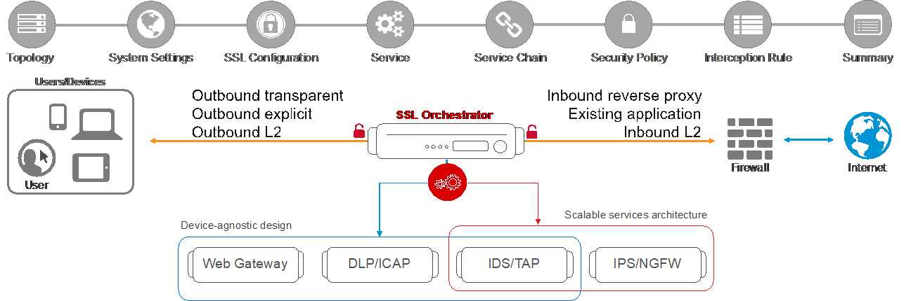

.. role:: red
.. role:: bred

What is the F5 SSL Orchestrator?
================================

F5 SSL Orchestrator (SSLO) provides an all-in-one appliance solution designed
specifically to optimize the SSL infrastructure, provide security devices with
visibility of SSL/TLS encrypted traffic, and maximize efficient use of that
existing security investment. This solution supports policy-based management
and steering of traffic flows to existing security devices, designed to easily
integrate into existing architectures, and centralizes the SSL decrypt/encrypt
function by delivering the latest SSL encryption technologies across the entire
security infrastructure.

**Multi-layered security**
   In order to solve specific security challenges, security administrators are
   accustomed to manually chaining together multiple point products, creating a
   bare-bones "security stack" consisting of multiple services. A typical stack
   may include components like Data Leak Prevention (DLP) scanners, Web
   Application Firewalls (WAF), Intrusion Prevention and Detection Systems
   (IPS and IDS), Malware Analysis tools, and more. In this model, all user
   sessions are provided the same level of security, as this "daisy chain" of
   services is hard-wired.

**Dynamic service chaining**
   Dynamic service chaining effectively breaks the daisy chain paradigm by
   processing specific connections based on context provided by the Security
   Policy, that then allows specific types of traffic to flow through arbitrary
   chains of services. These service chains can include five types of services:
   layer 2 inline services, layer 3 inline services, receive-only services,
   ICAP services, and HTTP web proxy services.

**Topologies**
   Different environments call for different network implementations. While
   some can easily support SSL visibility at layer 3 (routed), others may
   require these devices to be inserted at layer 2. SSL Orchestrator can
   support all of these networking requirements with the following topology
   options:

.. hlist::
   :columns: 2

   - Outbound transparent proxy
   - Outbound explicit proxy
   - Outbound layer 2
   - Inbound reverse proxy
   - Existing application
   - Inbound layer 2

**Security Policy**
   The SSLO Security Policy provides a rich set of context-aware methods to
   dynamically determine how best to optimize traffic flow through the security
   stack. Context can minimally come from the following:

.. hlist::
   :columns: 2

   - Source and destination address/subnet
   - URL filtering and IP intelligence (Subscriptions)
   - Host and domain name
   - Destination port
   - IP geolocation
   - Protocol

What's new in SSLO 4.0?
-----------------------

SSLO 4.0 provides significant architectural improvements over previous
versions. Here are the highlights:

- Replaces the complex iRules-based traffic classification and service chaining
  functions of previous versions with an Access per-request policy engine,
  providing much greater flexibility in traffic management options.

- Optimizes traffic flow through security services by replacing the complex
  "proxy hops" with a new "tee connector" - essentially a mid-proxy tap - that
  allows decrypted traffic to flow through security devices out-of-band from
  the main client-server proxy traffic. This is implemented as new "Service"
  and "Connector" profiles.

- Introduces new "split session" client and server SSL profiles, that are now
  responsible for carrying SNI signaling information across the inspection zone.

- Further optimizes traffic flow by reducing the amount of iRule data plane
  management, also making it easier to add customization iRules.

- Introduces three new network topologies. Along with the existing outbound
  transparent and explicit proxy flows, 4.0 now also supports inbound layer 3
  (reverse proxy) inspection, and layer 2 transparent inbound and outbound
  topologies.

SSLO 4.0 also includes the following new functionality features:

- Explicit and transparent web proxy devices as an inline security service.

- Front-end explicit proxy authentication via APM integration (relies on
  existing SWG-Explicit access policy).

- FTPS (passive), SMTPS, POP3S, and IMAPS protocols inspection.

- ICAP advanced filtering via LTM CPM policy (relies on an existing CPM policy).

- URL filtering as a function of the Access per-request service chaining policy.

- Authentication headers - ability to define additional HTTP headers to pass
  to inline security services.

- vCMP support - ability to select existing VLANs for inbound and outbound
  to/from inline services.

What's new in SSLO 5.0?
-----------------------

- Guided Configuration user experience, a complete refresh of the SSLO UI based
  on the Access Guided Configuration engine.

- Discreet "topology" definitions and the ability to define how SSLO listens
  for and processes traffic flows.

- Re-entrant, wizard-driven workflows. Based on the selected topology, SSLO
  5.0 presents an intuitive workflow UI that walks the user through a
  simplified object creation process.

.. attention:: Viprion chassis platform support is not available in SSLO 4.0 and 5.0.

What's new in SSLO 5.X?
-----------------------

SSLO 5.1 was released on December 17, 2018, a few days after the release of
BIG-IP 14.1 with SSLO 5.0. SSLO 5.1 contains significant updates to the product
and is therefore recommended (over 5.0) for customer environments. 

As of today two more updates have been released, 5.2 and 5.3. Additional
information about this updates can be found in the official release notes at:
https://support.f5.com/csp/knowledge-center/software/F5%20App%20Protect?module=F5%20SSL%20Orchestrator&version=14.1.0

All updates are available on the F5 downloads site, https://downloads.f5.com,
under the SSL Orchestrator section.

.. note:: This lab guide and corresponding Ravello lab environment are prepared
   for SSLO 5.3. If installing a fresh BIG-IP 14.1 instance, it is recommended
   to immediately download the 5.3 package and install over the built-in 5.0
   version. To do this, in the SSLO UI, click on **SSL Orchestrator** -->
   **Configuration** --> **Upgrade SSL Orchestrator**, choose the downloaded
   SSLO 5.3 package and then upload and install.
