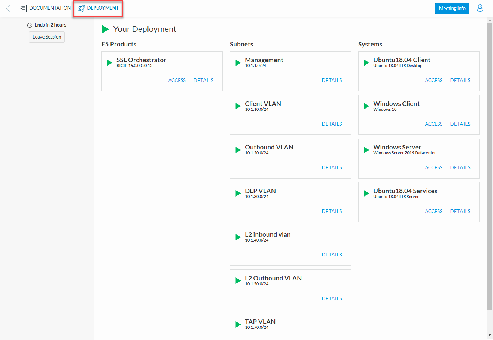

.. role:: red
.. role:: bred

SSL Orchestrator Lab Environment
================================================================================

Accessing the Virtual Lab
--------------------------------------------------------------------------------

If you are not familiar with the process for joining a training course, refer to:

- |join_link|
- |interface_link|

You should have received a course registration email that contains the UDF course link. Click on the link and log into the UDF student portal. 

After joining the course, you will see the **DOCUMENTATION** tab with some information about the lab resources and a link to the Lab Guide (this document).

.. image:: images/udf-documentation.png
   :align: left

.. note::

   You will use your local web browser and Remote Desktop Protocol (RDP) client to perform the lab exercises.
   
   You will not need to use SSH to access the UDF lab environment, so no SSH Key needs to be configured.

Click on the **DEPLOYMENT** tab to see all of your lab resources. You will access the **Ubuntu18.04 Client** and **Windows Client** machines using **RDP**. You will also access the **Web Shell** for various systems as directed in the lab exercises. 

Network Diagram
--------------------------------------------------------------------------------

Here is a visual representation of the Agility virtual lab environment. The numbers inside the right edge of the SSL Orchestrator box indicate the port numbers and VLAN tags (if applicable). The colored boxes to the right of the services respresent some product examples for each respective service type.

The first interface is connected to the client-facing VLAN. The second interface is connected to the Internet-facing VLAN. The remaining interfaces are connected to various types of security services: L2, L3, HTTP, ICAP, and passive Tap. The SSL Orchestrator management interface is not shown.

.. image:: images/labinfo-1.png
   :align: left

.. _credentials:

Virtual Lab Infrastructure Details (and Credentials)
--------------------------------------------------------------------------------

The following tables provide device/service network configuration details. Login credentials are also provided for use as directed in the lab exercises.

.. list-table:: **SSL Orchestrator**
   :header-rows: 0
   :widths: auto

   * - BIG-IP Management IP
     - 10.1.1.4
     -
   * - Gateway IP/DNS
     - 10.1.20.1
     -
   * - Login
     - admin:agility

       root:default
     -
   * - System DNS
     - 10.1.10.80 (Windows DNS for NTLM/AD)
     -
   * - Interfaces
     - Client VLAN
     - 1.1
   * -
     - Outbound VLAN
     - 1.2
   * -
     - Inline L3, HTTP, and ICAP services
     - 1.3 (tagged)
   * -
     - Inline L2 service inbound
     - 1.4
   * -
     - Inline L2 service outbound
     - 1.5
   * -
     - TAP service
     - 1.6
   * - SSL Orchestrator Topology
     - Name: f5labs_explicit

       Explicit Proxy: 10.1.10.150\:3128

       DNS: Forwarder - 10.1.10.80 

       (Explicit proxy DNS requests only)
     - 

.. list-table:: **Ubuntu18.04 Client**
   :header-rows: 0
   :widths: 200 600

   * - IP address
     - 10.1.10.50
   * - Login
     - student:agility

.. list-table:: **Windows Client**
   :header-rows: 0
   :widths: 200 300 300

   * - IP address
     - 10.1.10.70
     -
   * - Logins
     - **Username**
     - **Password**
   * -
     - F5LABS\\mike
     - agility
   * -
     - F5LABS\\jane
     - agility

.. list-table:: **Windows Server** (only for NTLM Authentication lab exercise)
   :header-rows: 0
   :widths: 200 600

   * - IP address
     - 10.1.10.80
   * - Login
     - N/A

.. list-table:: **Inline Layer 2 service**
   :header-rows: 0
   :widths: auto

   * - Login
     - student:agility
     - 
   * - Interfaces
     - Inbound (TO service) interface
     - 1.4
   * - 
     - Outbound (FROM service) interface
     - 1.5
   

.. list-table:: **Inline Layer 3 service**
   :header-rows: 0
   :widths: auto

   * - Login
     - student:agility
     -
     -
   * - Interfaces
     - Inbound (TO service) interface
     - 1.3 tag 60
     - 198.19.64.7/25
   * -
     - Outbound (FROM service) interface
     - 1.3 tag 70
     - 198.19.64.245/25
   * - Services
     - NGFW
     - 
     - 198.19.64.30/25

.. list-table:: **Explicit proxy (HTTP) service**
   :header-rows: 0
   :widths: auto

   * - Login
     - root:default
     -
     -
   * - Interfaces
     - Inbound (TO service) interface
     - 1.3 tag 30
     - 198.19.96.7/25
   * -
     - Outbound (FROM service) interface
     - 1.3 tag 40
     - 198.19.96.245/25
   * - Services
     - Squid
     - Port 3128
     - 198.19.96.30

.. list-table:: **ICAP service**
   :header-rows: 0
   :widths: auto

   * - Login
     - root:default
     -
     -
   * - Interface
     - Inbound (TO service) interface
     - 1.3 tag 50
     - 198.19.97.1/25
   * - Services
     - SquidClamAV
     - Port 1433
     - 198.19.97.50/25

       Request Modification URI Path: /avscan

       Response Modification URI Path: /avscan

       Preview Max Length: 1048576

.. list-table:: **Receive-only (TAP) service**
   :header-rows: 0
   :widths: auto

   * - Login
     - root:default
     - 
   * - Interface
     - Inbound (TO service) interface
     - 1.6
   * - MAC Address
     - 12:12:12:12:12:12 (arbitrary if directly connected)
     -

.. warning::
   Simple passwords were used in this lab environment in order to make it easier for students to access the infrastructure. This does not follow recommended security practices of using strong passwords.

   This lab environment is only accessible via an authenticated student login.

.. |join_link| raw:: html

      <a href="https://help.udf.f5.com/en/articles/3832165-how-to-join-a-training-course" target="_blank"> How to join a training course </a>

.. |interface_link| raw:: html

      <a href="https://help.udf.f5.com/en/articles/3832340-training-course-interface" target="_blank"> How to use the training course interface </a>

