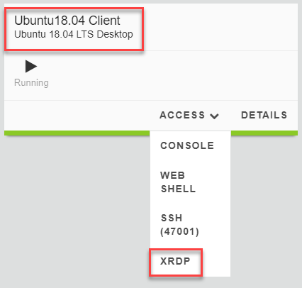
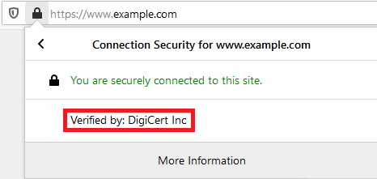
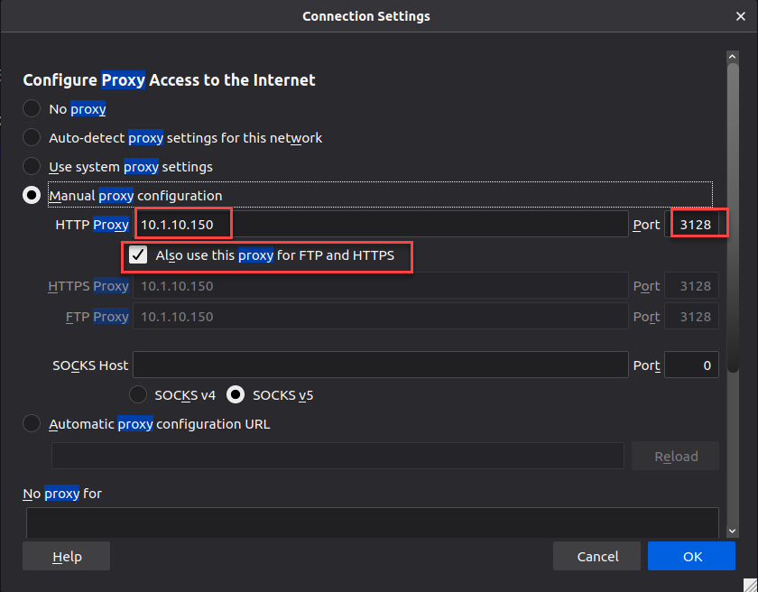

.. role:: red
.. role:: bred

Pre-existing environment validation
================================================================================

.. attention::
   A Microsoft Remote Desktop Protocol (RDP) client is required to connect to the *client* machines in this lab.

-  Start an RDP session to the **Ubuntu18.04 Client** (*Components > Ubuntu18.04 Client > ACCESS > XRDP*)

- When prompted, save the RDP file to your local machine and then open it to to connect.

-  At the Ubuntu Login prompt, click on the **OK** button to continue.

.. image:: ../images/ubuntu-client-rdp-2.png

|

.. tip::

   If the RDP session times out later, the password for the **student** user is ``agility``.

-  Open the **Firefox** browser

-  Browse to ``https://www.example.com/``

-  Click on the padlock icon in the address bar

   |ff-padlock|

-  Click the arrow to the right of **Connection secure**

   |ff-conn-expand|

|

-  Confirm that the connection/certificate is signed/verified by **DigiCert Inc**

   |ff-digicert-verified|

|

-  Modify the client's proxy settings to point to F5 SSL Orchestrator

   -  In Firefox, click on the menu (|ff-menu|) in the top right of the window

   -  Select **Preferences** on the menu
   
   -  In the **Find in Preferences** search field at the top, type ``proxy``
   
   -  Click the **Settings...** button under Network Settings
   
   -  Select the **Manual proxy configuration** radio button. Ensure the proxy settings appear as follows:
   
      |ff-connection-settings|

|

-  Click the **OK** button

-  **Close and relaunch** the web browser

-  Browse to ``https://www.example.com/`` once again

-  Confirm that the connection/certificate is now verified by **f5labs.com**

   |ff-f5labs-verified|

|

-  Confirm that the explicit proxy service is seeing decrypted traffic:

   -  Start a Web Shell to **Ubuntu18.04 Services** (*Components > Ubuntu18.04 Services > ACCESS > Web Shell*)

      .. image:: ../images/ubuntu-services.png
         :alt: Ubuntu18.04 Services Web Shell

      |

   -  Enter the following commands in the Web Shell:

         ``clear``
         ``tail -f -n 0 /var/log/squid/access.log`` 

   -  Visit a few secure (HTTPS) websites (non-banking) using Firefox on the **Ubuntu18.04 Client** machine and confirm that access is being logged even though we are visiting a secure website. You should see log entries of the sites and URLs visited, similar to the example below:

      |proxy-access-log|

      |

   -  Visit a financial web site such as \https://www.bankofamerica.com and verify that SSL Orchestrator is not intercepting TLS traffic. Confirm that the browser receives a server certificate that was issued by a trusted public CA. You should **not** see "Verified by: f5labs.com." because we are bypassing **Financial Institutions** in the SSL Orchestrator Security Policy.

   -  Confirm that the explicit proxy service is not seeing the bypassed (encrypted) traffic. There should be no log entries for the financial web site itself in the **access.log** file.

      .. note: 
         You may still see log entries for analytics web sites that are associated with the financial web site.

   -  Press Control+C to stop the *tail* tool.

.. |ff-conn-expand| image:: ../images/ff-conn-expand.png
   :alt: Site Information

.. |ff-f5labs-verified| image:: ../images/ff-f5labs-verified.png
   :alt: Verified By: f5labs.com

.. |proxy-access-log| image:: ../images/proxy-access-log.png
   :alt: Proxy Access Log
