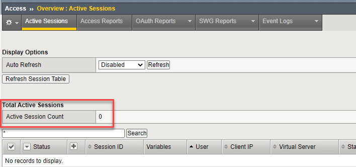
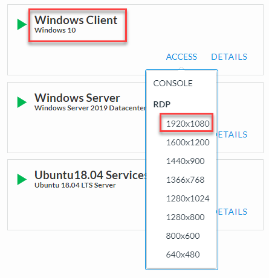

.. role:: red
.. role:: bred

Verify authentication is currently disabled
================================================================================

1. Start a TMUI session on **SSL Orchestrator** and log in if prompted (*Components > SSL Orchestrator > ACCESS > TMUI*)

      |credentials_link|

2. From the Main menu on the left, select **Access > Overview > Active Sessions**. The following screen should appear. You should see an **Active Session Count** of **0** and that there are no sessions listed in the table.

.. important::

   For this lab exercise, make sure you RDP into the **WINDOWS CLIENT** machine. This **WINDOWS CLIENT** machine is domain joined in order to test NTLM Authentication. The **Ubuntu18.04 Client** machine
   will be used later in the lab.

3.  Start an RDP session to the **Windows Client** (*Systems > Windows Client > ACCESS > RDP*)

4. Open the RDP file to connect.

5. At the authentication prompt, click on **More choices** to show additional logon options. Then click on **Use a different account**.

.. image:: ../images/windows-logon-1.png
   :alt: RDP Client Logon - Use a different account

6.  Login in as user: ``F5LABS\mike`` with password: ``agility``

.. image:: ../images/windows-logon-2.png
   :alt: Windows Logon - domain\user and password

7.  Accept any connection/security prompts.

.. note::
   Please be patient. The Windows machines are running with limited resources, so may be slow at times.

8.  Using Chrome, browse to ``https:\\www.f5.com``.

.. note::
   Chrome is already configured to use the f5labs_explicit topology's proxy (10.1.10.150:3128) for Internet browsing.

9.  Refresh the previously shown TMUI screen. You should still see an **Active Session Count** of **0**.

.. |credentials_link| raw:: html

      <a href="../labinfo.html#credentials" target="_blank"> Link to user credentials (opens in new browser tab) </a>

