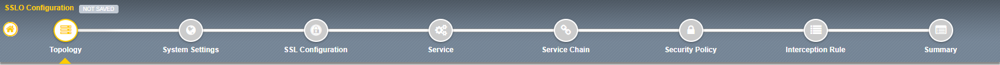
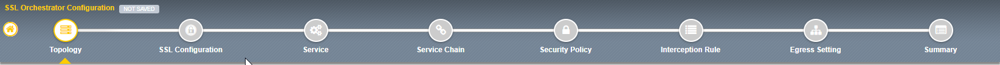

.. role:: red
.. role:: bred

Lab 1.4: Topology Properties
----------------------------

SSLO now creates discreet configurations based on the selected topology. For
example, in previous versions of SSLO, a transparent and explicit forward proxy
might be defined together. In SSLO 5.0, these are configured separately. An
explicit forward proxy topology will ultimately create an explicit proxy
listener and its relying transparent proxy lister, but the transparent listener
will be bound only to the explicit proxy tunnel. If a subsequent transparent
forward proxy topology is configured, it will not overlap the existing explicit
proxy objects. The Topology Properties page provides the following options:

The Protocol option presents four protocol types:

- **TCP** - this option creates a single TCP wildcard interception rule for
  the L3 Inbound, L3 Outbound L3, and L3 Explicit Proxy topologies.

- **UDP** - this option creates a single UDP wildcard interception rule for
  L3 Inbound and L3 Outbound topologies.

- **Other** - this option creates a single any protocol wildcard interception
  rule for L3 Inbound and L3 Outbound topologies, typically used for
  non-TCP/UDP traffic flows.

- **Any** - this option creates the TCP, UDP and non-TCP/UDP interception
  rules for outbound traffic flows.

The SSL Orchestrator Topologies option page presents six topologies:

- **L3 Explicit Proxy** - this is the traditional explicit forward proxy.

- **L3 Outbound** - this is the traditional transparent forward proxy.

- **L3 Inbound** - this is a reverse proxy "gateway" configuration. In its
  simplest form, this topology builds an SSLO environment designed to sit
  **in front of** another ADC or routed path. Advanced options allow it to
  define a pool for more directed traffic flow, but alone does not provide
  the same flexibility afforded a typical LTM reverse proxy virtual server.
  It also must perform re-encryption on egress. The primary use case for
  this topology is as a gateway SSL visibility solution, potentially
  sitting at a boundary edge in front of multiple internal ADC environments.

- **L2 Inbound** - the layer 2 topology options insert SSLO as a
  bump-in-the-wire in an existing routed path, where SSLO presents no IP
  addresses on its outer edges. The L2 Inbound topology provides a
  transparent path for inbound traffic flows.

- **L2 Outbound** - the layer 2 topology options insert SSLO as a
  bump-in-the-wire in an existing routed path, where SSLO presents no IP
  addresses on its outer edges. The L2 Outbound topology provides a
  transparent path for outbound traffic flows.

  .. important:: It is important to distinguish SSLO's layer 2 topology from
     those of other traditional layer 2 SSL visibility vendors. "True" layer
     2 solutions like Blue Coat's SSL visibility appliance (SSLVA) limit the
     types of devices that can be inserted into the inspection zone to layer
     2 and below, and devices must be directly connected to the appliance.
     SSLO's layer 2 topology only exists at the outer edges. Inside the
     inspection zone, full-proxy routing is still happening, so layer 3 and
     HTTP services can still function normally.

- **Existing Application** - this topology is designed to work with existing
  LTM applications. Whereas the L3 Inbound topology provides an inbound
  gateway function for SSLO, Existing Application works with LTM virtual
  servers that already perform their own SSL handling and client-server
  traffic management. The Existing Application workflow proceeds directly to
  service creation and security policy definition, then exits with an
  SSLO-type access policy and per-request policy that can easily be consumed
  by an LTM virtual server.

For this lab:

- **Name**: some name (ex. ":red:`lab1_outbound`")
- **Protocol**: :red:`Any` - this will create separate TCP, UDP and non-TCP/UDP
  interception rules.
- **IP Family**: :red:`IPv4`
- **Topology**: :red:`L3 Outbound`
- Click :red:`Save & Next.`
