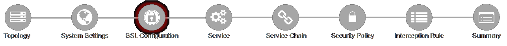

.. role:: red
.. role:: bred

Lab 1.5: SSL Configurations
---------------------------

This page defines the specific SSL settings for the selected topology, in this
case a forward proxy, and controls both client-side and server-side SSL
options. If existing SSL settings are available (from a previous workflow), it
can be selected and re-used. Otherwise the SSL Configurations page creates new
SSL settings for this workflow. For this lab, :red:`create a new SSL profile`.

- **Client-side SSL**

  - **Cipher Type** - cipher type can be a Cipher Group or Cipher String.
    If the former, select a previously-defined cipher group (from Local
    Traffic - Ciphers - Groups). If the latter, enter a cipher string that
    appropriately represents the client-side TLS requirement. For most
    environments, :red:`DEFAULT` is optimal. For this lab, lease
    :red:`Cipher String` selected.

  - **Certificate Key Chain** - the certificate key chain represents the
    certificate and private key used as the "template" for forged server
    certificates. While re-issuing server certificates on-the-fly is
    generally easy, private key creation tends to be a CPU-intensive
    operation. For that reason, the underlying SSL Forward Proxy engine
    forges server certificates from a single defined private key. This
    setting gives customers the opportunity to apply their own template
    private key, and optionally store that key in a FIPS-certified HSM for
    additional protection. The built-in "default" certificate and private
    key uses 2K RSA and is generated from scratch when the BIG-IP system is
    installed. The pre-defined :red:`default.crt` and :red:`default.key` can be
    left as is. Click :red:`Done`.

  - **CA Certificate Key Chain** - an SSL forward proxy must re-sign, or
    "forge" remote server certificate to local clients using a local
    certificate authority (CA) certificate, and local clients must trust
    this local CA. This setting defines the local CA certificate and
    private key used to perform the forging operation. Click the pencil
    icon to :red:`Edit`, then select :red:`subca.f5demolabs.com` for both
    Certificate and Key, and click :red:`Done`.

    .. note:: SSL Settings minimally require RSA-based template and CA
       certificates but can also support Elliptic Curve (ECDSA) certificates.
       In this case, SSLO would forge an EC certificate to the client if the
       TLS handshake negotiated an ECDHE_ECDSA cipher. To enable EC forging
       support, add both an EC template certificate and key, and EC CA
       certificate and key.

  - **[Advanced] Bypass on Handshake Alert** - this setting allows the
    underlying SSL Forward Proxy process to bypass SSL decryption if an SSL
    handshake error is detected on the server side. It is recommended to
    leave this :red:`disabled`.

  - **[Advanced] Bypass on Client Certificate Failure** - this setting
    allows the underlying SSL Forward Proxy process to bypass SSL
    decryption if it detects a Certificate request message from the server,
    as in when a server requires mutual certificate authentication. It is
    recommended to leave this :red:`disabled`.
   
    .. note:: The above two Bypass options can create a security vulnerability.
       If a colluding client and server can force an SSL handshake error, or
       force client certificate authentication, they can effectively bypass SSL
       inspection. It is recommended that these settings be left disabled.

- **Server-side SSL**

  - **Cipher Type** - cipher type can be a Cipher Group or Cipher String.
    If the former, select a previously-defined cipher group (from Local
    Traffic - Ciphers - Groups). If the latter, enter a cipher string that
    appropriately represents the server-side TLS requirement. For most
    environments, :red:`DEFAULT` is optimal.

  - **Trusted Certificate Authority** - browser vendors routinely update
    the CA certificate stores in their products to keep up with industry
    security trends, and to account for new and revoked CAs. In the SSL
    forward proxy use case, however, the SSL visibility product now
    performs all server-side certificate validation, in lieu of the client
    browser, and should therefore do its best to maintain the *same*
    industry security trends. BIG-IP ships with a CA certificate bundle
    that maintains a list of CA certificates common to the browser vendors.
    However, a more comprehensive bundle can be obtained from the F5
    Downloads site. For this lab, select the built-in :red:`ca-bundle.crt`.

  - **[Advanced] Expire Certificate Response** - SSLO performs validation
    on remote server certificates and can control what happens if it
    receives an expired server certificate. The options are **drop**, which
    simply drops the traffic, and **ignore**, which mirrors an expired
    forged certificate to the client. The default and recommended behavior
    for forward proxy is to :red:`drop` traffic on an expired certificate.

  - **[Advanced] Untrusted Certificate Authority** - SSLO performs
    validation on remote server certificates and can control what happens
    if it receives an untrusted server certificate, based on the Trusted
    Certificate Authority bundle. The options are **drop**, which simply
    drops the traffic, and **ignore**, which allows the traffic and forges
    a good certificate to the client. The default and recommended behavior
    for forward proxy is to :red:`drop` traffic on an untrusted certificate.

  - **[Advanced] OCSP** - this setting selects an existing or can create a
    new OCSP profile for server-side Online Certificate Status Protocol
    (OCSP) and OCSP stapling. With this enabled, if a client issues a
    Status_Request message in its ClientHello message (an indication that
    it supports OCSP stapling), SSLO will issue a corresponding
    Status_Request message in its server-side TLS handshake. SSLO will
    then forge the returned OCSP stapling response back to the client. If
    the server does not respond with a staple but contains an Authority
    Info Access (AIA) field that points to an OCSP responder URL, SSLO will
    perform a separate OCSP request. The returned status is then mirrored
    in the stapled client-side TLS handshake.

  - **[Advanced] CRL** - this setting selects an existing or can create a
    new CRL profile for server-side Certificate Revocation List (CRL)
    validation. With this enabled, SSLO attempts to match server
    certificates to locally-cached CRLs.

- Click :red:`Save & Next`.
