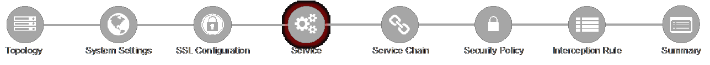

.. role:: red
.. role:: bred

Lab 1.6: Services List
----------------------

The Services List page is used to define security services that attach to SSLO.
The 5.0 SSLO Guided Configuration now includes a services catalog that contains
common product integrations. Beneath each of these catalog options is one of
the five basic service types. The service catalog also provides “generic”
security services. Depending on screen resolution, it may be necessary to
scroll down to see additional services.

.. image:: ../images/image10.png

This lab will create one of each type of security service. Click Add Service,
then either select a service from the catalog and click Add, or simply
double-click the service to go to its configuration page.

- **Inline layer 2 service** – select the FireEye Inline Layer 2 service from
  the catalog and click Add, or simply double-click the FireEye Inline Layer 2
  service, or any other Inline Layer 2 service in the catalog.

  - **Name** – provide a unique name to this service (example “FireEye”).

  - **Network Configuration** – paths define the network interfaces that take
    inspectable traffic to the inline service and receive traffic from the
    service. Click Add.

    - **Ratio** – inline security services are natively load balanced, so
      this setting defines a ratio, if any for the load balanced pool
      members. Enter 1.

    - **From BIGIP VLAN** – this is the interface taking traffic to the
      inline service. Select the Create New option, enter a unique name (ex.
      FireEye\_in), select the F5 interface connecting to the inbound side of
      the service, and add a VLAN tag value if required. For this lab, select
      interface 1.6.

    - **To BIGIP VLAN** – this is the interface receiving traffic from the
      inline service. Select the Create New option, enter a unique name (ex.
      FireEye\_out), select the F5 interface connecting to the outbound side
      of the service, and add a VLAN tag value if required. For this lab,
      select interface 1.7.

    - Click Done.

  - **Service Action Down** – SSLO also natively monitors the load balanced
    pool of security devices, and if all pool members fail, can actively
    bypass this service (**Ignore**), or stop all traffic (**Reset**,
    **Drop**). For this lab, leave it set to Ignore.

  - **Enable Port Remap** – this setting allows SSLO to remap the port of
    HTTPS traffic flowing across this service. This is advantageous when a
    security service defines port 443 traffic as encrypted HTTPS and natively
    ignores it. By remapping HTTPS traffic to, say, port 8080, the security
    service will inspect the traffic. For this lab, enable (check) this option
    and enter a port value value (ex. 8080).

  - **iRules** – SSLO now allows for the insertion of additional iRule logic
    at different points. An iRule defined at the service only affects traffic
    flowing across this service. It is important to understand, however, that
    these iRules must not be used to control traffic flow (ex. pools, nodes,
    virtuals, etc.), but rather should be used to view/modify application
    layer protocol traffic. For example, an iRule assigned here could be used
    to view and modify HTTP traffic flowing to/from the service. Additional
    iRules are not required, however, so leave this empty.

  - Click Save.

- **Inline layer 3 service** – select the Generic Inline Layer 3 service from
  the catalog and click Add, or simply double-click the Generic Inline Layer 3
  service.

  - **Name** – provide a unique name to this service (example “IPS”).

  - **IP Family** – this setting defines the IP family used with this layer 3
    service. Leave it set to IPv4.

  - **Auto Manage Addresses** – when enabled the Auto Manage Addresses setting
    provides a set of unique, non-overlapping, non-routable IP addresses to be
    used by the security service. If disabled, the To and From IP addresses
    must be configured manually. It is recommended to leave this option
    enabled (checked).

    .. note:: In environments where SSLO is introduced to existing security
       devices, it is a natural tendency to not want to have to move these
       devices. And while SSLO certainly allows it, by not moving the security
       devices into SSLO-protected enclaves, customers run the risk of exposing
       sensitive decrypted traffic, unintentionally, to other devices that may
       be connected to these existing networks. It is therefore *highly*
       recommended, and a security best practice, to remove SSLO-integrated
       security devices from existing networks and place them entirely within
       the isolated enclave created and maintained by SSLO.

  - **To Service Configuration** – the “To Service” defines the network
    connectivity from SSLO to the inline security device.

    - **To Service** – with the Auto Manage Addresses option enabled, this IP
      address will be pre-defined, therefore the inbound side of the service
      must match this IP subnet. With the Auto Manage Addresses option
      disabled, the IP address must be defined manually. For this lab, leave
      the 198.19.64.7/25 address intact.

    - **VLAN** – select the Create New option, provide a unique name (ex.
      IPS\_in), select the F5 interface connecting to the inbound side of the
      service, and add a VLAN tag value if required. For this lab, select
      interface 1.3 and VLAN tag 50.

  - **Service Down Action** – SSLO also natively monitors the load balanced
    pool of security devices, and if all pool members fail, can actively
    bypass this service (**Ignore**), or stop all traffic (**Reset**,
    **Drop**). For this lab, leave it set to Ignore.

  - **L3 Devices** – this defines the inbound-side IP address of the inline
    layer 3 service, used for routing traffic to this device. Multiple load
    balanced IP addresses can be defined here. Click Add, enter 198.19.64.64,
    then click Done.

  - **From Service Configuration** – the “From Service” defines the network
    connectivity from the inline security device to SSLO.

    - **From Service** – with the Auto Manage Addresses option enabled, this
      IP address will be pre-defined, therefore the outbound side of the
      service must match this IP subnet. With the Auto Manage Addresses
      option disabled, the IP address must be defined manually. For this lab,
      leave the 198.19.64.245/25 address intact.

    - **VLAN** – select the Create New option, provide a unique name (ex.
      IPS\_out), select the F5 interface connecting to the outbound side of
      the service, and add a VLAN tag value if required. For this lab, select
      interface 1.3 and VLAN tag 60.

  - **Enable Port Remap** – this setting allows SSLO to remap the port of
    HTTPS traffic flowing across this service. This is advantageous when a
    security service defines port 443 traffic as encrypted HTTPS and natively
    ignores it. By remapping HTTPS traffic to, say, port 8181, the security
    service will inspect the traffic. For this lab, enable (check) this option
    and enter a port value value (ex. 8181).

  - **Manage SNAT Settings** – SSLO now defines an option to enable SNAT
    (source NAT) across an inline layer 3/HTTP service. The primary use case
    for this is horizontal SSLO scaling, where independent SSLO devices are
    scaled behind a separate load balancer but share the same inline layer
    3/HTTP services. As these devices must route back to SSLO, there are now
    multiple SSLO devices to route back to. SNAT allows the layer 3/HTTP
    device to know which SSLO sent the packets for proper routing. SSLO
    scaling also requires that the Auto Manage option be disabled, to provide
    separate address spaces on each SSLO. For this, leave it set to None.

  - **iRules** – SSLO now allows for the insertion of additional iRule logic
    at different points. An iRule defined at the service only affects traffic
    flowing across this service. It is important to understand, however, that
    these iRules must not be used to control traffic flow (ex. pools, nodes,
    virtuals, etc.), but rather should be used to view/modify application
    layer protocol traffic. For example, an iRule assigned here could be used
    to view and modify HTTP traffic flowing to/from the service. Additional
    iRules are not required, however, so leave this empty.

  - Click Save.

- **Inline HTTP service** – an inline HTTP service is defined as an explicit or
  transparent proxy for HTTP (web) traffic. Select the WSA HTTP Proxy service
  from the catalog and click Add, or simply double-click the WSA HTTP Proxy
  service, or any other HTTP Proxy service in the catalog.

  - **Name** – provide a unique name to this service (example “Proxy”).

  - **IP Family** – this setting defines the IP family used with this layer 3
    service. Leave it set to IPv4.

  - **Auto Manage Addresses** – when enabled the Auto Manage Addresses setting
    provides a set of unique, non-overlapping, non-routable IP addresses to be
    used by the security service. If disabled, the To and From IP addresses
    must be configured manually. It is recommended to leave this option
    enabled (checked).

    .. note:: In environments where SSLO is introduced to existing security
       devices, it is a natural tendency to not want to have to move these
       devices. And while SSLO certainly allows it, by not moving the security
       devices into SSLO-protected enclaves, customers run the risk of exposing
       sensitive decrypted traffic, unintentionally, to other devices that may
       be connected to these existing networks. It is therefore *highly*
       recommended, and a security best practice, to remove SSLO-integrated
       security devices from existing networks and place them entirely within
       the isolated enclave created and maintained by SSLO.

  - **Proxy Type** – this defines the proxy mode that the inline HTTP service
    is in. For this lab, set this option to Explicit.

  - **To Service Configuration** – the “To Service” defines the network
    connectivity from SSLO to the inline security device.

    - **To Service** – with the Auto Manage Addresses option enabled, this IP
      address will be pre-defined, therefore the inbound side of the service
      must match this IP subnet. With the Auto Manage Addresses option
      disabled, the IP address must be defined manually. For this lab, leave
      the 198.19.96.7/25 address intact.

    - **VLAN** – select the Create New option, provide a unique name (ex.
      Proxy\_in), select the F5 interface connecting to the inbound side of
      the service, and add a VLAN tag value if required. For this lab, select
      interface 1.3 and VLAN tag 110.

  - **Service Down Action** – SSLO also natively monitors the load balanced
    pool of security devices, and if all pool members fail, can actively
    bypass this service (**Ignore**), or stop all traffic (**Reset**,
    **Drop**). For this lab, leave it set to Ignore.

  - **HTTP Proxy Devices** – this defines the inbound-side IP address of the
    inline HTTP service, used for passing traffic to this device. Multiple
    load balanced IP addresses can be defined here. For a transparent proxy
    HTTP service, only an IP address is required. For an explicit proxy HTTP
    service, the IP address and listening port is required. Click Add, enter
    198.19.96.66 for the IP Address, and 3128 for the Port, then click Done.

  - **From Service Configuration** – the “From Service” defines the network
    connectivity from the inline security device to SSLO.

    - **From Service** – with the Auto Manage Addresses option enabled, this
      IP address will be pre-defined, therefore the outbound side of the
      service must match this IP subnet. With the Auto Manage Addresses
      option disabled, the IP address must be defined manually. For this lab,
      leave the 198.19.96.245/25 address intact.

    - **VLAN** – select the Create New option, provide a unique name (ex.
      Proxy\_out), select the F5 interface connecting to the outbound side of
      the service, and add a VLAN tag value if required. For this lab, select
      interface 1.3 and VLAN tag 120.

  - **Manage SNAT Settings** – SSLO now defines an option to enable SNAT
    (source NAT) across an inline layer 3/HTTP service. The primary use case
    for this is horizontal SSLO scaling, where independent SSLO devices are
    scaled behind a separate load balancer but share the same inline layer
    3/HTTP services. As these devices must route back to SSLO, there are now
    multiple SSLO devices to route back to. SNAT allows the layer 3/HTTP
    device to know which SSLO sent the packets for proper routing. SSLO
    scaling also requires that the Auto Manage option be disabled, to provide
    separate address spaces on each SSLO. For this, leave it set to None.

  - **Authentication Offload** – when an Access authentication profile is
    attached to an explicit forward proxy topology, this option will present
    the authenticated username value to the service as an X-Authenticated-User
    HTTP header. For this lab, leave it disabled (unchecked).

  - **iRules** – SSLO now allows for the insertion of additional iRule logic
    at different points. An iRule defined at the service only affects traffic
    flowing across this service. It is important to understand, however, that
    these iRules must not be used to control traffic flow (ex. pools, nodes,
    virtuals, etc.), but rather should be used to view/modify application
    layer protocol traffic. For example, an iRule assigned here could be used
    to view and modify HTTP traffic flowing to/from the service. Additional
    iRules are not required, however, so leave this empty.

  - Click Save.

- **ICAP service** – an ICAP service is an RFC 3507-defined service that
  provides some set of services over the ICAP protocol. Select the Digital
  Guardian ICAP service from the catalog and click Add, or simply double-click
  the Digital Guardian ICAP service, or any other ICAP service in the catalog.

  - **Name** – provide a unique name to this service (example “DLP”).

  - **IP Family** – this setting defines the IP family used with this layer 3
    service. Leave it set to IPv4.

  - **ICAP Devices** – this defines the IP address of the ICAP service, used
    for passing traffic to this device. Multiple load balanced IP addresses
    can be defined here. Click Add, enter 10.70.0.10 for the IP Address, and
    1344 for the Port, and then click Done.

  - **ICAP Headers** – select either **Default** or **Custom** to specify
    additional ICAP headers. To add custom headers, select Custom, otherwise
    leave as Default.

  - **OneConnect** – the F5 OneConnect profile improves performance by reusing
    TCP connections to ICAP servers to process multiple transactions. If the
    ICAP servers do not support multiple ICAP transactions per TCP connection,
    do not enable this option. For this lab, leave the OneConnect setting
    enabled.

  - **Request URI Path** – this is the RFC 3507-defined URI request path to
    the ICAP service. Each ICAP security vendor will differ with respect to
    request and response URIs, and preview length, so it is important to
    review the vendor’s documentation. In this lab, enter /squidclamav.

  - **Response URI Path** – this is the RFC 3507-defined URI response path to
    the ICAP service. Each ICAP security vendor will differ with respect to
    request and response URIs, and preview length, so it is important to
    review the vendor’s documentation. In this lab, enter /squidclamav.

  - **Preview Max Length(bytes)** – this defines the maximum length of the
    ICAP preview. Each ICAP security vendor will differ with respect to
    request and response URIs, and preview length, so it is important to
    review the vendor’s documentation. A zero-length preview length implies
    that data will be streamed to the ICAP service, similar to an HTTP
    100/Expect process, while any positive integer preview length defines the
    amount of data (in bytes) that are transmitted first, before streaming the
    remaining content. The ICAP service in this lab environment does not
    support a complete stream, so requires a modest amount of initial preview.
    In this lab, enter 524288.

  - **Service Down Action** – SSLO also natively monitors the load balanced
    pool of security devices, and if all pool members fail, can actively
    bypass this service (**Ignore**), or stop all traffic (**Reset**,
    **Drop**). For this lab, leave it set to Ignore.

  - **HTTP Version** – this defines whether SSLO sends HTTP/1.1 or HTTP/1.0
    requests to the ICAP service.

  - **ICAP Policy** – an ICAP policy is a pre-defined LTM CPM policy that can
    be configured to control access to the ICAP service based on attributes of
    the HTTP request or response. ICAP processing is enabled by default, so an
    ICAP CPM policy can be used to disable the request and/or response ADAPT
    profiles.

  - Click Save.

- **TAP service** – a TAP service is a passive device that simply receives a
  copy of traffic. Select the Cisco Sourcefire TAP service from the catalog and
  click Add, or simply Double-click the Cisco Sourcefire TAP service, or any
  other TAP service in the catalog.

  - **Name** - provide a unique name to this service (example “TAP”).

  - **Mac Address** – for a tap service that is not directly connected to the
    F5, enter the device’s MAC address. For a tap service that is directly
    connected to the F5, the MAC address does not matter and can be
    arbitrarily defined. For this lab, enter 12:12:12:12:12:12.

  - **VLAN** – this defines the interface connecting the F5 to the TAP
    service. Click Create New and provide a unique name (ex. TAP\_in).

  - **Interface** – select the 1.4 interface.

  - **Enable Port Remap** – this setting allows SSLO to remap the port of
    HTTPS traffic flowing to this service. For this lab, leave the option
    disabled (unchecked).

  - Click Save.

- Click Save & Next.
