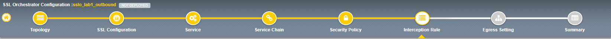

.. role:: red
.. role:: bred

Lab 1.9: Interception Rule
--------------------------

Interception rules are based on the selected topology and define the
"listeners", analogous to LTM virtual servers, that accept and process
different types of traffic (ex. TCP, UDP, other). The resulting LTM virtual
servers will bind the SSL settings, VLANs, IPs, and security policies created
in the topology workflow.

- **Ingress Network (VLANs)** - this defines the VLANs through which traffic
  will enter. For a transparent forward proxy topology, this would be a
  client-side VLAN. Select :red:`client-net`.

- **L7 Interception Rules** - FTP and email protocol traffic are all
  "server-speaks-first" protocols, and therefore SSLO must process these
  separately from typical client-speaks-first protocols like HTTP. This
  selection enables processing of each of these protocols, which create
  separate port-based listeners for each. As required, :red:`selectively enable
  the additional protocols that need to be decrypted and inspected` through
  SSLO.

  .. note:: This is optional. Including or not including has no bearing on the
     lab. This is for reference only.

- Click :red:`Save & Next`.
